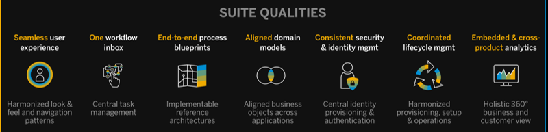
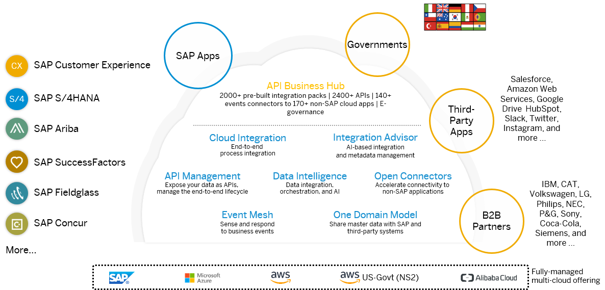

<!-- loiof2d8c9c558844cc884fd3f26478b9607 -->

# Introduction to SAP Integration Suite

Get to know SAP Integration Suite and its main capabilities, Cloud Integration, API Management, Open Connectors, and Integration Advisor.

<a name="loiof2d8c9c558844cc884fd3f26478b9607__section_ctv_5qx_qqb"/>

## SAP Integration Suite: A Future-Proof, Hybrid Integration Platform

SAP Integration Suite is an open and enterprise-grade integration platform that is a fully vendor-managed multi-cloud offering. It's SAP’s recommended integration platform for simplifying and accelerating integrations for both SAP and third-party integration scenarios. SAP Integration Suite supports integration in a holistic manner and provides prebuilt integration packages to enable accelerated integrations. It supports a range of integrations, including the integration of applications in the cloud and on premise, master data integration, B2B and electronic data interchange \(EDI\) integration, business-to-government \(B2G\) integration, data integration and pipelines, event-driven integration, and integration based on application programming interfaces \(APIs\). It also supports design and runtime governance of APIs and acts as the foundation for process excellence across the value chain. In summary, you have all the features necessary to build an Intelligent Enterprise.

**Key Highlights**

-   Leader in the Gartner 2020 Magic Quadrant™ for EiPaaS solutions

-   Simplified integrations with capabilities of Cloud Integration, API Management, Integration Advisor, AI-based development, SAP Integration Solution Advisory Methodology, the API Business Hub Enterprise, Cloud Connector, and Open Connectors for more than 170 non-SAP applications

-   Time-to-live is accelerated with 2200+ pre-built integrations, 2500 APIs, 160 business events

-   Modernization of integrations supported integration use cases/styles: cloud to cloud, cloud to ground, A2A, B2B/G, API-driven, event-driven

-   Fully capable feature set that can support cloud-to-cloud and hybrid integrations

<a name="loiof2d8c9c558844cc884fd3f26478b9607__section_zcc_vqx_qqb"/>

## Capabilities of SAP Integration Suite

SAP Integration Suite has four main capabilities: Cloud Integration, API Management, Open Connectors, and Integration Advisor.

**[Cloud Integration](https://help.sap.com/viewer/product/CLOUD_INTEGRATION/Cloud/en-US)**

The Cloud Integration capability within SAP Integration Suite supports end-to-end process integration across cloud-based and on-premise applications through the exchange of messages, from to cloud to on-premise and vice versa. It provides capabilities to process messages in integration scenarios spanning different companies, organizations, or departments within an organization.

Integration developers can use predefined integration content available on [SAP API Business Hub](https://api.sap.com) out of the box, enhance it, or develop their own integration content from scratch. Integration content refers to all design artifacts that define how a message is to be processed during an integration scenario. Cloud Integration provides a [set of adapters](https://help.sap.com/viewer/368c481cd6954bdfa5d0435479fd4eaf/Cloud/en-US/1f066330e8314324bf3ebe3b6adc21b2.html) that allow you to specify a connection type and define, for example, which technical protocols should be used to connect a sender or a receiver system to the tenant and how this connection is protected.

Since Cloud Integration covers the majority of the capabilities provided by SAP Process Orchestration system, it’s addressed as main service when planning to migrate to SAP Integration Suite.

**[API Management](https://help.sap.com/viewer/product/SAP_CLOUD_PLATFORM_API_MANAGEMENT/Cloud/en-US)**

The SAP API Management capability allows you to publish, promote, oversee, and secure APIs in a scalable environment. SAP API Management technology helps you share digital assets and enable developer communities to consume these assets in new channels, devices, and user interfaces.

**[Open Connectors](https://help.sap.com/viewer/product/OPEN_CONNECTORS/Cloud/en-US)** 

A third key capability is SAP Open Connectors, which provides out-of-the-box capabilities to connect to over 170 non-SAP services and applications on the market today. The number of standard connectors is growing and can be supplemented by the implementation of bespoke connectors. Once a particular Open Connector instance has been configured, it can be consumed in a homogeneous way within either Cloud Integration or API Management.

**[Integration Advisor](https://help.sap.com/viewer/368c481cd6954bdfa5d0435479fd4eaf/Cloud/en-US/6b9fe2d753534bebadcfa9080228bd94.html)** 

The final key capability is SAP Integration Advisor, a machine learning-based design tool that can be used to accelerate the implementation of mappings between different source and target message structures. The tool uses a knowledge graph that tracks past message structure definitions and how they were previously mapped. Using machine learning algorithms, the knowledge graph can propose mapping solutions for new mapping requirements to accelerate the design and development process. The capability is particularly useful for B2B scenarios but is also applicable for use in other areas such as A2A and B2G.

-   **[Value Proposition: Why You Should Move to SAP Integration Suite](value-proposition-why-you-should-move-to-sap-integration-suite-e592803.md "SAP Integration Suite is a multi-cloud SaaS solution that offers a number of significant
		advantages over an on-premise offering like SAP Process Integration and SAP Process
		Orchestration. Here are a few significant points that highlight the value proposition of SAP
		Integration Suite compared to SAP Process Orchestration.")**  
SAP Integration Suite is a multi-cloud SaaS solution that offers a number of significant advantages over an on-premise offering like SAP Process Integration and SAP Process Orchestration. Here are a few significant points that highlight the value proposition of SAP Integration Suite compared to SAP Process Orchestration.
-   **[Transition to SAP Integration Suite](transition-to-sap-integration-suite-0efebfb.md "")**  

