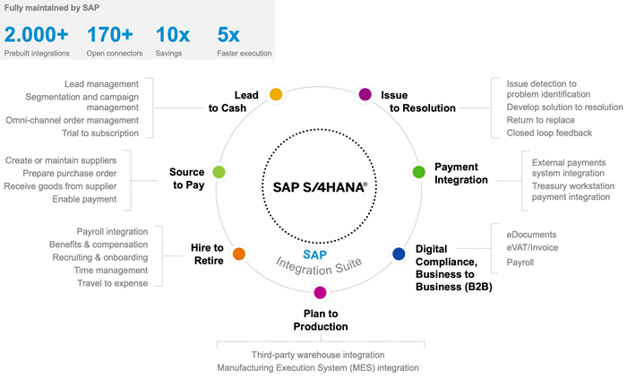
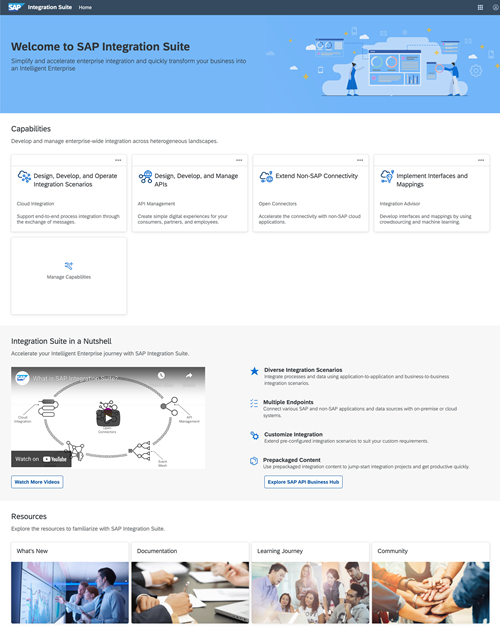
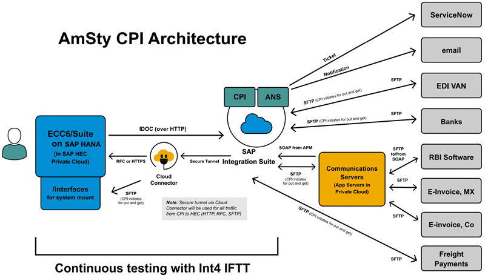
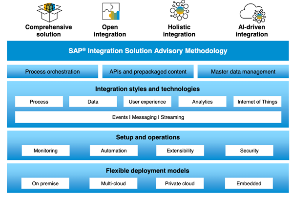

<!-- loioe5928032fee14042bde3980eca390284 -->

# Value Proposition: Why You Should Move to SAP Integration Suite

SAP Integration Suite is a multi-cloud SaaS solution that offers a number of significant advantages over an on-premise offering like SAP Process Integration and SAP Process Orchestration. Here are a few significant points that highlight the value proposition of SAP Integration Suite compared to SAP Process Orchestration.

SAP NetWeaver Process Integration and Process Orchestration is an on-premise integration platform hosted on customer-managed infrastructure. It offers a service-oriented architecture and was one of the most widely adopted integration platforms. However, modern day IT landscapes are evolving towards a cloud-first approach. They're leveraging SaaS offerings to offload IT maintenance efforts and focus on solving business challenges and innovating on customer experience. In this digital transformation journey, it's important that the integration platform is also a cloud native solution that can also support cloud \(cloud ↔ cloud\) and hybrid \(cloud ↔ on-premise\) integration scenarios.

Integration platforms play a strategic role for businesses coping with heterogeneous and hybrid IT landscapes. Seamless integration across applications and systems — whether they're SAP, non-SAP, on-premise, or cloud — enable organizations to digitize their end-to-end processes and make the enterprise more connected and intelligent. Forward-thinking organizations are taking a holistic and strategic approach to their enterprise integration initiatives as they pursue digital transformation, embracing the agility and simplicity of modern cloud-based integration platforms as they move to more intelligent solutions such as SAP S/4HANA and SAP’s Intelligent Suite. The right integration platform can help businesses achieve end-to-end process excellence across their systems, simplify connected experiences for customers, build business-to-business \(B2B\) networks and digital ecosystems, and innovate with new business models, while also bringing along the best of their existing integration investments.

SAP Integration Suite is a future-proof, cloud native, fully managed integration platform as a service \(iPaaS\) that can help in accelerating digital transformation journeys. It supports all types of modern-day integration patterns, helping customers build an enterprise IT landscape that transforms the organization into an Intelligent Enterprise.

For more information, see [What Is SAP Integration Suite?](https://help.sap.com/viewer/51ab953548be4459bfe8539ecaeee98d/sap.cp.integration.suite/en-US).

<a name="loioe5928032fee14042bde3980eca390284__section_l4n_pnv_drb"/>

## Advantages of SAP Integration Suite

### Faster time to value

SAP Integration Suite is a fully managed SaaS offering that can help you get started with no intervention from the service provider. It also offers 2000+ prebuilt integrations, 2500 APIs, and 150 business events on SAP Business Accelerator Hub, and this list keeps growing. You can quickly get started and implement your integration projects with a combination of these features, helping you generate value in less time. In line with SAP’s motto of “Run Simple”, SAP Integration Suite aims to “simplify integration” as much as possible by democratizing integration using the low-code no-code approach, an intuitive graphical user interface, and intelligent technologies to improve productivity. The overall learning curve for SAP Integration Suite is significantly smaller compared to other integration solutions owing to the innovative and intuitive features it offers.

### Accelerated integration with 2000+ integration packages

SAP Integration Suite provides prepackaged business content for different line of business scenarios on [SAP Business Accelerator Hub](https://api.sap.com/) without any additional costs. These integration packages contain integration flows, message and value mappings, and scripts among other integration artifacts that can accelerate your integration projects and reduce the overall implementation time. This also results in significant cost savings, with some customers reporting as much as 60% cost savings. SAP also manages the lifecycle of these integration packages, providing updates and patches that can be consumed with a few clicks.

### Lower cost of initial deployment and ongoing cost of running the solution

Since SAP Integration Suite is hosted on the SAP Business Technology Platform \(BTP\), it's fully managed by SAP. You can easily get started with SAP Integration Suite as it's offered in flexible licensing models like CPEA \(Cloud Platform Enterprise Agreement\) and PayG \(Pay-As-You-Go\). With minimal upfront effort, you have an enterprise-grade integration platform that you can leverage to implement any modern-day integration pattern. Messages are relatively inexpensive and offered in a [tiered pricing model](https://discovery-center.cloud.sap/serviceCatalog/integration-suite?tab=service_plan&region=all) that offers a lower price per message block as the message consumption increases. This pricing model offers greater value over a flat pricing model where customers with high message loads don't get any benefit.

### Ability to absorb innovation delivered by SAP at a faster rate

SAP fully manages and operates SAP Integration Suite, helping you focus your efforts on leveraging the service to solve your organization’s problems. With no weekly downtime for updates and upgrades, you can be sure that your business-critical processes are not affected during the maintenance windows. The monthly release cycle ensures that you will receive updates and upgrades on a regular basis without any impact on your existing scenarios, helping you to improve and innovate continuously. SAP Integration Suite is also the future-proof and recommended solution from SAP where all new innovations and features will be delivered. Here’s a preview of some of the features that will be delivered only on SAP Integration Suite:

-   **Future-proof** your investments and move to **multicloud** \(Amazon Web Services, Azure, Ali Cloud, Google Cloud\) deployments.

-   **Unified commercial offering and harmonized metering**

    -   One license and metric for all capabilities of SAP Integration Suite

    -   Free SAP-to-SAP messages via standard prepackaged content shipped by SAP via SAP Business Accelerator Hub

    -   Easy scalability with instances and messages. No limitation on “Connections or bandwidth”

    -   Open Connectors \(170+ connectors for third-party integrations\)

    -   Full lifecycle API management for modern API-first strategy

    -   Unlimited Async Message Queues \(required for reliable delivery, e.g. if the target system isn't available\)

    -   Integration Advisor \(60–70% faster implementation\) and bundled B2B Libraries

### Lower risk of deployment and get started easily

Getting started with SAP Integration Suite has never been easier. Once you license SAP Integration Suite, you can leverage the self-service to provision your tenant and get started quickly. The entire process of provisioning a tenant takes less than 4 hours, reducing the deployment risk and helping you focus on implementing integration scenarios. You can easily set up a global integration landscape in multiple regions within a few hours. The required capabilities can be activated separately, as and when required. The common launchpad acts as the ‘home page’ for SAP Integration Suite, helping you seamlessly switch between capabilities.

For detailed instructions on how to quickly get started with SAP Integration Suite, see [Initial Setup - SAP Integration Suite](https://help.sap.com/viewer/51ab953548be4459bfe8539ecaeee98d/sap.cp.integration.suite/en-US/3dcf507f92f54597bc203600bf8f94c5.html).

<a name="loioe5928032fee14042bde3980eca390284__section_nf2_pvx_qqb"/>

## Success Stories of Customers Who Transitioned to SAP Integration Suite

Customers who are already ahead in their digital transformation journeys have leveraged SAP Integration Suite to build modern and future-proof IT landscapes. This has helped them to take advantage of modern approaches to not only improve their existing business processes but also innovate and deliver a world-class customer experience to their customers and partners. The following section features a preview of a few customers who reaped the benefits of using SAP Integration Suite as their integration platform of choice.

For a full list of references of customers who are using SAP Integration Suite as their primary integration platform, see [SAP Integration Suite Customer Stories on SAP Customer Story Finder](https://www.sap.com/about/customer-stories.html?sort=latest_desc&tag=products:technology-platform/sap-business-technology-platform/sap-integration-suite).

### American Styrenics LLC

In a bid to future-proof their integration platform, American Styrenics LLC \(AmSty\) decided to migrate their existing 40 SAP Process Integration interfaces to SAP Integration Suite. They successfully completed the migration project within 3 months, with no impact on existing business. The fact that there were no major incidents after the migration is a testament to the degree of success of their migration project. The organization also leveraged SAP Alert Notification Service to integrate alerting with ServiceNow. This enabled them to distribute the monitoring of their integrations across their support organization.

For the full story, see [American Styrenics LLC success story on SAP Innovations Award portal](https://www.sap.com/bin/sapdxc/inm/attachment.11033/pitch-deck.pdf).

The following image provides an overview of AmSty's architecture.

### QforIT

QforIT streamlined enterprise integrations for its customers with SAP Integration Suite. They took advantage of the prepackaged integration scenarios available on the SAP Business Accelerator Hub, improving the speed of configuring integration scenarios by 400%. They also achieved a lift and shift approach to shifting scenarios from SAP Process Orchestration and SAP Process Integration to SAP Integration Suite with minimal efforts and risks. Improved monitoring capabilities provided by SAP Integration Suite helped them identify possible problems and enable fast, reactive monitoring support. QforIT uses SAP Integration Suite for smart integration of processes, people, things, and data.

For the full story, see [SAP Customer Story Finder portal](https://www.sap.com/documents/2020/12/a00c52aa-bf7d-0010-87a3-c30de2ffd8ff.html).

The following image is a graphical representation of QforIT’s integration strategy.

