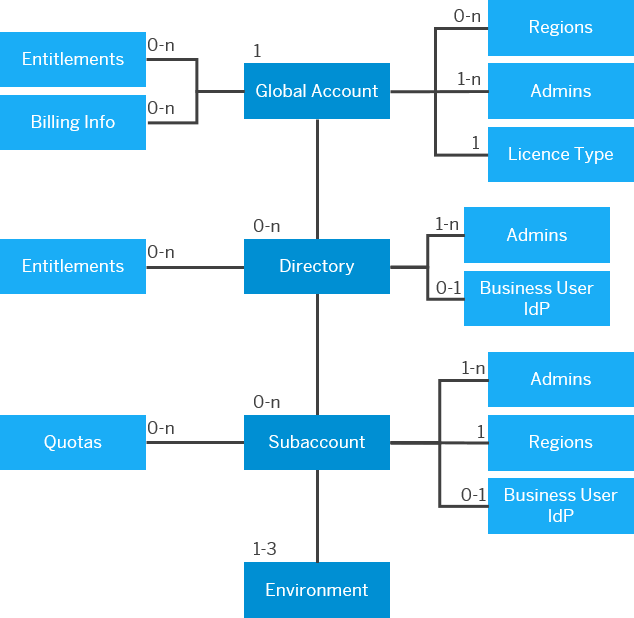
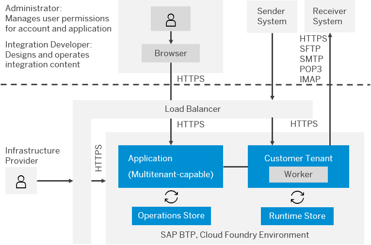
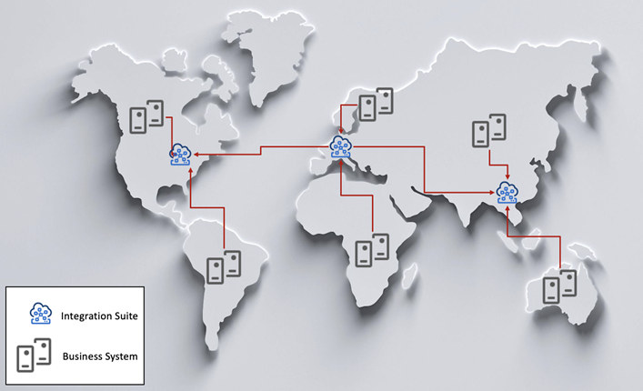

<!-- loioc0b207c20caf4675968e415b23ba1627 -->

# Cloud Foundry

The Cloud Foundry environment allows you to create polyglot cloud applications. It contains the Cloud Foundry runtime for SAP BTP, which is based on the open-source application platform managed by the Cloud Foundry Foundation.

The Cloud Foundry environment enables you to develop new business applications and business services, supporting multiple runtimes, programming languages, libraries, and services. You can leverage a multitude of build packs, including community innovations and self-developed build packs. For more information, see the official [Cloud Foundry documentation](https://docs.cloudfoundry.org/).

The following hyperscales and datacenters are available:

-   Microsoft Azure

-   Amazon Web Services

-   Alibaba

-   Google Cloud

    > ### Restriction:  
    > The availability on Google Cloud is planned for the future and is subject to change. For more information on new features and future releases, access the [Road Map Explorer](http://help.sap.com/disclaimer?site=https://roadmaps.sap.com/board?CB=901B0ED1A0641ED8B4D1230C6387E0DB&range=CURRENT-LAST) and the [What's New section](https://help.sap.com/doc/7ac9748e20cf453a94efda779542d34e/sap.cp.integration.suite/en-US/c10c21cd7c684f0885fa8b5db2982284.html) of SAP Integration Suite.\)

<a name="loioc0b207c20caf4675968e415b23ba1627__section_kp3_fww_qqb"/>

## Account Provisioning

With the cloud-centric model on SAP Business Technology Platform, slightly different terminology is used – **global accounts**, **subaccounts**, and **regions**. License costs are rolled up to the **global account** level which, based on the account type selected, offers different entitlements. The entitlements can then be allocated as quota to **subaccounts**. The quota ensures efficient allocation of services and resources across subaccounts.

Customers can deploy applications in different **regions**. Each region represents a geographical location \(for example, Europe, US East\) in which applications, data, or services are hosted. Regions are provided either by SAP or by our Infrastructure-as-a-Service \(IaaS\) partners Amazon Web Services \(AWS\), Microsoft Azure, Google Cloud, and Alibaba Cloud. The third-party region providers operate the infrastructure layer of the regions, while SAP operates the platform layer and Cloud Foundry.

Separated subaccounts can be provisioned to cater for the different environment requirements at the time so customers could have subaccounts for production, test, development environments etc. Subaccounts can also be provisioned on a temporary basis \(e.g., to support a fixed-time-frame project\) and deleted later, releasing any services and resources used. Since the license costs reside at the global account level, you can have as many subaccounts as needed.

Subaccounts enable companies to have a dedicated dev subaccount per development project. After the development and test phases, the app can be published in one single test subaccount and then one production subaccount. This is especially suited for companies with a focus on continuous integration and continuous delivery, as it creates isolation and independency for the different environments. For more details, see [Account Model 5: Create a Staged Development Environment Per Functional Area](https://help.sap.com/viewer/df50977d8bfa4c9a8a063ddb37113c43/Cloud/en-US/8f5753517acb40d58efc564471f95f52.html) in the Best Practices for SAP BTP.

<a name="loioc0b207c20caf4675968e415b23ba1627__section_csn_3ww_qqb"/>

## SAP Integration Suite on Multi-Cloud

SAP Integration Suite is an enterprise integration platform as a service \(EiPaaS\) that allows you to connect applications, processes, and people with speed and ease. It runs on the hyperscalers and includes different capabilities like Cloud Integration, API Management, Integration Advisor, and Open Connectors to solve integration challenges.

Since Cloud Integration is the main capability used during the migration of SAP Process Integration and SAP Process Orchestration to SAP Integration Suite, it's described in the following chapters.

<a name="loioc0b207c20caf4675968e415b23ba1627__section_rkb_mww_qqb"/>

## Cloud Integration Landscape

The technical approach in Cloud Integration differs from the SAP Process Integration and SAP Process Orchestration landscape. In Cloud Integration, the integration platform is designed as a containerized and clustered integration platform. Messages processed by integration flows from different customers are handled on different parts of the platform \(referred to as tenants\). Tenants processing integration flows from different customers are strictly separated from each other in terms of CPU, data storage, and user access. For more information, see [Technical Landscape, Cloud Foundry Environment](https://help.sap.com/viewer/368c481cd6954bdfa5d0435479fd4eaf/Cloud/en-US/cc22301edf174cc9bf7337c6c66fb704.html)\)

The following diagram describes the high-level architecture of Cloud Integration:

In a Cloud Integration system, you have two key components:

-   Tenant Management Nodes

    The tenant management node represents the web interface of Cloud Integration.

    The following operations can be performed in the web interface:

    -   **Discover**: Discover standard content available on SAP Business Accelerator Hub and copy this content to the tenant workspace.

    -   **Design Content \(Workspace\)**: In the workspace you can:

        -   Configure standard content

        -   Develop custom content

        -   Deploy artifacts \(both standard and custom\) to the runtime \(worker\) node\(s\).

        The content is created within integration packages. A package contains:

        -   Details about the package content \(description, version, vendor, …\)

        -   Documents: Additional resources to describe the content \(files or links\)

        -   Artifacts: integration flows, value-mappings, script collections, REST API, SOAP API, and custom integration adapters. Other artifacts such as referenceable message mappings will become available shortly, and others may be added in the future.

    -   **Monitor**: In this view all monitoring and operation tasks can be executed, including:

        -   Monitor Message Processing: Provides and overview of the processed messages, with the capability to drill down into individual message processing instances to diagnose any issues

        -   Manage Integration Content: Deploy integration artifacts and monitor their deployment status

        -   Manage Security:

            -   Security Material \(Credentials, OAuth, …\)

            -   Keystore \(Certificates\)

            -   Access Policies

            -   JDBC Material

            -   User Roles

            -   Connectivity Test: Testing Connectivity from Cloud Integration to other systems \(SSH, TLS, FTP, SMTP etc.\)

        -   Manage Stores: Data Storage, Variables, Number Ranges, Message Queues

        -   Manage Locks: Message Locks, Design-Time Artifact Locks

-   Worker Node \(runtime container\)

    During the deployment process, an integration artifact is compiled into an executable format and copied to each runtime container. The worker nodes then process messages that are exchanged with external systems or other integration flows.

<a name="loioc0b207c20caf4675968e415b23ba1627__section_xkk_pww_qqb"/>

## Central Architecture

In a central landscape, many business systems are bound to a single integration server. Most customers use this landscape as a starting point as it represents the smallest possible installation footprint and holds associated TCO benefits compared to the other models. For most organizations this model is ideal and caters for central governance and a high reuse of development objects. Global requirements can be met in this architectural model by implementing appropriate security and role-based policies for design time and runtime objects.

The central approach is also the perfect starting point for entering the cloud world, as all business systems connect to a single SAP Integration Suite.

<a name="loioc0b207c20caf4675968e415b23ba1627__section_ykk_pww_qqb"/>

## Distributed \(Model 1\) Architecture

Distributed \(model 1\) models are often found in organizations where performance or security reasons dictate a more complex solution compared to centralization. The distributed \(model 1\) model is a hybrid approach between central and distributed \(model 2\) domain models as it combines the benefits of performance and security with the benefits of centralized governance, maintenance, and monitoring.

A distributed architectural model on SAP Process Orchestration is defined by one integration server integrating with one or more decentrally deployed adapter engines. Since the SAP Integration Suite doesn’t offer distributed runtime nodes comparable to an Adapter Engine yet, this scenario can't be used. As an alternative, the distributed \(model 2\) domain model can be used with the same restrictions and guidelines as the distributed model. With the planned release of the hybrid deployment option, the distributed \(model 1\) architecture can also be resolved with a lightweight runtime in the customer network. The following table describes some aspects of using distributed \(model 1\) architecture:

<table>
<tr>
<th valign="top">

Reason

</th>
<th valign="top">

Description

</th>
<th valign="top">

Behavior in the cloud

</th>
</tr>
<tr>
<td valign="top">

Localization

</td>
<td valign="top">

Local processing of messages reduces network load while improving performance and reliability

</td>
<td valign="top">

The business system can communicate with regional cloud data centers. On ground localization will be available in the future with the hybrid deployment option.

</td>
</tr>
<tr>
<td valign="top">

Business Continuity

</td>
<td valign="top">

-   Downtime minimization

-   Technical abstraction from upgrades & downtime

</td>
<td valign="top">

SAP Integration Suite updates \(monthly\) are done with zero down time. There are up to 4 major upgrades planned on the SAP BTP per year \(up to 4 hours\). Depending on the datacenter location, the updates occur in different time slots.

</td>
</tr>
</table>

<a name="loioc0b207c20caf4675968e415b23ba1627__section_vh1_qww_qqb"/>

## Distributed \(Model 2\) Domain Architecture

Due to the more complex architecture, the distributed \(model 2\) domain model allows greater flexibility, but at the expense of a higher TCO. Organizations that use the distributed \(model 2\) domain model are usually larger in size and require a high degree of abstraction in their landscape.

<table>
<tr>
<th valign="top" colspan="2">

Assessment Summary

</th>
</tr>
<tr>
<th valign="top">

Advantages

</th>
<th valign="top">

Disadvantages

</th>
</tr>
<tr>
<td valign="top">

Local autonomy

</td>
<td valign="top">

TCO

</td>
</tr>
<tr>
<td valign="top">

Flexibility

</td>
<td valign="top">

Governance hard to enforce

</td>
</tr>
<tr>
<td valign="top">

Performance improvements due to local processing

</td>
<td valign="top">

Monitoring / Operation complexity

</td>
</tr>
<tr>
<td valign="top">

Availability and failover possible \(manually\)

</td>
<td valign="top">

Multi Hop Scenarios may be introduced

</td>
</tr>
<tr>
<td valign="top">

Network efficiency

</td>
<td valign="top">

Common Business Process Delivery

</td>
</tr>
</table>

<table>
<tr>
<th valign="top">

Reason

</th>
<th valign="top">

Description

</th>
<th valign="top">

Behavior in the cloud

</th>
</tr>
<tr>
<td valign="top">

Segmentation

</td>
<td valign="top">

-   Geographical

-   Organization and divisional autonomy due to legal or operational reasons
-   Separation of A2A and B2B integration scenarios for security reasons.

-   Separation by process types such as transactional versus master data.

-   Quality of Service obligations

-   Billing requirements based on volume

-   Prioritization of messages

-   Security issues around personal data

</td>
<td valign="top">

Segmentation use cases can be resolved with multiple SAP Integration Suite instances. However, it must be checked if the reasons are still valid.

-   Automatic scaling depending on resource consumption

-   Additional features to ensure data protection

</td>
</tr>
<tr>
<td valign="top">

Business Continuity

</td>
<td valign="top">

-   Downtime minimization

-   Technical abstraction from upgrades & downtime

</td>
<td valign="top">

SAP Integration Suite updates \(monthly\) are done with zero down time. There are up to 4 major upgrades planned on the SAP BTP per year \(up to 4 hours\). Depending on the datacenter location, the updates occur on different time slots.

</td>
</tr>
</table>

Within the distributed \(model 2\) domain architecture, you can have different governance options.

-   **Central**: Similar to the central architecture, development is done in only one specific tenant and then replicated to the required tenants. No changes or new developments are allowed in the other tenants.

-   **Local**: Design-time objects are created and changed in any development system. Local teams are responsible for their own development objects. This limits the reusage and avoidance of redundancy of objects due to local autonomy.

-   **Mixed**: Changes are made centrally and locally, but with strict control mechanisms to ensure some object reuse is possible and redundancies are minimized. This needs to be defined as an enterprise-wide practice by your organization. An example of such a mechanism is enforcing naming conventions or scenario-specific object separation. There could be common or global packages and some specific local packages.

