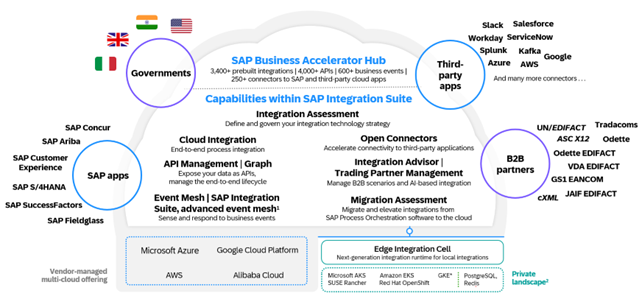
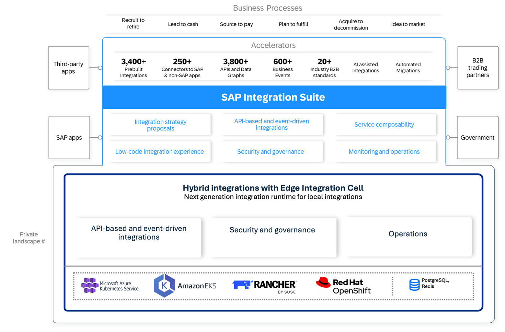

<!-- loio9d1b184ec08f4408b02ce1f4aad88562 -->

# Deployment Models

SAP Integration Suite offers different deployment models for integrating cloud and on-premises systems, the key deployment methods being the **full cloud deployment** and the **hybrid deployment with Edge Integration Cell**. Both approaches are designed to support the growing needs of businesses transitioning to a cloud-based or hybrid integration landscape.

<a name="loio9d1b184ec08f4408b02ce1f4aad88562__section_xlq_kq1_1dc"/>

## Full Cloud Deployment

The full cloud deployment model runs all integration processes in the cloud, leveraging the power and scalability of SAP's global cloud infrastructure across multiple locations and hyperscalers. SAP offers Integration Suite as an integration platform as a service \(iPaaS\) within the SAP Business Technology Platform \(BTP\). Communication between cloud-based integration services and on-premise systems is managed through secure channels such as the [cloud connector](https://help.sap.com/docs/connectivity/sap-btp-connectivity-cf/cloud-connector) or reverse proxy setups.

This model is ideal for organizations that have a mix of cloud and on-premises systems but are moving towards a cloud-first strategy. With this approach, you don't have to worry about infrastructure and complex services, but can deploy Integration Suite in your BTP subaccount and start using it.

### Key Characteristics

-   Cloud-Based Runtime: All message processing and orchestration are handled in the cloud.

-   Secure Communication: On-premise systems communicate with cloud services using HTTPS connections, which ensures secure data transmission through SSL/TLS protocols.

-   Cloud Connector: The cloud connector provides a secure and encrypted connection to integrate on-premises systems without exposing them directly to the internet.

-   Reverse Proxy: Organizations that use a proxy setup must allowlist IP ranges at the data center level.

A full cloud deployment allows you to process your messages entirely in the cloud. The optimal approach is to connect your on-premise systems to the cloud using a [cloud connector](https://help.sap.com/docs/connectivity/sap-btp-connectivity-cf/cloud-connector), which ensures secure and reliable communication. Additionally, you must configure your on-premise systems to allow outbound communication over HTTPS, and consider the necessary firewall or proxy adjustments. Once you've completed these steps, Integration Suite can access SAP or non-SAP on-premise backend systems to process messages.

### Benefits

-   Simplified Operations: Reduced complexity as all integration is handled through cloud services.

-   Security: Encrypted communication using SSL/TLS protocols ensures data integrity.

-   Scalability: Cloud-based deployments offer flexible scaling options based on business needs.

-   Cost Efficiency: Lower infrastructure costs due to minimal on-premise setup.

### Summary

The full cloud deployment is ideal for organizations focusing on cloud-native solutions with on-premise integration using secure internet connections. This deployment model is hosted in multiple regions using hyperscalers around the world to minimize latency in communication between systems. Additionally, it offers robust scalability, allowing you to adjust resources based on demand. The full cloud deployment also provides high availability and disaster recovery capabilities through its reliable and resilient infrastructure. Furthermore, it supports advanced security measures, including encryption and compliance with global standards, to protect sensitive data and maintain regulatory compliance.

<a name="loio9d1b184ec08f4408b02ce1f4aad88562__section_p1z_lq1_1dc"/>

## Hybrid Deployment with Edge Integration Cell

The hybrid deployment option offers a more versatile solution, particularly for organizations that need to keep certain integration processes on-premise due to compliance or security concerns. With [**Edge Integration Cell**](https://help.sap.com/docs/integration-suite/sap-integration-suite/what-is-sap-integration-suite-edge-integration-cell), you can process messages within your on-premise environment while still leveraging the design, management capabilities, and monitoring of SAP Integration Suite's cloud-based UI. Edge Integration Cell is designed to operate without an internet connection for a limited period, which enables you to process messages without an internet connection and enhance the security of the backend systems.

### Key Characteristics

-   Edge Integration Cell Runtime: The message processing runtime is deployed within your on-premise infrastructure and hosted on a [Kubernetes cluster](https://help.sap.com/docs/integration-suite/sap-integration-suite/prepare-your-kubernetes-cluster) using container technology like Docker.

-   Cloud-based Design and Management: While the runtime is on-premise, integration flows are designed, configured, and monitored through the cloud-based web UI of SAP Integration Suite.

-   Compliance and Security: Messages between on-premises systems \(or between on-premises and cloud systems\) are processed locally, ensuring data only leaves the internal network when necessary. This makes the model ideal for scenarios in which sensitive data can't be exposed to the internet, even if encrypted.

-   Seamless Integration: The model supports both cloud-to-on-premise and on-premise-to-on-premise integration.

In a hybrid scenario, you can deploy Edge Integration Cell within your own infrastructure hyperscaler, enabling on-premise message processing. This is particularly useful for businesses with compliance requirements or security restrictions that prevent them from sending certain data through the cloud, even when encrypted. While the design and configuration of integration flows are handled in the cloud, the actual message execution happens on-premise.

### Benefits

-   Local Data Processing: Sensitive data can be processed locally without exposure to the cloud.

-   Greater Control: Since data doesn't leave your internal network unless required, you have more control over data flow and security.

-   Flexibility: The model supports both cloud-to-on-premise and on-premise-to-on-premise scenarios, thereby offering a hybrid solution for complex landscapes.

-   Advanced Integration Features: Leverages the latest cloud integration capabilities while still meeting on-premise needs.

### Summary

The hybrid deployment with Edge Integration Cell offers flexibility for those with complex security or compliance requirements, allowing for on-premise data processing while still benefiting from cloud-based design and management. This model supports API-led integration, which enables you to design, configure, and monitor APIs in the cloud while running them within your private landscape. It also provides enhanced data governance by ensuring sensitive data is processed locally, which is crucial for industries with strict regulatory requirements. Additionally, Edge Integration Cell facilitates seamless integration with existing on-premises systems, offering a smooth transition for organizations moving from traditional to hybrid environments.

**Related Information**  

[What's New in SAP Integration Suite](https://help.sap.com/whats-new/5793247a5d5741beb0decc5b7dee1160?locale=en-US)

[What Is Edge Integration Cell](https://help.sap.com/docs/integration-suite/sap-integration-suite/what-is-sap-integration-suite-edge-integration-cell)

[Setting Up and Managing Edge Integration Cell](https://help.sap.com/docs/integration-suite/sap-integration-suite/setting-up-and-managing-edge-integration-cell)

