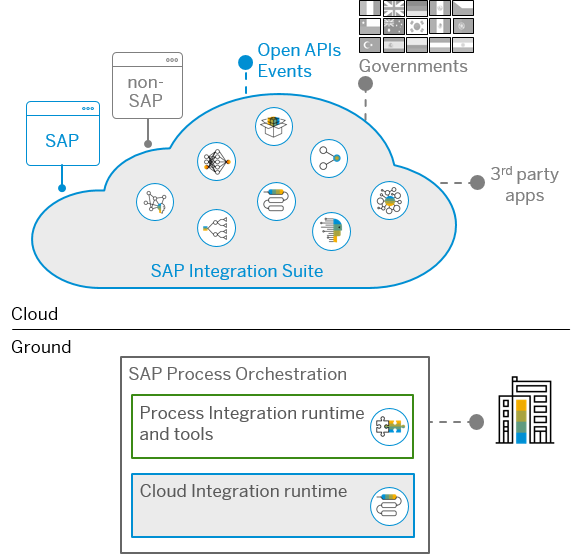
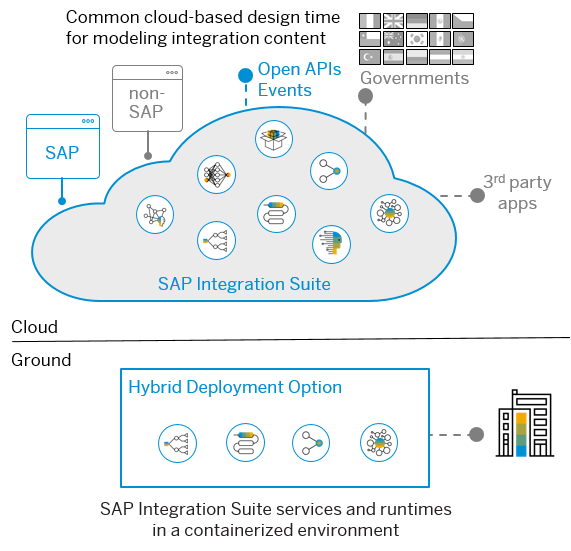

<!-- loioec41d9e834364fff905f5be11bcbafe3 -->

# Future Support of On-Premise Integration

Many customers will still have a strong on-premise landscape and on-premise integration scenarios. This scenario is planned to be supported by a hybrid deployment option to avoid sending data to and receiving data from the cloud.

<a name="loioec41d9e834364fff905f5be11bcbafe3__section_ulp_vxw_qqb"/>

## Cloud Integration Runtime

Today there's already the option to use the Cloud Integration runtime on SAP Process Orchestration. The design and implementation are done in the web UI of Cloud Integration. In the next step, the integration flow is deployed to the Cloud Integration runtime of SAP Process Orchestration. This allows leveraging the newly available features on Cloud Integration to implement integration scenarios, such as on-premise to on-premise.

<a name="loioec41d9e834364fff905f5be11bcbafe3__section_wvk_xxw_qqb"/>

## Hybrid Deployment Option

> ### Restriction:  
> This feature is planned for the future and is subject to change. For more information on new features and future releases, access the [Road Map Explorer](http://help.sap.com/disclaimer?site=https://roadmaps.sap.com/board?CB=901B0ED1A0641ED8B4D1230C6387E0DB&range=CURRENT-LAST) and the [What's New section](https://help.sap.com/doc/7ac9748e20cf453a94efda779542d34e/sap.cp.integration.suite/en-US/c10c21cd7c684f0885fa8b5db2982284.html) of SAP Integration Suite.

SAP is working on providing a lightweight runtime allowing you to have an on-premise runtime, which can be used for all SAP Integration Suite scenarios \(e.g. on-premise to on-premise integration processes\).

-   Design, configuration, and monitoring will be on the cloud

-   The runtime will leverage container technology such as Docker

-   The runtime can hold any SAP Integration Suite services or engines

-   The software lifecycle of the hybrid deployment option shall be in sync with the cloud delivery speed

