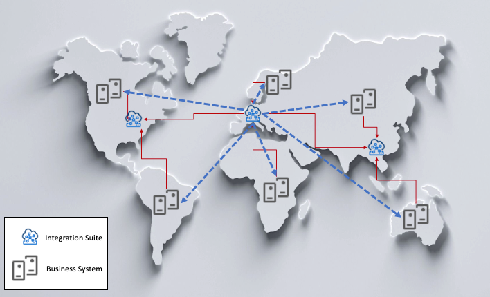

<!-- loio2957369fc53e43b0b20db92399c7a132 -->

# Landscape Aspects

Get an overview of the main aspects of landscape, which are governance, business system communication strategy, software logistics and synchronization, and security utilization.

<a name="loio2957369fc53e43b0b20db92399c7a132__section_wy4_yxt_mqb"/>

## Governance

Governance can be defined by the policies, processes, and procedures that support any IT landscape. In the context of SAP Integration Suite and this guide, governance is defined relative to change management of design time objects in the SAP Integration Suite. Who can change what and where are of relevance in this criterion.

In a distributed \(model 2\) domain model, a decision needs to be made where changes are allowed, for example if changes are done in one central SAP Integration Suite only or regionally and then replicated with appropriate controls. A central governance model is highly recommended as a starting point in distributed \(model 2\) domain scenarios. When this can't be achieved, a mixed mode can be adhered to as described in the following:

-   **Central**

    Design-time objects are created and changed in one development system only and then replicated consistently throughout the landscape as required. No changes are to be made or new objects to be created in other regional domains.

    -   This is the recommended approach in distributed \(model 2\) domain scenarios when it can be applied practically. It may require strict policy enforcement and a higher level of collaboration but the benefits of object reuse and one model for everyone are significant.

    -   The implementation of access policies and user roles for design-time object creation and authoring is recommended.

    Governance in a central deployment model is simplified as there's only one development environment for objects to be created or changed and hence central governance strategy is enforced.

    -   While a distributed \(model 2\) domain scenario may give you greater flexibility, the central model is recommended to guarantee high object reuse and consistency.

    -   The use of developing guidelines \(naming conventions, roles, and authorizations\) can support global requirements and cater to the needs of regional divisions or businesses. Defining these constraints before an implementation is imperative for success and possible future growth.

-   **Regional**

    Design-time objects are created and changed in any development system. Regional SAP Integration Suite instances are responsible for their own development objects and are not replicated. The ability to reuse objects and avoid redundancies is minimized due to local autonomy and resulting loss of control.

    -   At the very least, you should implement naming conventions per region or division so that controlled convergence is still possible in case of consolidation at a later stage.

    -   This mode guarantees isolation of each instance, which may be a business requirement allowing complete autonomy and agility when onboarding or decommissioning segments.

-   **Mixed**

    Changes are to be made centrally and locally however with strict control mechanisms to ensure some object reuse is possible and redundancies are minimized. An example of such a mechanism is enforcing naming conventions or scenario-specific object separation, like transactional relevant objects x master data.

    -   Demarcation of object ownership is recommended. A global SAP Integration Suite instance may be responsible for master data, and local regions handle the transactional scenarios. Or possibly all SAP-centric content is managed globally and local divisions or regions manage legacy system objects and scenarios.

    -   The aim of this mode is to achieve some level of reuse and convention such that redundancies are avoided. This demarcation is specific to each organization.

<a name="loio2957369fc53e43b0b20db92399c7a132__section_pd5_yww_qqb"/>

## Business System Communication Strategy

In any architectural model, a decision needs to be made regarding business system communication strategy. What SAP Integration Suite instance can communicate with what business systems? Should a hub-to-hub or a hub-to-system model be permitted? The following diagram illustrates the differences of the approach.

### Hub-to-Hub Model

This approach normalizes communications between regions or divisions such that each business system belongs to a specific SAP Integration Suite. Any messages or scenarios requiring integration to a given business system must be processed via its nominated integration server. This allows consistent communication paths but requires additional configuration due to the additional hops from integration server to integration server. Consideration must be given to performance implications and possible demarcation options based on protocol.

### Hub-to-Business-System Model

This approach allows each SAP Integration Suite to directly communicate with each business system, which increases the complexity of integration scenarios. Managing such an approach requires a higher level of governance and may be restricted to certain protocols. For simplicity, this diagram only illustrates one integration server communicating with each business system

<a name="loio2957369fc53e43b0b20db92399c7a132__section_im2_zww_qqb"/>

## Software Logistics and Synchronization

**Central**

In a central deployment model, the transport and synchronization of objects are optimized due to a single production instance. As a result, no synchronization is required.

**Distributed \(model 1\)**

In a distributed \(model 1\) deployment model, the transport and synchronization of objects are optimized due to a single production instance. As a result, no synchronization is required.

**Distributed \(model 2\)**

In a distributed \(model 2\) domain deployment model, the transport and synchronization of objects are complex and require careful consideration per integration scenario. It all depends on whether integration scenarios are local or global in nature.

-   If the integration scenarios are local and don’t require multihop to each integration server, the development objects are discrete in scope.

-   If your integration scenarios cross domains and require multihop integration with other integration servers, an increased amount of synchronization is required when promoting scenarios within your landscape.

Generally, the level of distributed \(model 2\) domains and combination of governance models determines how complex your synchronization effort will be. Keep in mind that models are determined by organisation-specific architectural practices.

<a name="loio2957369fc53e43b0b20db92399c7a132__section_dpn_zww_qqb"/>

## Security Utilization

Although this has been covered to an extent within the governance section, it’s important to reiterate the application of security in the context of SAP Integration Suite and distributed architectures. It’s common for organizations to specify they need distributed \(model 2\) domains due to security reasons. SAP Integration Suite offers a feature to configure the access to design-time and runtime artifacts, which allows very strict control. In a global example, you can allow developers in the Europe to only access and change objects they are assigned to, and the same applies to developers in APJ. The recommendation is to thoroughly investigate the application of security as a means to enable central governance and simplify your architecture with a central approach

