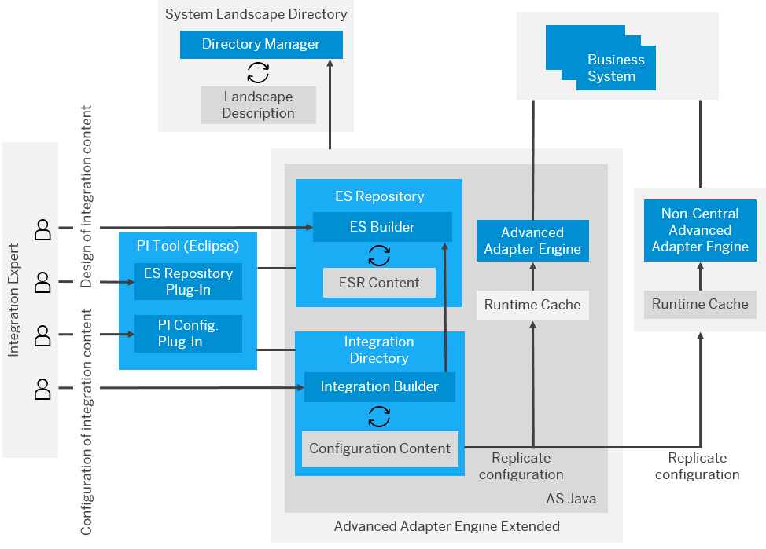

<!-- loioa13372ed809f407e85c8dc9aa47ab9f9 -->

# SAP Process Orchestration Architecture

Get an overview of the architecture and main components of SAP Process Orchestration.

In an SAP Process Orchestration system, there are different tools to define, design, and develop integration scenarios. The following figure illustrates its high-level architecture:

  

The main components of SAP Process Orchestration are the following:

-   **[System Landscape Directory \(SLD\)](https://support.sap.com/en/tools/software-logistics-tools/landscape-management-process/system-landscape-directory.html)**: The SLD is a component of SAP NetWeaver and is implemented with Java technology. It's the central information repository for the system landscape and stores all information related to the installed components of the landscape, which means it also facilitates the easy access to the information of the different systems and software. The information is divided in three categories:

    -   **Landscape**: configuration of the technical systems, landscapes, and business systems.

    -   **Software Catalog**: information about the products and software components.

    -   **Development**: information about the name reservations and CIM instances.

-   **Enterprise Services Repository \(ESR\)**: ES Repository is a central repository that makes it possible to define, design, and create objects to be used in the integration scenario. The repository stores the definitions and metadata of enterprise services and business processes. It also provides a central modeling and design environment for creating and aggregating data models. ES Repository is managed using the **Enterprise Services Builder \(ESB\)**, which is the tool used to develop and access the objects in ES Repository and the **Services Registry**:

    -   **Enterprise Services Builder \(ESB\)**: ESB is used to define and manage objects in ESR. It contains the namespaces, data types, message types, service interfaces \(outbound/inbound\), message mapping, and operation mappings of interfaces.

    -   **Services Registry**: Services Registry represents a registry for Web services and centrally stores information regarding the services within SOA landscape. Contains information related to the services, with references to the WSDL of registered services and endpoints. It provides support for SAP and non-SAP applications and controls the available services in SOA landscape. It's an important source for developers to find the available services in the system landscape that could be reused in integration scenarios.

-   **Integration Directory \(ID\)**: The Integration Directory is used to configure the end-to-end integration scenarios using the objects created in ESR and SLD.

    Objects included:

    -   Integrated Configuration Objects

    -   Communication Channels

    -   Routing between the sender and target systems, and the mappings.

    Related Toolset:

    -   **Integration Builder**: Edit \(create, copy\) and manage the objects in the Integration Directory.

-   **Advanced Adapter Engine \(AAE\)**: With the Advanced Adapter Engine, you can connect SAP systems and non-SAP systems. You use the various adapters in the Advanced Adapter Engine to convert XML- and HTTP-based messages to the specific protocol and format required by these systems, and the other way around.

-   **Cloud Integration Content**: You can deploy, execute, and operate cloud integration content from the SAP Integration Content Catalog in the Advanced Adapter Engine with all the deployment options \(PI-AEX, decentralize Adapter Engine, SAP Process Orchestration and SAP Process Integration dual usage type\). For more information, see SAP Note [2197483](https://launchpad.support.sap.com/#/notes/2197483).

-   **Configuration and Monitoring**: These components provide an overview of the status of the individual components of SAP Process Integration and SAP Process Orchestration and include the capability to perform test message execution to verify that the runtime components are working correctly, test connectivity, check the status of your communication channels or the Java Proxies, etc. For more information, see the section [Error Handling and Logging Strategy](../50-error-handling-and-logging/error-handling-and-logging-strategy-8faa23e.md).

The integrated development environment SAP NetWeaver Developer Studio \(NWDS\) is an Eclipse-based tool that can be used to develop end-to-end scenarios \(interfaces\). In NWDS, it’s possible to create ESR objects and Integration Directory configurations, and to graphically model the message handling within the Process Integration Designer perspective.

With NWDS, you can build end-to-end integrations using integration flows, more plug-ins for development that might be accessed by the perspectives and views, and an integrated runtime view. The SAP Process Integration Runtime perspective allows you to directly navigate into the respective monitoring environments of SAP Process Integration such as message monitoring and channel monitoring. For more information, see [SAP NetWeaver Developer Studio Basics](https://help.sap.com/viewer/5cb5ae1ec9624cd5a9a08d860ca127de/7.5.latest/en-US/82c701ea566e4f8ab1f279f5c1b20f71.html).

