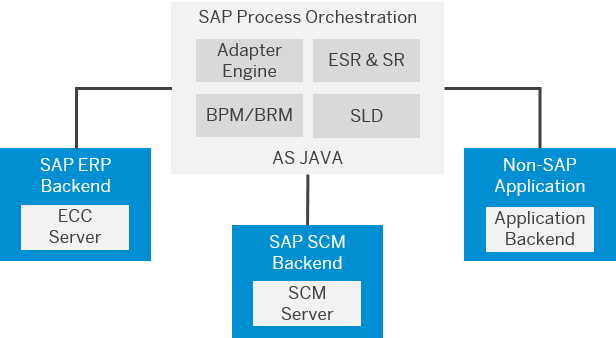
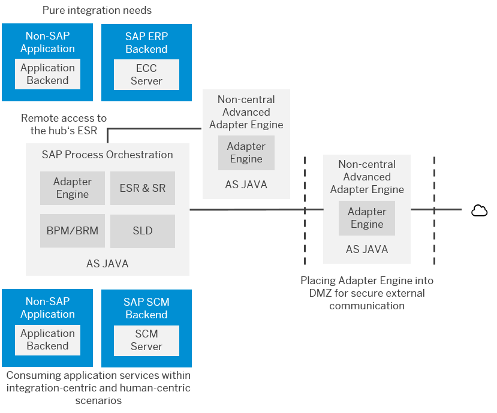
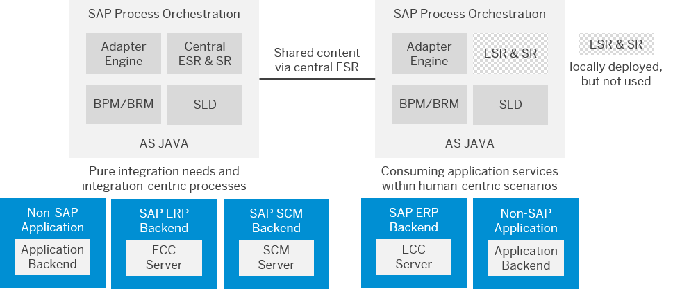

<!-- loio7f4454c98f96406bb6c8846cd369e675 -->

# SAP Process Orchestration Landscape

SAP Process Orchestration offers several landscape deployment solutions that can be categorized as central, distributed \(model 1\), or distributed \(model 2\) domains.

The following section describes the three high-level architectural models in SAP Process Orchestration deployment: [Central](sap-process-orchestration-landscape-7f4454c.md#loio7f4454c98f96406bb6c8846cd369e675__section_rm5_pzj_4rb), [Distributed \(Model 1\)](sap-process-orchestration-landscape-7f4454c.md#loio7f4454c98f96406bb6c8846cd369e675__section_wb5_pzj_4rb), and [Distributed \(Model 2\)](sap-process-orchestration-landscape-7f4454c.md#loio7f4454c98f96406bb6c8846cd369e675__section_vkp_szj_4rb). The scope is to give an overview of architecture topology with specific reference to federation, and not to discuss scaling with respect to performance or high availability.

<a name="loio7f4454c98f96406bb6c8846cd369e675__section_rm5_pzj_4rb"/>

## Central

A single integration server communicating with all business systems. Central deployment of SAP Process Orchestration is a common architecture for most organizations as it represents the smallest possible installation footprint and holds associated TCO benefits.

**Benefits**

-   Less complex system architecture

-   Central governance of metadata
-   Central configuration, monitoring, and administration
-   Support for stateless message processing, and stateful message orchestration

**Considerations**

-   For SAP Process Orchestration, system sizing and configuration must reflect both human-centric and integration-centric scenarios.

<a name="loio7f4454c98f96406bb6c8846cd369e675__section_wb5_pzj_4rb"/>

## Distributed \(Model 1\)

A single integration server with one or more decentralized adapter engines communicating with relevant business systems. It's often found in organizations where performance or security reasons dictate a more complex solution compared to centralization. This is a hybrid approach between central and federated models combining the benefits around performance and security with the benefits from centralized governance, maintenance, and monitoring.

**Benefits**

-   Centralized governance, maintenance, and monitoring
-   Decoupled runtimes and distributed load
-   Separating pure messaging from process orchestration
-   Localization: Reduced message travel time and reduced network load in global networks
-   Business continuity: Minimize planned downtime via switchover
-   Security: Secure deployment of AAE instances in DMZ enforcing network isolation for B2B scenarios

**Considerations**

-   BPM/ccBPM scenarios require central SAP Process Integration / SAP Process Orchestration runtime.

-   For SAP Process Orchestration, two Integrated Configuration Objects are required for scenarios spanning both Adapter Engines.

<a name="loio7f4454c98f96406bb6c8846cd369e675__section_vkp_szj_4rb"/>

## Distributed \(Model 2\)

Two or more integration servers \(domains\) within a single landscape tier communicating with relevant business systems. Use of additional decentralized adapter engines per integration server is also possible and adds a further level of complexity. Due to the more complex architecture, the second distributed domain model allows greater flexibility, however at the expense of a higher TCO. Such organizations are usually larger in size and require a high degree of abstraction in their landscape. Customer-driven reasons include:

-   Organization and divisional autonomy due to legal or operational reasons

-   Separation of A2A and B2B integration scenarios for security reasons

-   Separation by process types such as transactional versus master data

-   Business continuity such as downtime minimization

-   Quality of Service obligations

-   Billing requirements based on volume

-   Security issues around personal data

-   Prioritization of messages

-   Geography

-   Technical Abstraction from upgrades & downtime

In contrast to customer-driven reasons for this model, there are also some SAP-driven reasons such as isolation for upgrade path independency or decoupling of business systems and portal UI bindings.

**Benefits**

-   Separation of SAP Process Integration / SAP Process Orchestration systems due to different reasons, such as technical aspects, business requirements, or geographical distribution
-   Systems can be optimized for their respective use case
-   ESR can be connected to multiple systems
-   Central development and service design

**Considerations**

-   Central ESR requires at least SAP NetWeaver 7.31
-   Increased TCO due to additional administration effort

