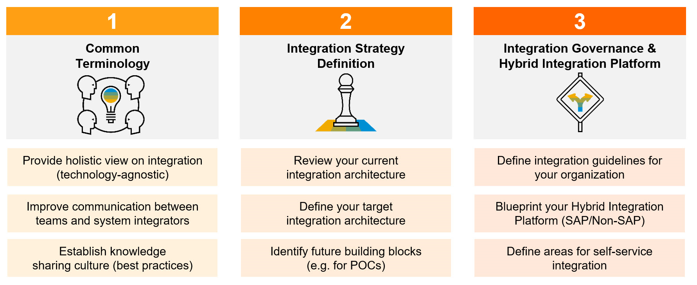

<!-- loio3c445fa975b14e0abddb5af44908128e -->

# Understanding Landscape Requirements

Before starting a migration from SAP Process Orchestration to SAP Integration Suite, assess the current landscape and design the to-be landscape.

For this assessment process, SAP recommends using the [SAP Integration Solution Advisory Methodology](https://blogs.sap.com/2019/02/24/integration-solution-advisory-methodology-isa-m-define-integration-guidelines-for-your-organization/). The goal of SAP Integration Solution Advisory Methodology is to simplify integration and help enterprise architects to manage the complexity in their hybrid landscapes.

There are three use cases on how the methodology can support enterprise architects:

  

One of the first steps of SAP Integration Solution Advisory Methodology is to analyze the as-is landscape and define the to-be landscape. The focus is on the integration landscape, integration domains, integration patterns, and use cases. At this phase, there are no technologies evaluated. This provides a good overview of where the organization currently is and in which direction the organization is evolving in the next years with regards to the integration strategy.

Once the direction of the integration strategy has been mapped out at a high level, a more detailed evaluation of the current technologies used within the SAP Process Integration and SAP Process Orchestration landscape can commence.

[SAP Process Orchestration Architecture](sap-process-orchestration-architecture-a13372e.md) describes the important factors to analyze with regards to the existing SAP Process Integration and SAP Process Orchestration landscape, and the high-level steps to follow to ensure a successful migration.

