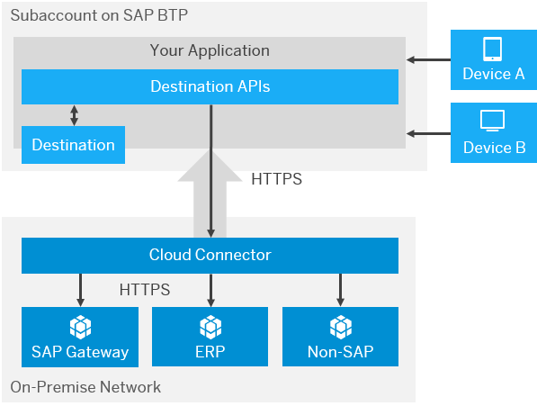
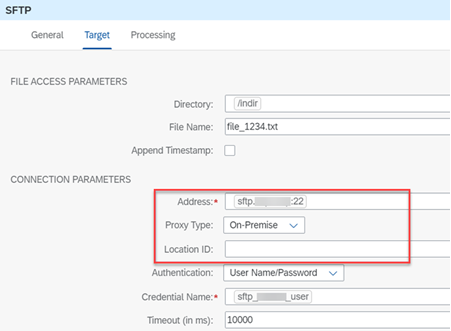

<!-- loiode83ef5b43214011932d2e70ec63f556 -->

# Connecting to On-Premise Systems Using Cloud Connector

Find out how Cloud Connector can help you to connect cloud-based services and on-premise systems.

While businesses across the globe are rapidly adopting a cloud-centric approach to their IT landscapes, many will inevitably end up with a hybrid environment whereby some software systems reside on-premise and others have moved to the cloud as subscription-based services. Due to the requirements imposed by the diverse nature of many business processes and their need to interact with multiple software systems in a fully connected manner, integration between the cloud-based services and the on-premise systems is an inevitable necessity.

SAP Cloud Connector was implemented as a solution to bridge the gap between on-premise and the cloud. The SAP Cloud Connector is an on-premise piece of software that needs to be installed inside your landscape. Once configured and paired with your SAP BTP account, a secure tunnel is established between SAP BTP \(and all the services and applications that run on it\) and the Cloud Connector. This way, all communication between SAP BTP and the backend system gets routed via the Cloud Connector over the secure SSL tunnel. As a result, the access control now only needs to be configured in the Cloud Connector. Despite having a light footprint, SAP Cloud Connector is a secure, richly featured application that provides full logging, auditing, and traceability features together with the capability to be installed as a cluster to ensure high availability.

<a name="loiode83ef5b43214011932d2e70ec63f556__section_yxb_4zk_mqb"/>

## Installation of Cloud Connector

SAP Cloud Connector is freely available to download and install from [SAP Development Tools](https://tools.hana.ondemand.com/#cloud). Several installation types are available providing support for Windows, Linux and Mac OS X.

For more information about how to install Cloud Connector, see [SAP BTP Connectivity](https://help.sap.com/viewer/product/CP_CONNECTIVITY/Cloud/en-US).

<a name="loiode83ef5b43214011932d2e70ec63f556__section_h3f_4zk_mqb"/>

## Setup of Cloud Connector

Cloud Connector can be used to control access for both On-Premise-to-Cloud and Cloud-to-On-Premise communication. However, the On-Premise-To-Cloud scenario is only used when connecting an on-premise application with an SAP HANA database on SAP BTP. Since the SAP Integration Suite can only utilize the feature to set up a connection to on-premise systems, the trigger of the integration scenario must always be SAP BTP.

Currently, the following protocols are supported:

-   HTTP

-   RFC \(currently Cloud Integration only provides an RFC receiver adapter, so no RFC calls from an on-premise application to Cloud Integration are possible\)

-   LDAP

-   TCP \(to support protocols such as SFTP and FTP\)

> ### Caution:  
> TCP-based connections can pose a security risk by permitting unmonitored traffic, so ensure only trustworthy applications have access. Because it uses plain TCP, the Cloud Connector can't see or log any detail information about the calls. Therefore, in contrast to HTTP or RFC \(both running on top of TCP\), the Cloud Connector can't check the validity of a request.
> 
> To minimize this risk, make sure you
> 
> -   deploy only trusted applications on SAP BTP,
> 
> -   configure an application allow list in the Cloud Connector, as described in [Set Up Trust for Principal Propagation](https://help.sap.com/viewer/cca91383641e40ffbe03bdc78f00f681/Cloud/en-US/a4ee70f0274248f8bbc7594179ef948d.html), and
> 
> -   take the recommended security measures for your SAP BTP \(sub\)account, as described in section [Security](https://help.sap.com/viewer/cca91383641e40ffbe03bdc78f00f681/Cloud/en-US/e129aa20c78c4a9fb379b9803b02e5f6.html) in the SAP BTP documentation.

For more information on configuration, operation, and security, see the [Cloud Connector](https://help.sap.com/viewer/cca91383641e40ffbe03bdc78f00f681/Cloud/en-US/e6c7616abb5710148cfcf3e75d96d596.html) help documentation.

<a name="loiode83ef5b43214011932d2e70ec63f556__section_zkh_4zk_mqb"/>

## Example of Use in an Integration Flow

There are different use cases to establish connection to an On-Premise System. In the blog [Cloud Integration - Connect CPI with Your On-Premise Mail Server](https://blogs.sap.com/2020/01/08/cloud-integration-connect-cpi-with-your-on-premise-mail-server/) a connection to an on-premise Mail server is established.

<a name="loiode83ef5b43214011932d2e70ec63f556__section_r2j_4zk_mqb"/>

## Access Control

The Cloud Connector offers the feature to allow only specific services and paths to be exposed to SAP BTP. This can be specified with the Access Control. For help documentation on setting up access for each protocol type, see the following:

-   Access control for [HTTP](https://help.sap.com/viewer/cca91383641e40ffbe03bdc78f00f681/Cloud/en-US/e7d4927dbb571014af7ef6ebd6cc3511.html)

-   Access control for [RFC](https://help.sap.com/viewer/cca91383641e40ffbe03bdc78f00f681/Cloud/en-US/ca5868997e48468395cf0ca4882f5783.html)

-   Access control for [LDAP](https://help.sap.com/viewer/cca91383641e40ffbe03bdc78f00f681/Cloud/en-US/e4ba9b3aad764b38b9c253fdbcfde713.html)

-   Access control for [TCP](https://help.sap.com/viewer/cca91383641e40ffbe03bdc78f00f681/Cloud/en-US/befd4374d33a4833be117d7149b6a103.html)

<a name="loiode83ef5b43214011932d2e70ec63f556__section_iyk_4zk_mqb"/>

## Cloud Integration Using Cloud Connector

Once the appropriate access control has been set up, Cloud Integration can use the Cloud Connector with a simple configuration step in the adapter channel.

The key configuration settings are illustrated in the following graphic using an SFTP adapter as an example:

The first key change is to set the *Proxy Type* to *On-Premise* \(rather than *Internet*\), at which point the *Location ID* field becomes visible. If you have multiple Cloud Connector instances connected to a single SAP BTP tenant subaccount, you need to specify a unique location ID when setting up the connections. In this situation, you must specify the location ID of the correct Cloud Connector you wish to connect to as part of the channel configuration. If you only have a single Cloud Connector instance with no location ID, this can be left blank.

The second key information is the *Address* \(the URL of the target server\) and must correspond to the URL specified in the destination definition.

The last key part is to provide the correct authentication credentials.

