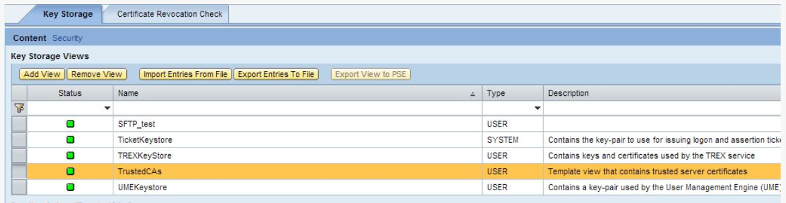
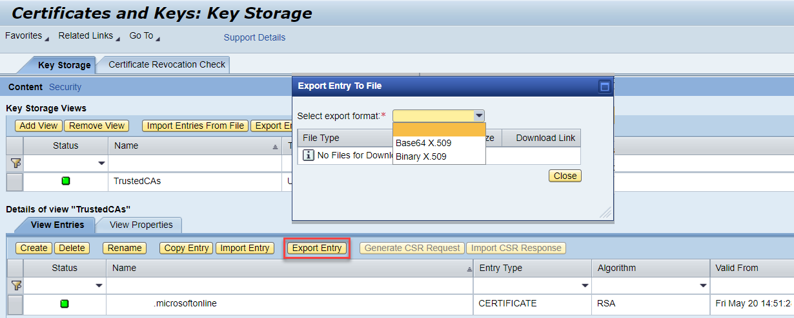

<!-- loio09ec01662efc4886afbbc7e8dddc8bdc -->

# Managing Security Material in Cloud Integration

To securely transmit messages from a source system to a target system via middleware such as Cloud Integration, a number of key types of security components must be stored and managed securely on each Cloud Integration tenant.

These security components can be categorized as follows:

-   [Configure Inbound HTTP Connection](managing-security-material-in-cloud-integration-09ec016.md#loio09ec01662efc4886afbbc7e8dddc8bdc__section_wc4_r4m_mqb)

-   [Security Material](managing-security-material-in-cloud-integration-09ec016.md#loio09ec01662efc4886afbbc7e8dddc8bdc__section_xs1_fyd_mqb) 

-   [Keystore Entries](managing-security-material-in-cloud-integration-09ec016.md#loio09ec01662efc4886afbbc7e8dddc8bdc__section_jhv_gyd_mqb)

-   [Access Policies](managing-security-material-in-cloud-integration-09ec016.md#loio09ec01662efc4886afbbc7e8dddc8bdc__section_dzs_112_mqb)

-   [JDBC Material](managing-security-material-in-cloud-integration-09ec016.md#loio09ec01662efc4886afbbc7e8dddc8bdc__section_nmz_3b2_mqb)

-   [User Roles](managing-security-material-in-cloud-integration-09ec016.md#loio09ec01662efc4886afbbc7e8dddc8bdc__section_smr_jb2_mqb)

Before using such security material to start transmitting or receiving messages, it can be useful to test their validity, for example by executing a connectivity test.

<a name="loio09ec01662efc4886afbbc7e8dddc8bdc__section_wc4_r4m_mqb"/>

## Configure Inbound HTTP Connection

Various sender adapters allow you to enable a sender system to send messages to Cloud Integration over the HTTP protocol. For inbound HTTP connections, a load balancer component connects the remote sender system and the Cloud Integration tenant. There are multiple options of user authentication for user role authorization:

<table>
<tr>
<th valign="top">

Authentication

</th>
<th valign="top">

Description

</th>
</tr>
<tr>
<td valign="top">

[Client certificate authentication](https://help.sap.com/viewer/368c481cd6954bdfa5d0435479fd4eaf/Cloud/en-US/7f84d16aa42741efb08dc9875743e47c.html) 

</td>
<td valign="top">

Using this option, authentication of a sender is performed based on a client certificate. At runtime, the system checks if a service key that contains the client certificate provided by the sender is available. If a service key is available, the system checks if the associated service instance has a role specified that grants permissions to call the integration flow endpoint.

An SAP BTP tenant administrator can generate the [service key](https://help.sap.com/viewer/368c481cd6954bdfa5d0435479fd4eaf/Cloud/en-US/7a9b282981784f399615b2fda3cda062.html) used for certificate-based authentication.

This process is also describes in the blog [How to Set Up Secure HTTP Inbound Connection with Client Certificates](https://blogs.sap.com/2019/08/14/cloud-integration-on-cf-how-to-setup-secure-http-inbound-connection-with-client-certificates/).

</td>
</tr>
<tr>
<td valign="top">

[OAuth with client credentials grant](https://help.sap.com/viewer/368c481cd6954bdfa5d0435479fd4eaf/Cloud/en-US/6c052ce62b27449385d3e75aeeb08f05.html) 

</td>
<td valign="top">

The sender is authenticated based on an OAuth access token. The access token is retrieved in a preceding call from an authorization server.

An SAP BTP tenant administrator can generate the [service key](https://help.sap.com/viewer/368c481cd6954bdfa5d0435479fd4eaf/Cloud/en-US/6c052ce62b27449385d3e75aeeb08f05.html) used for OAuth with client credentials grant.

</td>
</tr>
<tr>
<td valign="top">

[Basic Authentication for a user with client credentials from the service key](https://help.sap.com/viewer/368c481cd6954bdfa5d0435479fd4eaf/Cloud/en-US/647eeb3eca5d4c299009cacd1332247e.html) 

</td>
<td valign="top">

The sender is authenticated based on user credentials that are generated together with a service key.

The steps to create service instance and service key are the same as for the option “OAuth with client credentials grant”. However, during runtime no access token is retrieved. Instead, the values of clientid and clientsecret from the service key are used for authentication.

</td>
</tr>
<tr>
<td valign="top">

[Basic authentication for user registered with an identity provider](https://help.sap.com/viewer/368c481cd6954bdfa5d0435479fd4eaf/Cloud/en-US/5d46e56550a048e99995f23e1e20083a.html) 

</td>
<td valign="top">

The sender is authenticated based on user credentials associated with a user registered at an identity provider \(IDP\).

</td>
</tr>
</table>

<a name="loio09ec01662efc4886afbbc7e8dddc8bdc__section_xs1_fyd_mqb"/>

## Managing Security Material

On the *Operations* page of the Cloud Integration tenant, the *Manage Security* area provides an overview of security-related artifacts. Select the tile *Security Material* to open the area *Manage Security Material*, in which security materials can be created and uploaded.

The following types of security material are supported:

<table>
<tr>
<th valign="top">

Material Type

</th>
<th valign="top">

Description

</th>
</tr>
<tr>
<td valign="top">

User Credentials

</td>
<td valign="top">

Used for Basic Authentication \(with Username / Password combination\)

</td>
</tr>
<tr>
<td valign="top">

OAuth2 Client Credentials

</td>
<td valign="top">

Many Web servers nowadays use OAuth credentials for authorization purposes. Cloud Integration provides the capability to store and use such credentials to allow the system to connect at runtime.

For deployment information, see [Deploying an OAuth2 Client Credentials Artifact](https://help.sap.com/viewer/368c481cd6954bdfa5d0435479fd4eaf/Cloud/en-US/801b106885b14d2788223956ce9786e5.html).

</td>
</tr>
<tr>
<td valign="top">

OAuth2 SAML Bearer Assertion

</td>
<td valign="top">

Used for accessing OAuth protected resources by propagating the user identity

For more information, see the blog [OAuth2 SAML Bearer/X.509 Certificate Authentication Support in SuccessFactors Connector](https://blogs.sap.com/2021/03/26/sap-cloud-integration-oauth2-saml-bearer-x.509-certificate-authentication-support-in-successfactors-connector/).

For deployment information, see [Deploying an OAuth2 Bearer Assertion](https://help.sap.com/viewer/368c481cd6954bdfa5d0435479fd4eaf/LATEST/en-US/3ee658286bac40829fcfa4e0c9044f75.html).

</td>
</tr>
<tr>
<td valign="top">

OAuth2 Authorization Code

</td>
<td valign="top">

This is another form of use of OAuth2: if you use an OAuth2 authorization code, the authentication is performed via a separate authorization server as an intermediary step. The client can exchange the OAuth2 authorization code for an access token that is granted by the authorisation server and typically has a restricted Time-To-Live \(TTL\). This way the actual user credentials are never shared with the client, and the owner of the user credentials can revoke the authorisation code at any time.

For deployment information, see [Deploying an OAuth2 Authorization Code](https://help.sap.com/viewer/368c481cd6954bdfa5d0435479fd4eaf/Cloud/en-US/081bfd7fe8b141219db523491e2b7023.html).

</td>
</tr>
<tr>
<td valign="top">

Secure Parameters

</td>
<td valign="top">

Used to deploy confidential data, for example, key information such as passwords that may be required for custom adapters.

For deployment information, see [Deploying a Secure Parameter Artifact](https://help.sap.com/viewer/368c481cd6954bdfa5d0435479fd4eaf/Cloud/en-US/4641d6c531d34cf7aef94ba5a873bf6e.html).

</td>
</tr>
<tr>
<td valign="top">

Known Hosts \(SSH\)

</td>
<td valign="top">

The known hosts file contains the public keys for all hosts with which the Cloud Integration tenant intends to communicate by using the Secure Shell \(SSH\) protocol.

For deployment information, see [Deploying an SSH Known Hosts Artifact](https://help.sap.com/viewer/368c481cd6954bdfa5d0435479fd4eaf/Cloud/en-US/46da32434a4e4bb8a86c5bf7e7de214d.html).

</td>
</tr>
<tr>
<td valign="top">

PGP Public Keyring

</td>
<td valign="top">

This artifact contains one or more public keys that enable the Cloud Integration tenant to encrypt or verify messages using the Pretty Good Privacy \(PGP\) encryption standard as part of support for Message Layer Security \(MLS\).

For deployment information, see [Deploying a PGP Public Keyring](https://help.sap.com/viewer/368c481cd6954bdfa5d0435479fd4eaf/Cloud/en-US/7f04458e2f3e4493a4337db1d45099a2.html).

</td>
</tr>
<tr>
<td valign="top">

PGP Secret Keyring

</td>
<td valign="top">

This artifact contains one or more public and private key pairs for the usage of Open Pretty Good Privacy \(PGP\). The private key enables the Cloud Integration tenant to decrypt or sign messages as part of Message Layer Security \(MLS\).

For deployment information, see [Deploying a PGP Secret Keyring](https://help.sap.com/viewer/368c481cd6954bdfa5d0435479fd4eaf/Cloud/en-US/9d8e1a9504ed4da0bc9b4377e1f27c9b.html).

For details on how to create a key pair, see [Creating a Key Pair](https://help.sap.com/viewer/368c481cd6954bdfa5d0435479fd4eaf/Cloud/en-US/bb416c51c3d64d3fba03bce1b5d06846.html).

For more information about importing and exporting PGP secret keys, see the blog [Import and Export PGP Secret Key - Change PGP Secret Key Password](https://blogs.sap.com/2021/01/19/cloud-integration-import-and-export-pgp-secret-key-change-pgp-secret-key-password/).

</td>
</tr>
</table>

<a name="loio09ec01662efc4886afbbc7e8dddc8bdc__section_jhv_gyd_mqb"/>

## Managing Keystore Entries

The Cloud Integration Operations view contains the Keystore Monitor. The Keystore Monitor allows a tenant administrator to manage the tenant keystore and its entries \(X.509 certificates and key pairs\).

For more information, see [Managing Keystore Entries](https://help.sap.com/viewer/368c481cd6954bdfa5d0435479fd4eaf/Cloud/en-US/2dc8942e02de4be59bd2afaa3bfdc591.html).

### Migration of Keystore Entries from SAP Process Orchestration to Cloud Integration

The methods to access, import, and export each certificate differ between the systems and the administrative tools. This section provides details on how to migrate certificates in SAP Process Orchestration and Cloud Integration.

**Export Certificate from SAP Process Orchestration**

In SAP Process Orchestration, you can access the keystores by going to *SAP NetWeaver Administrator* \> *Configuration* \> *Security* \> *Certificates and Keys*.

On this page, you can manage the application server Java certificates and keys. For instance, you access the server credentials of multiple virtual keystores called keystore views. The keys and certificates in the keystore views can be used for encryption, identification, and verification purposes when using AS Java functions.

Assuming that the certificate is in *TrustedCAs*, click on that to check the entries associated.

In the details of *TrustedCAs*, select the certificate and select *Export Entry*. Save the key/certificate on your local file system.

By default, SAP NetWeaver Java comes with some keystore views serving different purposes:

-   TicketKeystore \(used for issuing logon and assertion tickets\)

-   UMEKeystore \(contains key-pair used by the UME provider service of the AS Java\)

-   ICM\_SSL\_<instance \_ID\> \(contains the SSL key pair and trusted server certificates for client authentication over SSL\)

-   TrustedCAs \(contains trusted server certificates\)

For more information about how to import a certificate into the keystore view, see [Uploading Certificates to SAP Process Integration](https://help.sap.com/viewer/d0802f41861a4f81a3610d873fdcf148/LBN/en-US/ed2d035ec16d44c387e93602f029cf52.html) and SAP Note [2056672](https://me.sap.com/notes/2056672).

**Importing Certificates to Cloud Integration**

The Keystore Monitor in Cloud Integration allows a tenant administrator to manage the tenant keystore and its entries \(i.e., X.509 certificates and key pairs\).

Connections between a Cloud Integration tenant and a remote system can be secured in different ways, such as basic authentication, client authentication, or OAuth2. Using client authentication, you must maintain these certificates in the keystore.

In Cloud Integration, you can access the *Keystore* tile in the *Manage Security* section.

A keystore typically contains entries that belong to the tenant administrator \(customer\) and entries that are owned by SAP. Each entry is uniquely identified by an alias.

The operations you can perform on a keystore entry depend on whether it's owned by SAP or the tenant administrator. As the tenant administrator, you can, for example, delete or backup entries that are owned by the tenant administrator. SAP can't access or download any keystore entries owned by the tenant administrator.

In Cloud Integration, there’s the concept of security material, which is stored in the tenant and enables the reuse of some parameters such as authentication parameters \(for Basic authentication\), PGP private and public keys \(to support encryption and decryption for Message Layer Security\), and OAuth2 credentials.

<a name="loio09ec01662efc4886afbbc7e8dddc8bdc__section_dzs_112_mqb"/>

## Managing Access Policies

Access Policies serve two purposes: first, to restrict the tasks that can be performed in an artifact at design-time, and second, to restrict the data that can be displayed at runtime level, such as the access to Message Processing Log Attachments, trace data, data stores, and variables.

Access policies provide an extra layer of granularity in terms of controlling how artifacts can be accessed, and by whom, at a deeper level than the standard User Roles provide as part of the standard SAP BTP authorization model.

Currently, access policies can be used to control access to the following integration artifacts and integration content on a Cloud Integration tenant:

-   Integration flows

-   OData API definitions

-   REST API definitions

-   SOAP API definitions

-   JMS message queues

-   Global datastores

-   Global variables

A single access policy can be used to control access to multiple types of objects. The actual names of the objects can be specified by using a specific name, or a regular expression \(e.g., HR, Finance\) can be used to protect multiple objects.

Access policy can help in segregating data even on a single tenant.

### Managing Access Policies, Cloud Foundry Environment

In Cloud Integration, the access policies restrict the access to selected integration artifacts and associated data, provide controlled access, and safeguard the operations from unauthorized users. Thus, access policies are associated with a role and contain references to integration artifacts. It’s possible to group some integration flows and provide protection to the business data processed.

The access policies are defined in the design and runtime of integration artifacts and include the protection of integration flows and artifacts, REST and SOAP APIs, and so on.

To define the access policies in Cloud Integration, follow these steps:

1.  Define a custom role using the platform cockpit.

2.  Define an access policy using the Web UI \(Monitor section\).

3.  Assign the custom role to users of the referenced artifacts.

With the access policies, the following actions are restricted: edit, copy, download, delete, configure, mass delete and download, and simulation of integration flow.

For more information, see [Managing Access Policies, Cloud Foundry Environment](https://help.sap.com/viewer/368c481cd6954bdfa5d0435479fd4eaf/Cloud/en-US/7db3c87f6c744016b7eed9838912e123.html), as well as the blogs [Access policy for securing design artifacts](https://blogs.sap.com/2021/06/07/access-policy-for-securing-design-artifacts-and-control-access-to-integration-flow-in-the-sap-cloud-integration/) and [Access Policies: Defining Roles on Artifact Level](https://blogs.sap.com/2020/06/12/cloud-integration-access-policies-defining-roles-on-artifact-level/).

<a name="loio09ec01662efc4886afbbc7e8dddc8bdc__section_nmz_3b2_mqb"/>

## Managing JDBC Material

On the *Operations* page of the Cloud Integration tenant, the *Manage Security* area provides an overview of security-related artifacts. You open the *Manage JDBC Material* area by clicking the tile *JDBC Material*.

In this section, two types of JDBC-related material are stored:

-   **JDBC Data Sources**: Allow you to create and manage a cluster of artifact connections to interact with a database \(DB\). Each data source contains information on database type, as well as database-specific configuration parameters.

    For more information, see [Managing JDBC Data Sources](https://help.sap.com/viewer/368c481cd6954bdfa5d0435479fd4eaf/Cloud/en-US/4c873fac537248e58767f74e4a74d867.html).

-   **JDBC Drivers**: Typically the tenant administrator configures JDBC drivers on your Cloud Integration tenant to enable you to establish connections to a database managed by a third-party vendor. Your database vendor should provide the driver or the access to download it from their official website.

    For more information, see [Configure JDBC Drivers](https://help.sap.com/viewer/368c481cd6954bdfa5d0435479fd4eaf/Cloud/en-US/77c7d9550e12494eb600ec82496ef215.html).

<a name="loio09ec01662efc4886afbbc7e8dddc8bdc__section_smr_jb2_mqb"/>

## Managing User Roles

A user account represents an individual person and can have one or more roles associated. These roles define the user’s permissions in organizations and spaces. The user role management determines which features users can view, check, access, and what kind of actions users can do. In this case, each role has a set of permissions.

In order to access user roles, in the *Monitor* view, click the *User Roles* tile in the *Manage Security* section. User roles defined by SAP and by the tenant administrator are displayed.

In this app, roles can be added, changed \(only the description\), or deleted. The actual assignment to users in the system must, however, still be performed by an administrator that has the authorization to modify roles, role collections, and role assignment in the SAP BTP Cockpit. This process is described in the section [Securing User Access to Cloud Integration](security-dd0fb21.md).

<a name="loio09ec01662efc4886afbbc7e8dddc8bdc__section_adl_kb2_mqb"/>

## Validating Security Content Through Connectivity Tests

Once security content has been deployed onto a Cloud Integration tenant, it’s good practice to perform connectivity tests between the tenant and the business systems you wish it to connect to where possible. Performing these connectivity tests before sending any messages between the middleware and the business systems avoids any possible loss of messages.

On the *Operations* page of the Cloud Integration tenant, the *Manage Security* area provides an overview of security-related artifacts. You open the *Connectivity Tests* area by clicking the tile titled *Connectivity Tests*.

Currently, testing of the following adapter types is supported:

<table>
<tr>
<th valign="top">

Adapter Type

</th>
<th valign="top">

Description

</th>
</tr>
<tr>
<td valign="top">

TLS

</td>
<td valign="top">

Checks HTTPS connectivity and allows you to verify that certificates are valid and trusted.

</td>
</tr>
<tr>
<td valign="top">

SSH

</td>
<td valign="top">

Allows you to verify access to an SFTP server and verify that the credentials used are accepted by the server. You also have the option to verify access to specific directories on the server. Supported credential types:

-   User credentials

-   Public key

</td>
</tr>
<tr>
<td valign="top">

FTP

</td>
<td valign="top">

Allows verification of access to an FTP server \(on the Internet or on-premise\) and also verifies that the user credentials are accepted \(if authentication is required\).

</td>
</tr>
<tr>
<td valign="top">

SMTP

</td>
<td valign="top">

Allows verification of SMTP connectivity to a mail server. Supported credential types are:

-   Encrypted username/password

-   Plain username/password

-   OAuth2 authorization code

</td>
</tr>
<tr>
<td valign="top">

IMAP

</td>
<td valign="top">

Allows verification of connectivity to an IMAP mail server. Supported credential types are:

-   Encrypted username/password

-   Plain username/password

-   OAuth2 authorization code

</td>
</tr>
<tr>
<td valign="top">

POP3

</td>
<td valign="top">

Allows verification of connectivity to a POP3 mail server. Supported credential types are:

-   Encrypted username/password

-   Plain username/password

</td>
</tr>
<tr>
<td valign="top">

AMQP

</td>
<td valign="top">

Allows verification of connectivity to an AMQP server via either TCP or WebSocket transport protocol. Both Internet-based and on-premise \(via Cloud Connector\) connectivity is supported. Connectivity is via TLS and the test can also validate Server Certificates.

</td>
</tr>
<tr>
<td valign="top">

Kafka

</td>
<td valign="top">

Allows verification of connectivity to a Kafka broker using either SASL or Client Certificates over TLS.

</td>
</tr>
<tr>
<td valign="top">

Cloud Connector

</td>
<td valign="top">

Validates that connectivity to a particular Cloud Connector instance is working. If multiple Cloud Connector instances are connected to the same SAP BTP tenant, the Location ID can be used to uniquely identify the correct target. See later section for details on Cloud Connector.

</td>
</tr>
</table>

For more information, see [Performing Connectivity Tests](https://help.sap.com/viewer/368c481cd6954bdfa5d0435479fd4eaf/Cloud/en-US/d5b2faebc03b4c27b664a35c65ad5a2d.html).

