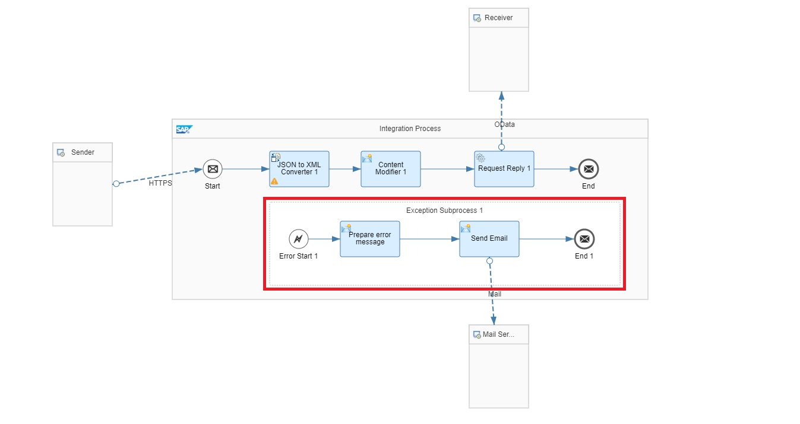

<!-- loio60e4680ed390483e9cd7399642026b0b -->

# Error Handling

Discover the different types of error messages and how they're handled in SAP Process Orchestration and Cloud Integration.

<a name="loio60e4680ed390483e9cd7399642026b0b__section_fsc_gvw_lqb"/>

## Error Messages

There are two types of errors that you can encounter when handling errors in SAP Process Orchestration and Cloud Integration:

-   **Technical Errors**: Errors triggered by the system because of technical issues. These can be a wrong password, the Web Service is down, scheduling error, mapping error, etc.

-   **Business Errors**: Errors triggered by the target application itself. These errors can be, for example, an error while creating a business partner, or a response error while creating a sales order because the material number doesn’t exist in the target system.

In the middleware layer, you normally provide support for technical errors, while for the business errors you only need to assure that the error message is propagated for the source/caller system. Alternatively, you can also use [SAP Application Interface Framework](https://www.sap.com/products/application-interface-mgmt.html) to process the error in the business layer.

<a name="loio60e4680ed390483e9cd7399642026b0b__section_xrs_rkx_xqb"/>

## Error Handling

In SAP Process Orchestration, there’s a built-in mechanism to reprocess asynchronous error messages, or, depending on the business requirements, enable alerts via e-mail and customize a response error message to the source system \(in case of synchronous messages\). For point-to-point interfaces, you have the possibility to configure an error message while designing the interface in Enterprise Services Repository. Some communication channels also count with specific parameters to handle errors \(e.g., REST, SFTP\). When using SAP Business Process Management \(SAP BPM\), you can implement other types of error handling, such as generating a log file to an SFTP server and/or sending an asynchronous message to a third system. The following are the general recommendations while handling errors in SAP BPM:

-   Make the error as specific as possible and provide all the necessary information to facilitate the process for the future administrator who has to handle it.

-   Use boundary events for automated/human activities.

-   Use multiple boundary events to handle different types of exceptions.

-   Create reusable exception processes, if possible, for different processes that share the same error handling.

In Cloud Integration, if you don't use an external system or service to generate alerts via e-mail \(SAP Solution Manager, SAP Cloud ALM, SAP Alert Notification service for SAP BTP\) or use an asynchronous adapter with native support for reprocessing \(AS2, AMQP, JMS\), you can achieve both capabilities implementing exception subprocesses directly into the integration flow:

For more information about how to use exception subprocess, see [Define Exception Subprocess](https://help.sap.com/viewer/368c481cd6954bdfa5d0435479fd4eaf/Cloud/en-US/690e0784c90342669a5f1461ae65b95f.html) in the documentation for Cloud Integration.

For documentation about best practices while handling errors in Cloud Integration, see [Handle Errors Gracefully](https://help.sap.com/viewer/368c481cd6954bdfa5d0435479fd4eaf/Cloud/en-US/42c95f752c8d4b4cad98b7608223424f.html).

If you want to access the delivered package for Cloud Integration with some examples of integration flows with error handling, go to the [API Business Hub](https://api.sap.com/package/DesignGuidelinesHandleErrors?section=Overview) or access it directly from the Cloud Integration tenant.

