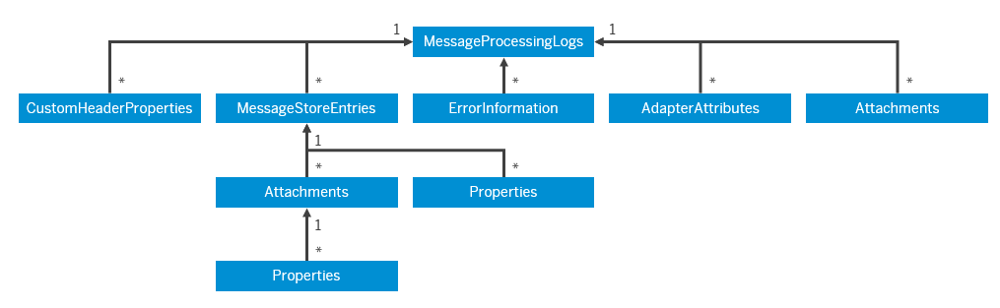
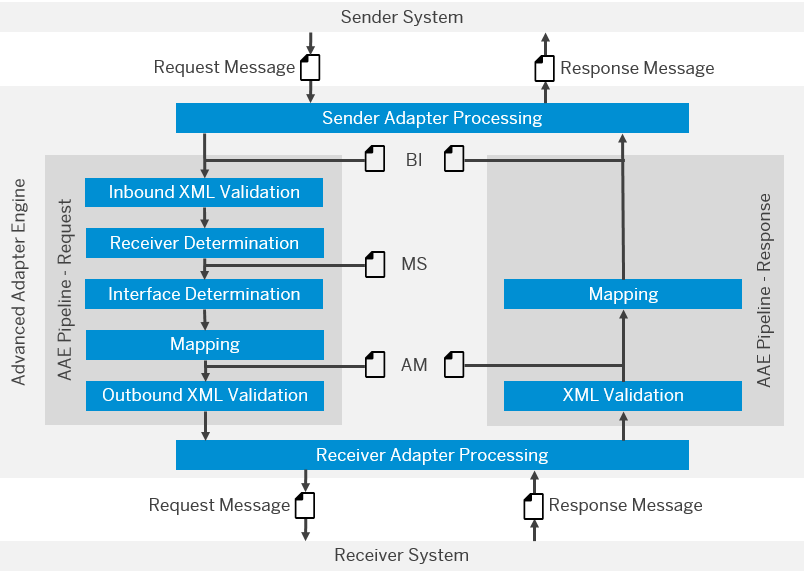
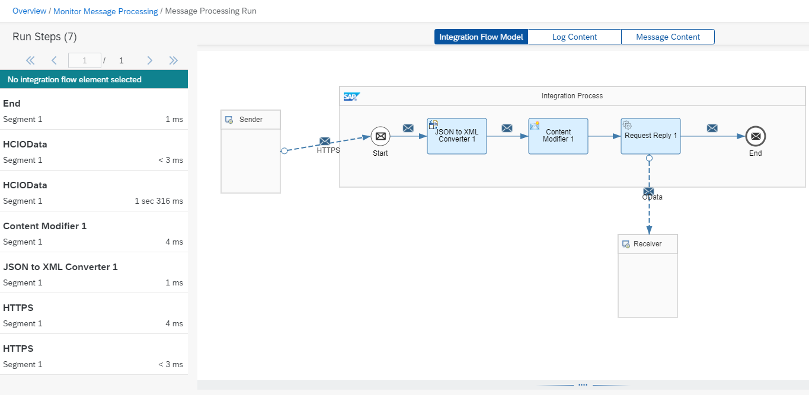

<!-- loiofa01783eab8f4dee94fe6ec7dc16e9ee -->

# Logging

Learn about different ways to do logging and tracing in SAP Process Orchestration and Cloud Integration.

<a name="loiofa01783eab8f4dee94fe6ec7dc16e9ee__section_agd_rww_lqb"/>

## Message Staging and Logging

While Cloud Integration is hosted on hyperscalers with a restricted database per tenant and not administered by the customer, an SAP Process Orchestration on-premise installation varies from customer to customer and is usually managed by the customer or a partner. This means that in SAP Process Orchestration, you must maintain parameters for housekeeping, archiving, etc. For more information on how to change the message logging periods in SAP Process Orchestration, see the following help documentation:

-   [Configuring Message Logging](https://help.sap.com/viewer/5cf7d2de571a45cc81f91261668b7361/7.5.latest/en-US/7ac83c3c90b74c1f9a00d761496e28ea.html)

-   [Persist duration time at the Adapter Engine for synchronous and asynchronous messages](https://wiki.scn.sap.com/wiki/display/XI/Persist+duration+time+at+the+Adapter+Engine+for+synchronous+and+asynchronous+messages)

-   [Configuring Message Retention](https://help.sap.com/viewer/6dbe2ddcde6a4087858c533f8032445b/7.5.latest/en-US/66ca97663c22403cb111a28cc88027d9.html)

In Cloud Integration, there are three different types of logs:

-   **Audit Log**: Stores information on system changes. The retention time in database is 30 days.

-   **System Log**: Stores information on HTTP requests or default trace files. The retention time in database is 7 days.

-   **Message Processing Log \(MPL\)**: Stores information on every message processed on a tenant and all their relative details such as attachments, processing steps, etc. This is the data model for the Message Processing Log entity:

The retention time in the database for the messages is 30 days. The retention time and method may change for each log type in the future. For more information, see [Specific Data Assets](https://help.sap.com/viewer/368c481cd6954bdfa5d0435479fd4eaf/Cloud/en-US/f9223443fb8b43abb602332d9be94cce.html).

[Data Store](https://help.sap.com/viewer/368c481cd6954bdfa5d0435479fd4eaf/Cloud/en-US/1aab5e9482f545539a7caae3e9887e4e.html) is another option for developers in Cloud Integration who need to keep messages or attachments for a longer period. Data Stores are collections that can be created to store or read temporary messages. Possible use cases are:

-   Collect error messages in a data store. A scheduled integration flow can collect all those error messages and send a summary of those errors via email to the IT Team or automatically create support tickets.

-   Receive different asynchronous messages \(with different data types\) and wait before composing a full enriched target message. This is common in Commerce Cloud integrations. In SAP Process Orchestration, you could only do something similar using SAP BPM.

Although the data stores are a powerful resource, they must not be used as a database to keep data indefinitely. For more information about the guidelines while using data store, see [Data Storages](https://help.sap.com/viewer/368c481cd6954bdfa5d0435479fd4eaf/Cloud/en-US/a836b4e38d1a45f6be7071b9b697c2a3.html) in the Cloud Integration documentation.

If long-term storage of message logs or data is required \(for example, for legal or compliance reasons\), it’s recommended to use a separate storage mechanism such as a separate SAP HANA database instance and publish APIs that can be invoked from Cloud Integration to post any data. However, keep in mind that the introduction of these capabilities increases the processing time for integration flows.

<a name="loiofa01783eab8f4dee94fe6ec7dc16e9ee__section_kxm_sfd_mqb"/>

## Trace

When doing troubleshooting in SAP Process Orchestration, you may need to access the message payload in all its phases, for example, right after SAP Process Orchestration receives the message from the sender, before and after the internal operation mapping, and more. The following overview provides each message log step:

You can enable the log of each message trace level as described in the section [Message Staging and Logging](logging-fa01783.md#loiofa01783eab8f4dee94fe6ec7dc16e9ee__section_agd_rww_lqb). Alternatively, you can change it directly in your Integrated Configuration object by going to *Edit Integrated Configuration* \> *Advanced Settings*. In section *Staging*, select *Use scenario-specific configuration*, and for *Message Preparation*, select *Store*. In section *Logging*, select *Use scenario-specific configuration*, and for *Receiver Determination* and *Mapping*, select *Log*.

After activating it, you can access the message details page in message monitor and display all the relevant steps.

In Cloud Integration, if you need to find out how a message is processed and transformed at runtime, an option is to run the related integration flow with the logging level set at Trace. Unlike SAP Process Orchestration, in Cloud Integration you don't need to redeploy your integration flow to activate the trace feature. With this level of logging turned on, you can then use the log monitor to examine the Message Payload, as well as the Properties and Header values that exist in each step in the integration flow execution:

For more information, see [Tracing the Execution of an Integration Flow](https://help.sap.com/viewer/368c481cd6954bdfa5d0435479fd4eaf/Cloud/en-US/4ec27d358d844c96b3ae11febd440eac.html).

If the traces contain sensitive data, they can be protected with access policies. For more information, see [Managing Access Policies, Cloud Foundry Environment](https://help.sap.com/viewer/368c481cd6954bdfa5d0435479fd4eaf/Cloud/en-US/7db3c87f6c744016b7eed9838912e123.html).

