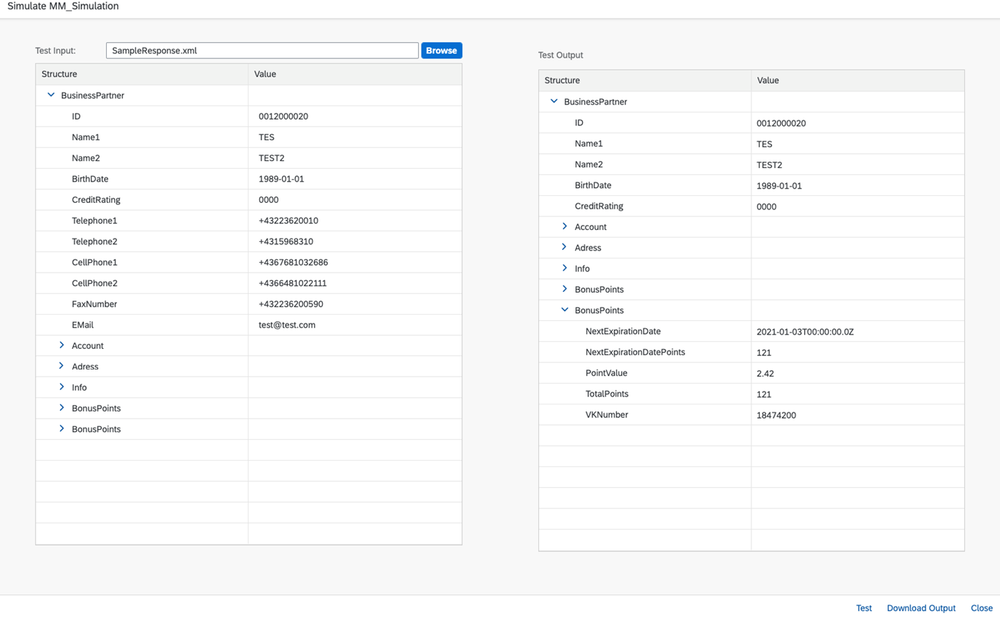
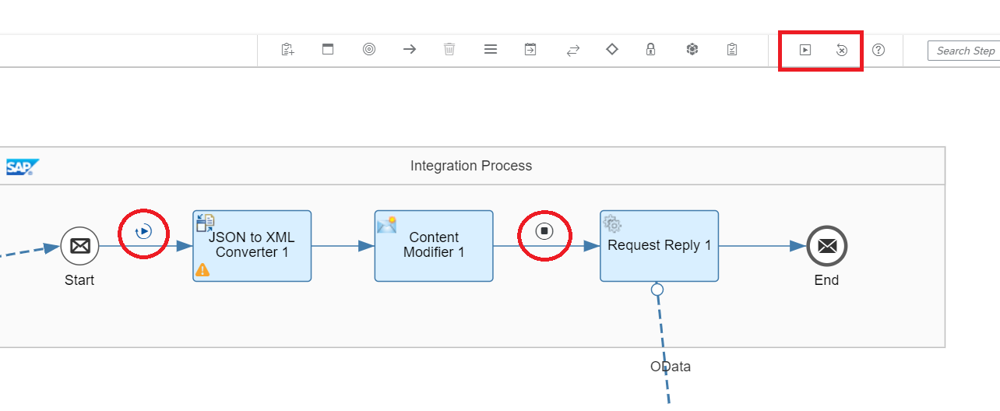

<!-- loioad7823647e1442ada5910295419918cc -->

# Simulation

While developing the interface, you need to test your message mapping, or in Cloud Integration, test part of your integration flow. To do so, both SAP Process Orchestration and Cloud Integration provide features to support this development activity.

In SAP Process Orchestration, you can test your message directly in the monitoring page as described in SAP Note [2367889](https://me.sap.com/notes/2367889). In Enterprise Services Repository, you can also test your message in the message mapping and operation-mapping level. For more information, see [Test Environment for Operation Mappings](https://help.sap.com/viewer/0b9668e854374d8fa3fc8ec327ff3693/LATEST/en-US/4bf411c6c0c33de4e10000000a42189e.html).

A more robust tool that allows you to set up automatic tests for existing SAP Process Integration scenarios and to reduce the business downtime is the SAP Process Integration Test Tool. For more information, see [SAP Process Integration Test Tool](https://help.sap.com/viewer/adce595d012841ceb85db272fbd9e5f5/7.5.latest/en-US).

In Cloud Integration, there are two different options to test an integration scenario: **simulating a mapping** or **simulating an integration flow**.

**Simulate Mapping**

Similar to the SAP Process Orchestration mapping test, within the *Design Environment* of an integration flow open a Message Mapping and click *Simulate*. In the next step, it's required to upload a source file as input for the simulation. Afterwards, the simulation can be executed with the *Test* button, and the result is displayed.

In Cloud Integration, you can use the *Display Queue* functionality, previously available in SAP Process Orchestration, to examine the context queue of any target element. The result mapping can also be downloaded if needed.

For more information, see the blog [Message Mapping Simulation in SAP Cloud Platform Integration](https://blogs.sap.com/2017/05/26/message-mapping-simulation-in-sap-cloud-platform-integration/).

**Simulate Integration Flow**

When developing your integration flow, you can use a simulation feature that allows you to simulate parts of your integration process or all of it. At various steps in your integration flow, you can set a *Simulation Start* point and inject the input data. If you don't want to execute the integration flow until the end, you can also specify a *Simulation End* point:

For more information, see [Simulation of an Integration Flow](https://help.sap.com/viewer/368c481cd6954bdfa5d0435479fd4eaf/Cloud/en-US/2e2210b6db0c4fdb937b3a57d952f582.html) and the blog [Integration Flow Simulation in Cloud Integration](https://blogs.sap.com/2020/04/13/integration-flow-simulation-in-sap-cloud-platform-integration/).

