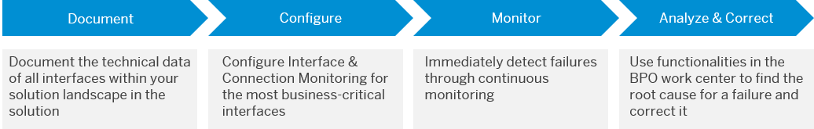
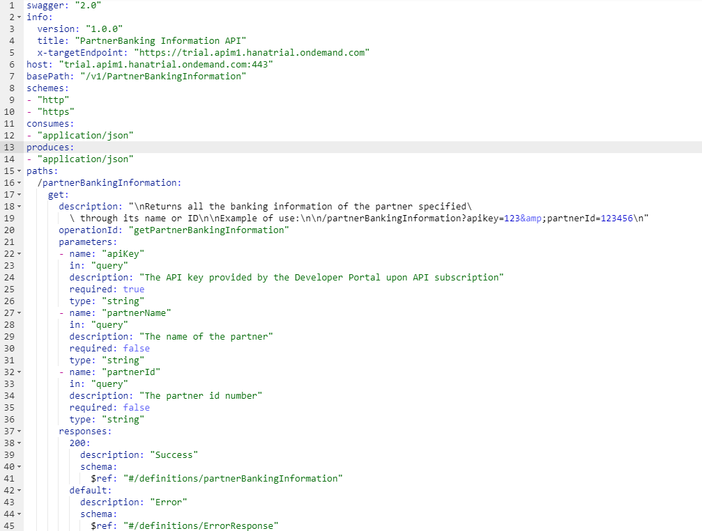
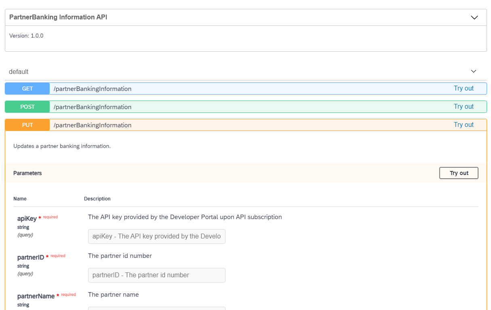

<!-- loio290ede0489be41928543d3ec666ee143 -->

# Interface Documentation

SAP Solution Manager 7.2 makes it possible to manage the interface documentation and document it sustainably.

Interface Documentation in SAP Solution Manager 7.2 as part of Solution Documentation provides the possibility to centrally document interfaces in the solution landscape. All interface technologies that exist in an SAP landscape are available, including SAP PI interfaces where the processing is done through different kinds of adapters. Each interface can be specified individually, as every interface technology provides a set of so-called interface attributes that come out-of-the-box. In case further interface attributes are needed, it’s possible to create custom attributes and use them in the same way as the attributes delivered by SAP. Moreover, custom-specific interface technologies can be defined in case the standard technologies are insufficient to describe the interface properly.

Moreover, many customers still use offline documents like spreadsheets to list their interfaces, which are cumbersome to handle and often pose the risk that data gets lost or outdated information is used because of improper document management. The Interface Documentation application aims at replacing this type of maintenance mode. Although it's some initial effort to transfer the offline documentation into the SAP system, it's worthwhile to do so. Interfaces and their attribute data can then benefit from all features Solution Documentation provides. For example, different versions of the same interface can exist in parallel, and attribute data for the same interface can vary per site or system role.

In addition, integration with the Interface & Connection Monitoring application is available: interface attribute data maintained in Interface Documentation can be used to configure Interface Channels for monitoring & alerting, without having to enter the same data into the system again. This integration reflects the best practice-like approach for Interface Management in SAP Solution Manager as indicated in the following figure.

  

For more details and setup instructions, see the wiki page [Interface Documentation for Solution Manager 7.2](https://wiki.scn.sap.com/wiki/display/SM/Interface+Documentation+for+Solution+Manager+7.2) and the blog [Interface Documentation with SAP Solution Manager](https://blogs.sap.com/2020/04/16/interface-documentation-with-sap-solution-manager/).

<a name="loio290ede0489be41928543d3ec666ee143__section_qhh_htz_mqb"/>

## Documenting APIs with OpenAPI

For a more developer-oriented method to generate interface documentation, you can create API specifications that are available for all the developers that will use it in the future.

In SAP API Management, you can design you own RESTful API definitions using the API Designer UI and [OpenAPI specification](https://github.com/OAI/OpenAPI-Specification/blob/main/versions/3.0.2.md) \(formerly known as Swagger Specification\).

With that, you can describe and document different aspects of your API using a language-agnostic syntax, including:

-   Available endpoints and methods \(e.g., GET, POST\)

-   Input and output for each operation

-   Authentication methods

-   Description of usage, license, terms, and other information.

With the OpenAPI specification, you can import it in different tools for different purposes \(test generation, client code generation, server code generation\) or you can also import into SAP API Management to generate the APIs proxy.

For more information about how to use API Designer, see [Create an API from API Designer](https://help.sap.com/viewer/66d066d903c2473f81ec33acfe2ccdb4/LATEST/en-US/26e1bbd2f3864b53a288e25786eb94e0.html).

For more information about how to import OpenAPI \(Swagger\) files into API Management, see [Import an API](https://help.sap.com/viewer/66d066d903c2473f81ec33acfe2ccdb4/LATEST/en-US/9342a932441e45cd9636eb0a01a89958.html).

For more about how to create API services using OpenAPI, see the blog [Develop and Manage API-first Enterprise Microservices in API Management](https://blogs.sap.com/2017/12/13/sap-api-management-api-implementation-and-management-on-cloud-foundry-part-1/).

