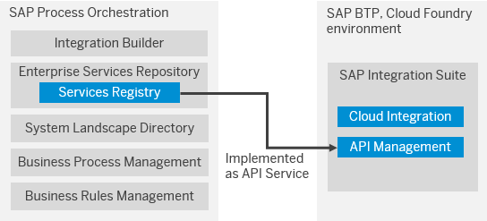

<!-- loio0b47fd88cef54fa08f534b6760bb62cf -->

# Services Registry to API Management

Find out more about the API Management capability.

The API Management capability comes with the objective to create an enterprise-wide governance, secure and harmonized experience for customers, partners and employees while consuming exposed APIs. API Management isn't only a service to gateway some particular API, but it also counts with a try-subscribe developer portal for external parties, real-time insights, and analytics on the API traffic and meter/monetization possibilities.

The following image shows how you can position the API Management while migrating from SAP Process Orchestration:

You can find more details about the API Management capability and how to provision it under the following links:

-   [What is API Management](https://help.sap.com/viewer/66d066d903c2473f81ec33acfe2ccdb4/Cloud/en-US/0aef7634df25497896abf18faac8a1ce.html)

-   [Initial Setup for API management](https://help.sap.com/viewer/66d066d903c2473f81ec33acfe2ccdb4/Cloud/en-US/65c51104497e4ad1ac12d273e8cee2d2.html)

-   [Enable SAP Cloud Platform API Management in Cloud Foundry Environment](https://blogs.sap.com/2020/06/22/part-1-enable-sap-cloud-platform-api-management-in-cloud-foundry-environment/)

