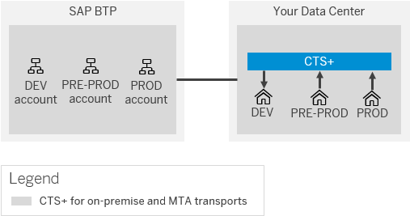
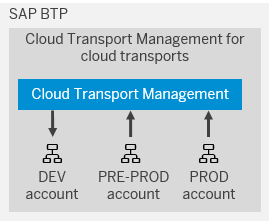
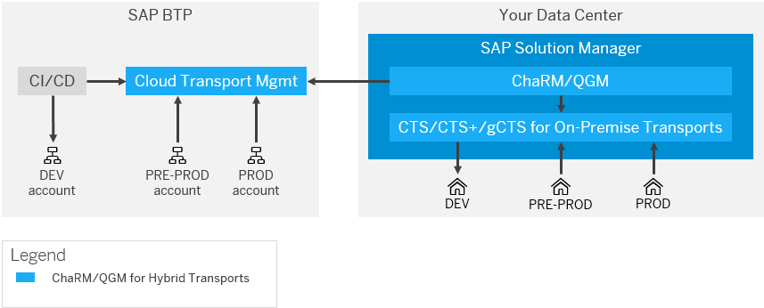

<!-- loio085fb3419c9640dfae9f5f5653bf0c9b -->

# Transport Management Options

Learn more about the different transport management options that are available to you, including Enhanced Change and Transport System \(CTS+\), SAP Cloud Transport Management service, and SAP Solution Manager.

<a name="loio085fb3419c9640dfae9f5f5653bf0c9b__section_dqq_4lz_mqb"/>

## Multi-tier Environments

For SAP Process Integration and SAP Process Orchestration, it's recommended to set up separate landscapes for development, test, and productive system. In any organization using Cloud Integration as their integration middleware service, there's typically what is commonly referred to as a multi-tier environment, like in PI/PO. In both cases, this concept supports the capability for an organization to have a ‘live’ production middleware service in place that handles the actual movement of business messages between production systems, while still being able to develop, perform quality assurance, and fix and test new or revised integration content before deploying to production where the real business processes are performed.

The minimum number of tiers possible is a 2-tier system comprised of a development \(Dev/Test\) tenant and a production tenant.

Many larger organizations, however, opt for a much larger multi-tier environment such as:

-   3-tier: **Development \(Dev\)** → **Test \(or Quality Assurance System\)** → **Production \(Prod\)**

-   4-tier: **Development \(Dev\)** → **Test** → **Preproduction \(Pre-Prod\)** → **Production \(Prod\)**

Preproduction is typically closer in size to production \(in terms of resources such as memory and CPU\) and traditionally would be used for performance and volume testing, analysis of any bugs detected in production. It's often deemed as part of the production landscape and used for live support.

In some situations, organizations may opt for even more development and test tenants to support either multiple projects on the go, depend on the dimension of the project, segregate development by geographical region, by business function \(e.g. separate HR, Finance\). One of the benefits of multi-tier landscape is the possibility to perform tests in parallel with the developments or numerous other reasons.

For more information, see the blog [Multitenancy Architecture on SAP Cloud Platform, Cloud Foundry environment](https://blogs.sap.com/2018/09/26/multitenancy-architecture-on-sap-cloud-platform-cloud-foundry-environment/).

<a name="loio085fb3419c9640dfae9f5f5653bf0c9b__section_yx5_4lz_mqb"/>

## Managing Environments

Governing, and managing the proper testing and audited transport of integration objects between the different tier systems can become complex. It remains equally critical that only properly tested and signed-off integration objects reach the production tier in a synchronized manner to ensure business continuity and prevent any breakdown in business processes. To aid in this governance process, SAP provides tools, products, and services to manage this governance process. The current toolset available is summarized in the next sections.

<a name="loio085fb3419c9640dfae9f5f5653bf0c9b__section_ktw_4lz_mqb"/>

## Enhanced Change and Transport System \(CTS+\)

Enhanced Change and Transport System \(CTS+\) was originally designed to handle ABAP-based objects in on-premise systems as well as non-ABAP content such as the java-based objects from SAP Process Integration and SAP Process Orchestration. CTS+ is a tool that supports all development workbenches and applications.

It allows to attach the objects developed/created to a CTS+ transport request. When the development objects are ready to be tested in quality environment, for example, the request should be released. After this step, it's not possible to add or change the objects already released and for other changes, a new change request must be created. CTS+ provides a unified transport tool and simplifies the execution of imports in a new environment.

Since all transports are logged in CTS+, it’s possible to have an overview of the status of the change requests, like the errors that could happen during the transport, which allows you to quickly solve the issues. You can also check if a change request was already executed and the ones that are planned.

For more information, see [Transporting Non-ABAP Objects in Change and Transport System](https://help.sap.com/viewer/4a368c163b08418890a406d413933ba7/202009.002/en-US/bb6fab6036a146baa58e42fac032ab7b.html).

CTS+ has been extended to handle transports in SAP BTP:

-   CTS+ can transport in Cloud Foundry environment.

-   The transports are based on Multitarget Applications \(MTA\) and cover:

    -   Development artifacts

    -   SAP Integration Suite

-   CTS+ can only be used for organizations that intend to adopt a hybrid approach in which some systems remain either on-premise or choose to opt for the Private Cloud Edition \(PCE\) for SAP Solutions such as SAP S/4HANA and SAP Solution Manager.

-   Note that the ABAP server acting as CTS+ control system \(in many cases an SAP Solution Manager\) resides in your on-premise data center even for the SAP BTP transports.

For more information, see [Transporting Multitarget Applications in Cloud Foundry using CTS+](https://help.sap.com/viewer/65de2977205c403bbc107264b8eccf4b/Cloud/en-US/c9a406970bb84b37ae8a5a5620ae0739.html), the [support page for CTS+](https://support.sap.com/en/tools/software-logistics-tools/enhanced-change-and-transport-system.html), and the blog [Setting up a CTS+ enabled transport landscape in SAP Cloud Platform](https://blogs.sap.com/2017/03/29/setting-up-a-cts-enabled-transport-landscape-in-sap-cloud-platform/).

<a name="loio085fb3419c9640dfae9f5f5653bf0c9b__section_dzy_4lz_mqb"/>

## SAP Cloud Transport Management Service

The SAP Cloud Transport Management service is a new service that has been built directly on the SAP BTP to support the transport of not only integration artifacts and application-specific content for Cloud Integration, but also other cloud-based development objects built using the various technologies \(e.g., Java, Node.JS, SAPUI5\) available on SAP BTP.

SAP Cloud Transport Management allows you to manage software deliverables between accounts of different environments \(like Cloud Foundry environment\) by transporting them across runtimes. It's a multi-tenant application and provides a tenant separation.

Cloud Transport Management has the following capabilities:

-   It's the officially recommended solution for transporting in the cloud

-   It can transport development artifacts \(via MTA\) and application-specific content

-   It will cover further content types in the future \(see the [roadmap for SAP Cloud Transport Management](https://roadmaps.sap.com/board?PRODUCT=73554900100800001901&range=CURRENT-LAST)\)

-   It covers the SAP BTP, Cloud Foundry environment and is planned to be extended to further multi-environments and to SAP SaaS solutions \(such as SAP Cloud Price Quote\)

-   Cloud Transport Management and CTS+ can be used in parallel: Cloud Transport Management for cloud transports, and CTS+ for ABAP and non-ABAP on-premise transports.

-   Cloud Transport Management is not planned to cover on-premise transports.

For more information, see the [SAP Cloud Transport Management documentation](https://help.sap.com/viewer/7f7160ec0d8546c6b3eab72fb5ad6fd8/Cloud/en-US/5fef9d6b1cb047b2b18d9eb57aa15352.html).

<a name="loio085fb3419c9640dfae9f5f5653bf0c9b__section_vm1_plz_mqb"/>

## SAP Solution Manager

SAP Solution Manager is a centralized application management and administration solution used to implement, operate, and monitor SAP solutions. It’s useful to manage the lifecycle of an SAP solution and provide integrated content, tools, methodologies, and access to SAP systems. It ensures reliability and stability of solutions.

Some benefits of using SAP Solution Manager are the efficient project administration, control of cross-component implementations, minimizing the risk and increasing the reliability of solutions, and speeds up test preparation and execution. SAP Solution Manager can store the testing materials and test results to support cross-component tests.

It’s also possible to manage documentation of interfaces, as describes in [Interface Documentation](interface-documentation-290ede0.md).

For more information, see the [support page for SAP Solution Manager](https://support.sap.com/en/alm/solution-manager.html).

In a hybrid environment, any changes or new development can involve development objects that span both on-premise and cloud-based services or components. For example, there may be changes required to ABAP objects in an on-premise system, while integration artifacts to support the hybrid application may be required as well. It can be critical to ensure that all objects are verified and moved in a synchronized manner to ensure the hybris application doesn't fail. By using tools such as Change Request Management \(ChaRM\) in SAP Solution Manager, this synchronized movement of objects can be managed.

-   Both Cloud Transport Management and CTS+ can be integrated with the Change Management tools on SAP Solution Manager:

    -   Change Request Management \(ChaRM\)

    -   Quality Gate Management \(QGM\)

-   This allows synchronized transports of ABAP and non-ABAP on-premise assets via CTS+, and cloud artifacts via Cloud Transport Management in hybrid projects.

-   This setup is important for customers with strict audit requirements such as banking or pharmaceuticals.

-   The prerequisite for integrating Cloud Transport Management with SAP Solution Manager is release 7.2 with SPS10 \(available as of December 2019\) or higher.

> ### Note:  
> gCTS is the Git-based CTS solution that's currently not relevant to integration artifacts and hence isn't covered further here.

For more information, visit the blog [Interplay of SAP Cloud Platform Transport Management, CTS+ and ChaRM in hybrid landscapes](https://blogs.sap.com/2020/01/31/interplay-of-sap-cloud-platform-transport-management-cts-and-charm-in-hybrid-landscapes/).

