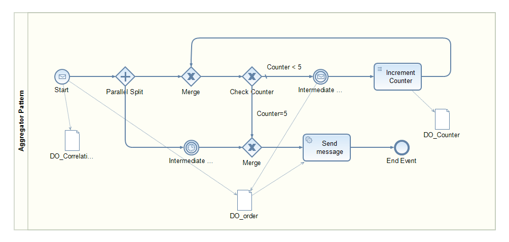

<!-- loio8cfddfcf26f149cab9542ad0683278c6 -->

# Aggregator

The [Aggregator](https://www.enterpriseintegrationpatterns.com/patterns/messaging/Aggregator.html) pattern is a special filter that receives a stream of messages and identifies messages that are correlated. Once a complete set of messages has been received, the Aggregator collects information from each correlated message and publishes a single, aggregated message to the output channel for further processing.

The following sections describe the usage of this stateful pattern in SAP Process Orchestration and Cloud Integration.

<a name="loio8cfddfcf26f149cab9542ad0683278c6__section_acw_xwj_qqb"/>

## SAP Process Orchestration

Since the Aggregator pattern keeps a state, Business Process Management \(BPM\) is required to orchestrate the message flow. For the actual exchange of messages with the involved systems, the Process Integration runtime of SAP Process Orchestration is used. In the following, the focus is on the BPM process only. For a detailed description of the overall implementation, see the blog [Enterprise Patterns in Process Orchestration – Aggregator](https://blogs.sap.com/2012/10/11/enterprise-patterns-in-process-orchestration-aggregator/).

In this example, the process collects messages within a specific period, and each bulk should have 5 items at most. This model is a combination of an intermediate timer event and a loop. The incoming messages meeting the correlation condition are collected. An incoming message triggers the process instance. In the Start event, the counter is reset and the correlation condition is stored. A parallel split gateway is used to branch into the intermediate timer event path and the path containing the loop. The loop waits on further incoming messages with the same correlation condition as the start event. If a message arrives, the respective data object is appended, and the counter is incremented. Depending on which event occurs first, either the maximum number of messages or the waiting time has been exceeded, the aggregated message is sent, and the process instance is ended. Optionally, the model can be enhanced to wait for a dedicated message stopping the collection \(not shown here\).

<a name="loio8cfddfcf26f149cab9542ad0683278c6__section_ed1_ywj_qqb"/>

## Cloud Integration

For a detailed description of the Aggregator pattern on Cloud Integration, see [Aggregator](https://help.sap.com/viewer/368c481cd6954bdfa5d0435479fd4eaf/Cloud/en-US/5f5e01bfa534465eab55c8751f72a5bc.html).

The integration flow model presented in the help documentation illustrates the use of a dedicated Aggregator flow step. It‘s not required to model the pattern in a loop as seen for SAP Process Orchestration. In the Aggregator flow step, the correlation condition, as well as the completion conditions, can be defined. Right now, the last message condition and the completion timeout are supported in this model step. Unfortunately, maximum number of messages isn't supported yet. The rest of the flow steps are used to map the collection of items to the right message format. In this case, an order with order header information and all items, hence removing redundant information.

