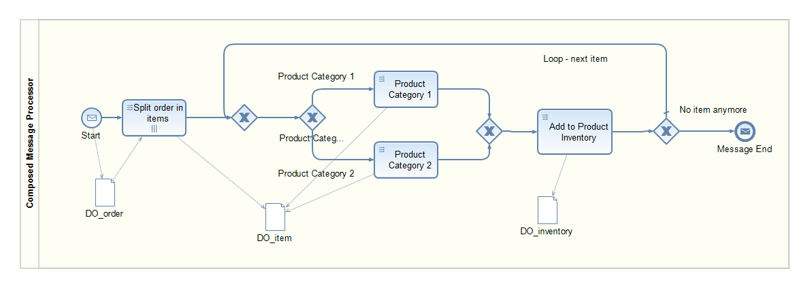

<!-- loio9ade128cbcfa4359816169bbc56f25c6 -->

# Composed Message Processor

The [Composed Message Processor](https://www.enterpriseintegrationpatterns.com/patterns/messaging/DistributionAggregate.html) pattern describes how to handle a message with multiple elements, but each element requires different processing. You use a Composed Message Processor pattern to split the message into multiple submessages, route the split messages to different destinations, and then reaggregate the responses back into one single message.

<a name="loio9ade128cbcfa4359816169bbc56f25c6__section_ay1_kyj_qqb"/>

## SAP Process Orchestration

The process model of the Composed Message Processor pattern on SAP Process Orchestration is explained in more detail. The process itself is modeled using Business Process Management \(BPM\), and the message exchange with the various systems is done using the Process Integration runtime of SAP Process Orchestration. This document focuses on the BPM process only. For a detailed description of the overall implementation, see the blog [Enterprise Patterns in Process Orchestration - Composed Message Processor](https://blogs.sap.com/2013/01/03/enterprise-patterns-in-process-orchestration-composed-message-processor/).

The BPM process is modeled following the BPMN \(Business Process Model & Notation\) specification. The process model starts with a message start event receiving an order with multiple items. In a mapping, the order is split. For the mapping, looping is defined as part for each although the individual split messages actually run in sequence. For each item, a condition is carried out, and the processing is routed to either of the branches depending on the respective product category. A router condition checks if all items have been processed. If not, the processing is looped back, and the next item is processed. Otherwise, the aggregated message is returned.

<a name="loio9ade128cbcfa4359816169bbc56f25c6__section_ikd_kyj_qqb"/>

## Cloud Integration

For a detailed description of the Composed Message Processor pattern on Cloud Integration, see [Composed Message Processor](https://help.sap.com/viewer/368c481cd6954bdfa5d0435479fd4eaf/Cloud/en-US/353a11956dbc43d8a6146330e16680e4.html). In the following, only the rough model is outlined.

In the sample integration flow presented in the help documentation, a General Splitter is used to split an order into multiple individual messages according to the number of items. In the General Splitter property, the Parallel Processing check box is selected to ensure concurrent processing of the split messages. The Router forwards the items to different inventory systems depending on the product category where the items are enriched. Finally, the Gather step reaggregates the multiple messages into a single message.

