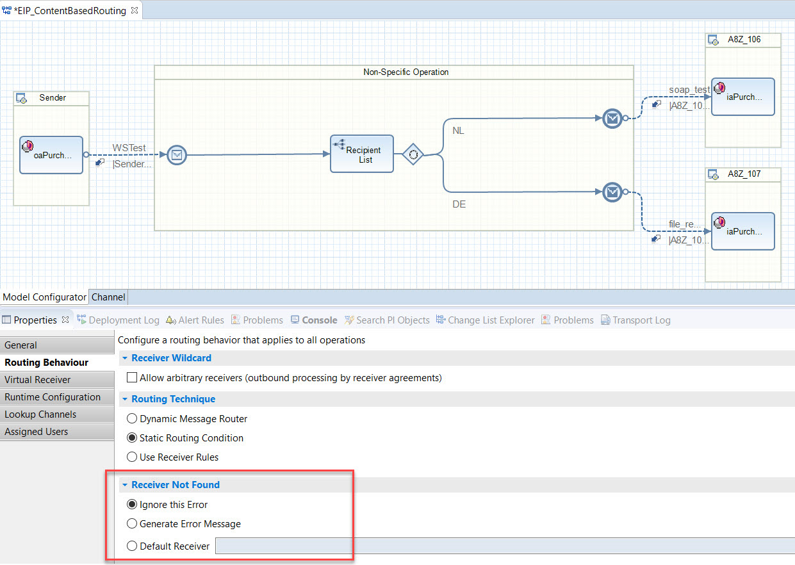

<!-- loio147229ca9f88465ca3ab3c6bd3eee589 -->

# Content-Based Routing

The [Content-Based Routing](https://www.enterpriseintegrationpatterns.com/patterns/messaging/ContentBasedRouter.html) pattern is used to route a message to the correct recipient based on its content. The message is routed to exactly one channel.

<a name="loio147229ca9f88465ca3ab3c6bd3eee589__section_zxf_pyj_qqb"/>

## SAP Process Orchestration

In the integration flow, you can add a recipient list and maintain a list of potential receivers. You can select one of the following routing techniques:

-   dynamic \(via message mapping\),

-   static \(an XPath condition either based on the payload data or the message header\), and

-   receiver rules \(reusable routing conditions\).

SAP Process Orchestration doesn’t distinguish between the Content-based Router and the Recipient List patterns. While the former message is routed to exactly one receiver, the latter can broadcast the message to multiple receivers. However, if used routing conditions are disjoint, each message is routed to exactly one receiver strictly following the definition of the Content-based Router. In the example, a static routing condition is used.

Here, the focus is on the Receiver Not Found configuration options. During message processing, the condition is evaluated, and if met, the message is routed to the respective receiver. If no receiver could be determined, various options to proceed are available:

-   raise an error,

-   send to a default receiver, or

-   ignore the message.

In the following example, the latter option is used. The message is discarded without raising an error if neither condition is met.

<a name="loio147229ca9f88465ca3ab3c6bd3eee589__section_jdk_pyj_qqb"/>

## Cloud Integration

The Content-based Router pattern is modeled using a router flow step. Like for SAP Process Orchestration, the XPath condition can be either based on the payload data or the message header. For each of the Receiver Not Found options described above, SAP has shipped an integration flow variant. For a detailed description of all three variants of the Content-based Router pattern on Cloud Integration, see [Content-Based Routing](https://help.sap.com/viewer/368c481cd6954bdfa5d0435479fd4eaf/Cloud/en-US/90f35f3d4fa740a28c49ab2b85940609.html). The figure in the documentation shows the variant where the message should be discarded if neither condition is met. For all variants, it’s recommended to store the XPath expression as an Exchange property, which is then used in the routing conditions. This way, it’s easier to trace the value of the XPath condition in case of errors. Furthermore, a better runtime behavior can be expected since the message needs to be parsed only once. For each receiver, the routing condition is configured accordingly. In addition, we define a default route that points to an End event.

