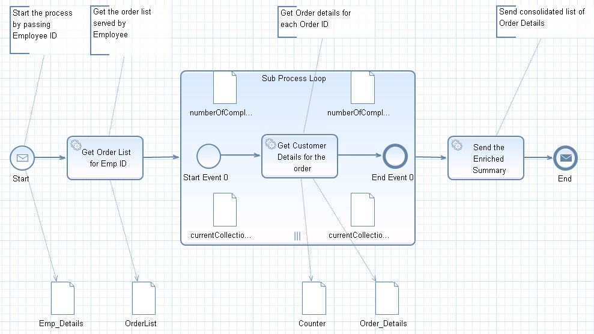
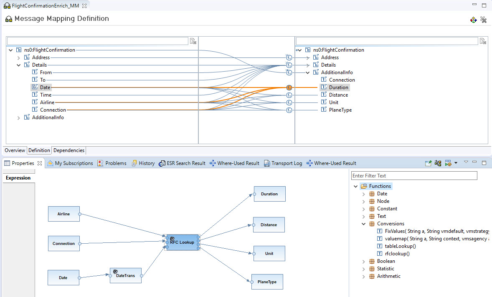

<!-- loiod86ba3fe12484edbbb0bae76f3be3616 -->

# Content Enricher

The [Content Enricher](https://www.enterpriseintegrationpatterns.com/patterns/messaging/DataEnricher.html) pattern is used to access an external system in order to add missing data to a message. This process is also called look-up.

## SAP Process Orchestration

-   Model the lookup within a Business Process Management \(BPM\) process

-   Implement a lookup within a message mapping

The first option using a BPM process is described in the blog [Enterprise Patterns in Process Orchestration – Content EnricherOn SAP Process Orchestration, there are two options:](https://blogs.sap.com/2012/10/04/enterprise-patterns-in-process-orchestration-content-enricher/). In this example, you first gather an order list for a specific employee. Here, customer details are missing which you need to read from a different system. Therefore, you loop over the list of orders, and within each loop pass, you do a Web Service call using an automated activity. Within the automated activity, the additional information is then mapped to the respective order item, hence enriching the message.

For RFC and JDBC lookups, the message mapping tool within the Enterprise Services Repository \(ESR\) of SAP Process Orchestration supports standard functions to configure the lookups. Those functions use the message types stored in the ESR so that you can simply select the input and output fields when configuring the lookup.

<a name="loiod86ba3fe12484edbbb0bae76f3be3616__section_wmn_wwj_qqb"/>

## Cloud Integration

On Cloud Integration, you can model the Content Enricher:

-   via the request-response pattern

-   via a dedicated Content Enricher flow step

For RFC and JDBC lookups, theIn the example described, a dedicated Content Enricher step was used. The benefit of the Content Enricher flow step is that it automatically matches the responses to the different items of the original message. Therefore, it’s suited especially for enriching bulk data. Using this option is better in terms of performance compared to a request-response pattern. Here, you don’t need to loop over all items carrying out individual lookup calls, but instead do one call, and the matching is done automatically based on your key.

In the example in the documentation, there's an order with multiple items, including product and product category information. We perform a lookup to gather the main category names \(OData query not displayed\), and automatically match them to the respective item based on the category as the key element.

For more information, see [Content Enricher](https://help.sap.com/viewer/368c481cd6954bdfa5d0435479fd4eaf/LATEST/en-US/0e7ba7fc4d4b4f47ab84ad6ce0d1a8ec.html).

