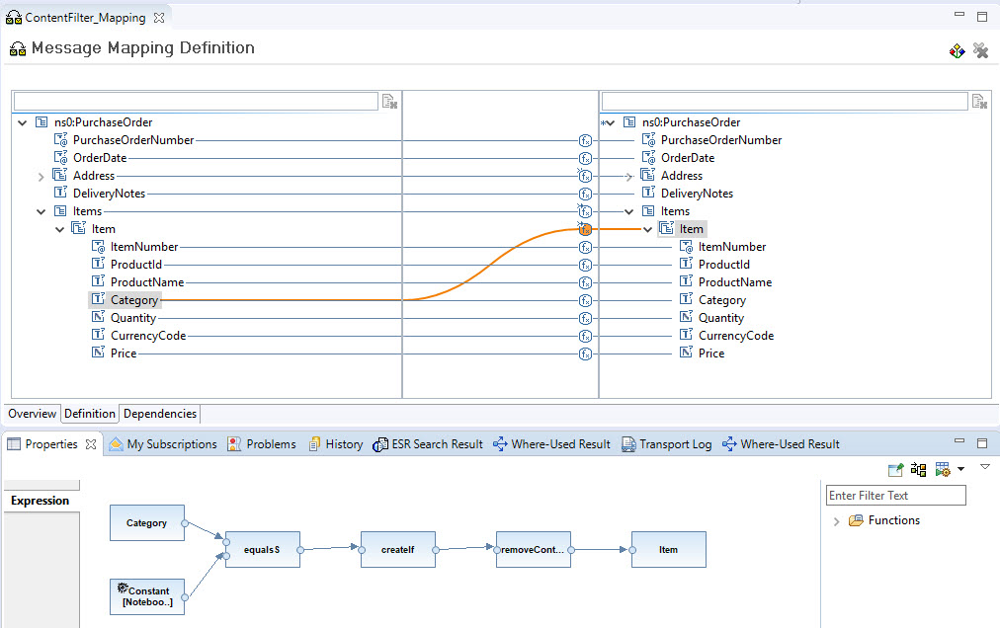

<!-- loio627d65c91ee84680997d93adbab858c4 -->

# Content Filter

The [Content Filter](https://www.enterpriseintegrationpatterns.com/patterns/messaging/ContentFilter.html) pattern is used to remove data from a message that you don't need in your application system. You only keep the important information.

<a name="loio627d65c91ee84680997d93adbab858c4__section_rfv_k1k_qqb"/>

## SAP Process Orchestration

In the example, a purchase order contains multiple items of different product categories. The Content Filter pattern is implemented using a message mapping. In the message mapping, all items within the purchase order that aren't intended for a particular receiver are removed, so only those items of a specific product category are kept. In this example, those items are only the notebooks.

As illustrated in the following figure, all the header fields are mapped one by one. For the Item node, we check if the Category equals Notebooks. If so, we create the node, otherwise, the item is discarded. All fields below the Item node are mapped one by one.

<a name="loio627d65c91ee84680997d93adbab858c4__section_ksy_k1k_qqb"/>

## Cloud Integration

On Cloud Integration, there are two options:

-   Use the dedicated Filter flow step.

-   Reuse the message mapping from the earlier example.

Both options are described in [Content Filter](https://help.sap.com/viewer/368c481cd6954bdfa5d0435479fd4eaf/LATEST/en-US/6fd4a865c9f3456ea452e6b3da4715f6.html). The latter option can be resolved by importing the message mapping from Process Orchestration or modeling it the same way as described in the earlier chapter. In this chapter, the focus is on the second option.

In the integration flow model in the documentation, you can see that we use a Filter flow step where we maintain the XPath expression. Here, we keep all items with category Software. Value type needs to be nodelist since the XPath expression may apply to multiple items. The filter removes the purchase order header. So, we need to save this part in an exchange property using a content modifier, and in another content modifier, we construct the message based on the item list and the stored header fields.

