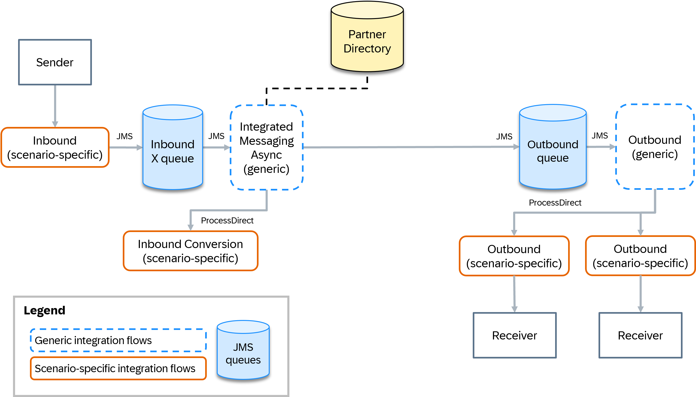

<!-- loio21b45fc82d384a0da18c215043dbce78 -->

# Integrated Messaging Runtime \(Asynchronous\)

The asynchronous integrated messaging runtime combines inbound conversion, receiver determination, and interface determination in one single pipeline step.

The following fixed sequence of integration flows makes up the pipeline steps of the asynchronous integrated messaging runtime:

1.  [Inbound Processing \(Scenario-Specific\)](integrated-messaging-runtime-asynchronous-21b45fc.md#loio21b45fc82d384a0da18c215043dbce78__section_uvp_gnf_g2c): Handles the sender adapters.
2.  [Integrated Messaging Runtime Async \(Generic\)](integrated-messaging-runtime-asynchronous-21b45fc.md#loio21b45fc82d384a0da18c215043dbce78__section_vvp_gnf_g2c): Dispatches the messages to the inbound conversion, determines the receivers and the receiver interfaces in a content-based router or recipient list pattern scenario and handles the retry of messages if processing errors occur.
3.  [Conversion at Inbound \(Scenario-Specific\)](integrated-messaging-runtime-asynchronous-21b45fc.md#loio21b45fc82d384a0da18c215043dbce78__section_yvp_gnf_g2c): Is called by the Integrated Messaging Runtime Async \(Generic\) integration flow and runs conversion at the Cloud Integration inbound, for example, JSON to XML conversion.
4.  [Outbound Processing \(Generic\)](integrated-messaging-runtime-asynchronous-21b45fc.md#loio21b45fc82d384a0da18c215043dbce78__section_zvp_gnf_g2c): Dispatches the messages to the message outbound and handles the retry of failed messages.
5.  [Outbound Processing \(Scenario-Specific\)](integrated-messaging-runtime-asynchronous-21b45fc.md#loio21b45fc82d384a0da18c215043dbce78__section_bwp_gnf_g2c): Handles the mappings and message outbound delivery.

> ### Note:  
> The asynchronous integrated messaging runtime shares most of its pipeline steps with the fully decoupled pipeline. However, the generic inbound processing, the generic receiver determination, and the generic interface determination are combined in one single pipeline step.

> ### Note:  
> Generic integration flows read from JMS queues, for which some capacity restraints apply. To meet the demands of your landscape and workload, you can customize the JMS adapter parameters, for example, the **number of concurrent processes**. The default value is `2` as delivered with the integration package. See [Configure the JMS Sender Adapter](https://help.sap.com/docs/integration-suite/sap-integration-suite/configure-jms-sender-adapter).

<a name="loio21b45fc82d384a0da18c215043dbce78__section_uvp_gnf_g2c"/>

## Inbound Processing \(Scenario-Specific\)

The first integration flow in the sequence of flows represents the sender adapter processing. It's identical to the first integration flow in the sequence of the fully decoupled pipeline.

Once the message has passed through the integration flow, ensure that it's written to the inbound processing queue of the integrated messaging runtime by configuring the JMS queue name accordingly. By default, the inbound processing queue equals `PIPX01`.

See [Inbound Processing \(Scenario-Specific\)](https://help.sap.com/docs/migration-guide-po/migration-guide-for-sap-process-orchestration/pipeline-steps#loiof8e69f43059a44cdb891892f4ff083d8__section_cfy_myk_31c).

<a name="loio21b45fc82d384a0da18c215043dbce78__section_vvp_gnf_g2c"/>

## Integrated Messaging Runtime Async \(Generic\)

The second integration flow in the sequence of flows, `Pipeline Generic Step02 - Integrated Messaging Runtime Async`, is a generic integration flow, which means it’s used across all integration scenarios and only must be deployed once. In this case, use the Partner Directory to dynamically configure the message processing.

The generic asynchronous integrated messaging runtime integration flow reads the messages from the first JMS queue \(by default `PIPX01`\). It then passes the messages to a scenario-specific integration flow to run scenario-specific inbound conversion steps like a JSON to XML conversion or conversion steps of the adapter module chain if needed.

The information about whether a conversion is needed is stored in the Partner Directory. If a conversion is needed, the end point of the ProcessDirect adapter of the scenario-specific conversion integration flow is read from the Partner Directory. The partner ID with which the information is fetched relies on the headers `SAP_Sender` and `SAP_SenderInterface` and is determined by running a Groovy script. It's either derived from an alternative partner or defined as a combination of the sender system name and the sender interface name. See [Using the Partner Directory in the Pipeline Concept](https://help.sap.com/docs/migration-guide-po/migration-guide-for-sap-process-orchestration/using-partner-directory-in-pipeline-concept).

After the successful conversion, the message is passed to the next flow step in the integration flow to determine the list of receivers and receiver interfaces. If no conversion is needed, the message is directly passed to the receiver and interface determination step without calling any scenario-specific inbound conversion.

To determine the receivers and receiver interfaces, the XSLT mapping that contains the content-based routing xpath conditions is read from the Partner Directory and then executed.

> ### Note:  
> The generic integrated messaging runtime integration flow can handle only XSLT mappings that contain xpath conditions for both determining the list of receivers and the list of receiver interfaces. See *Combined Receiver and Interface Determination in a Single XSLT* in [Special Cases: Bypass Options](https://help.sap.com/docs/migration-guide-po/migration-guide-for-sap-process-orchestration/using-partner-directory-in-pipeline-concept#loio9ec7d2dce72d423abff80543f11b2091__section_lsh_hkp_hcc). For this reason, the special case in which you can reuse an existing extended receiver determination mapping is not supported.
> 
> However, custom receiver determination is supported as long as you provide an XML message containing both the list of receivers and the list of receiver interfaces. See [Custom Receiver Determination](https://help.sap.com/docs/migration-guide-po/migration-guide-for-sap-process-orchestration/customizing-pipeline-concept#custom-receiver-determination).

> ### Note:  
> If you want to define routing conditions based on headers or properties, see [Access Header and Properties in XSLT Mapping](https://help.sap.com/docs/integration-suite/sap-integration-suite/access-header-and-properties-in-xslt-mapping). More specifically, you can define routing conditions based on dynamic configuration parameters of the sender adapter or any other parameter defined in the scenario-specific inbound processing flow. To do so, pass those values to the generic integration flows using any header with the prefix `dc`.

If the extended receivers XML doesn't contain any receiver nodes, the message processing continues in the `Receiver not found` route. Depending on the settings for `Receiver not found`, either an **error** is raised, the message is **ignored**, or the message is sent to a **default** receiver. In all cases, a custom status is maintained so that you have full transparency about why the processing has been stopped. The following table lists the message behavior and custom status for each option:

<table>
<tr>
<th valign="top">

Option

</th>
<th valign="top">

Behavior

</th>
<th valign="top">

Custom Status

</th>
</tr>
<tr>
<td valign="top">

Error

</td>
<td valign="top">

The message is kept in the inbound JMS queue and eventually retried until the maximum number of retries is reached.

</td>
<td valign="top">

`ReceiverNotFoundError`

</td>
</tr>
<tr>
<td valign="top">

Ignore

</td>
<td valign="top">

The message is stopped without an error and its status is set to `Completed`.

</td>
<td valign="top">

`ReceiverNotFoundIgnored`

</td>
</tr>
<tr>
<td valign="top">

Default

</td>
<td valign="top">

The default receiver name is fetched from the payload and the message processing continues.

</td>
<td valign="top">

`ReceiverNotFoundDefault`

</td>
</tr>
</table>

If the message processing continues by the default route and at least one receiver has been determined, the extended receivers XML message is split based on the list of receivers using an iterating splitter. For each split message, the standard message header `SAP_Receiver` is set with the name of the receiver system and the message is further split based on the list of interfaces using another iterating splitter.

For each split message, the message headers `SAP_ReceiverInterfaceIndex` and `SAP_OutboundProcessingEndpoint` are set based on the split messages. The original payload is retrieved from the exchange property, and the message is stored in the outbound processing queue, to be passed to the next pipeline step. For a special case in which you can use a receiver-specific JMS queue, see [Receiver-Specific Outbound Queues](https://help.sap.com/docs/migration-guide-po/migration-guide-for-sap-process-orchestration/special-cases#loio1606af9b55bf4391bea01d2f7ee112af__section_n2d_cjf_j1c).

In the special case of a point-to-point scenario, all the flow steps that determine the receivers and the receiver interfaces are skipped, and the message is directly stored in the outbound processing queue.

If an error occurs, it's fetched in an exception subprocess, which first checks if the maximum number of retries have been exceeded. If they haven't been exceeded, the message remains in the first JMS queue from which it's retried. Otherwise, the message is parked in a dead letter queue.

> ### Note:  
> You can define the maximum number of retries for a specific scenario. This information is also stored in the Partner Directory. See [Standard Retry Handling](https://help.sap.com/docs/migration-guide-po/migration-guide-for-sap-process-orchestration/monitoring-and-error-handling-pipeline-concept#loioed9b82cb928049e6990a4d784aa6aac7__section_l3k_qrn_j1c).

The following diagram is an example of a generic integrated messaging runtime flow:

<a name="loio21b45fc82d384a0da18c215043dbce78__section_yvp_gnf_g2c"/>

## Conversion at Inbound \(Scenario-Specific\)

The third integration flow is a scenario-specific integration flow that carries out message conversion at the Cloud Integration inbound. It's identical to the third integration flow in the sequence of the fully decoupled pipeline.

See [Conversion at Inbound \(Scenario-Specific\)](https://help.sap.com/docs/migration-guide-po/migration-guide-for-sap-process-orchestration/pipeline-steps#loiof8e69f43059a44cdb891892f4ff083d8__section_q1q_vyk_31c).

<a name="loio21b45fc82d384a0da18c215043dbce78__section_zvp_gnf_g2c"/>

## Outbound Processing \(Generic\)

The fourth integration flow in the sequence of flows, `Pipeline Generic Step06 - Outbound Processing`, is a generic integration flow. It dispatches the messages to the right scenario-specific outbound processing and handles the retry if outbound conversion errors occur. It's identical to the sixth integration flow in the sequence of the fully decoupled pipeline.

> ### Note:  
> Steps four and five of the fully decoupled pipeline are skipped.

See [Outbound Processing \(Generic\)](https://help.sap.com/docs/migration-guide-po/migration-guide-for-sap-process-orchestration/pipeline-steps#loiof8e69f43059a44cdb891892f4ff083d8__section_yqj_xyk_31c).

<a name="loio21b45fc82d384a0da18c215043dbce78__section_bwp_gnf_g2c"/>

## Outbound Processing \(Scenario-Specific\)

The fifth and last integration flow is a scenario-specific integration flow that carries out mappings, message conversions at the Cloud Integration outbound, and the message delivery. It's identical to the seventh integration flow in the sequence of the fully decoupled pipeline, which means you can use the same templates to create the scenario-specific outbound flows.

See [Outbound Processing \(Scenario-Specific\)](https://help.sap.com/docs/migration-guide-po/migration-guide-for-sap-process-orchestration/pipeline-steps#loiof8e69f43059a44cdb891892f4ff083d8__section_e2p_xyk_31c).

