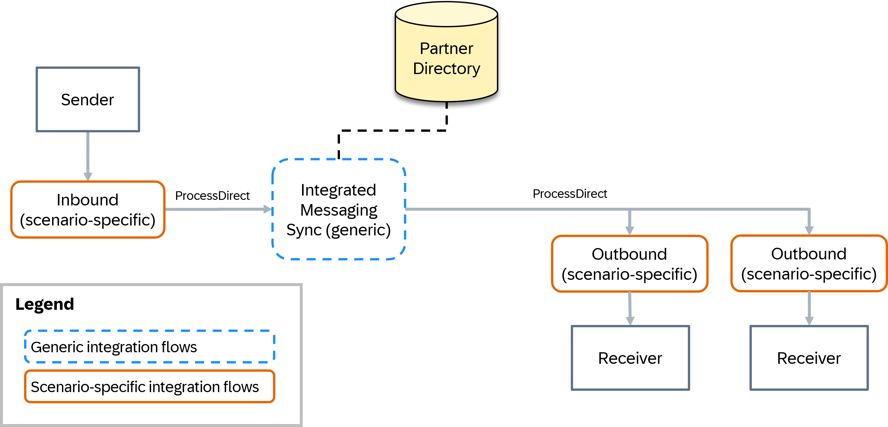

<!-- loio0dfede91771545cfbf722556030d5902 -->

# Integrated Messaging Runtime \(Synchronous\)

The synchronous integrated messaging runtime is used for handling synchronous content-based router scenarios. Unlike the asynchronous messaging, the synchronous pipeline doesn't use JMS queues, but instead connects the pipeline steps using the ProcessDirect adapter, which is synchronous by nature.

The following fixed sequence of integration flows makes up the pipeline steps of the synchronous integrated messaging runtime:

1.  [Inbound Processing \(Scenario-Specific\)](integrated-messaging-runtime-synchronous-0dfede9.md#loio0dfede91771545cfbf722556030d5902__section_gfd_gdn_g2c): Handles the sender adapter, the conversion of the request from the sender, and the conversion of the response to the sender. It calls the next pipeline step using a request reply flow step.
2.  [Integrated Messaging Runtime Sync \(Generic\)](integrated-messaging-runtime-synchronous-0dfede9.md#loio0dfede91771545cfbf722556030d5902__section_cvh_hdn_g2c): Determines the receivers and the receiver interfaces in a content-based router pattern scenario.
3.  [Outbound Processing \(Scenario-Specific\)](integrated-messaging-runtime-synchronous-0dfede9.md#loio0dfede91771545cfbf722556030d5902__section_axr_3dn_g2c): Handles the request mapping, the message outbound delivery, and the response mapping.

<a name="loio0dfede91771545cfbf722556030d5902__section_gfd_gdn_g2c"/>

## Inbound Processing \(Scenario-Specific\)

The first integration flow in the sequence of flows represents the sender adapter processing as well as the conversion of the request and the response from and to the sender, respectively.

> ### Note:  
> Unlike the asynchronous pipelines, the inbound conversion doesn’t need to be called explicitly from the generic inbound processing flow. Instead, you can maintain the conversion in this scenario-specific integration flow.

> ### Note:  
> Depending on your specific use cases, you can also configure inbound processing integration flows, which are used across multiple scenarios. See, for example, [XI Sender Adapter](https://help.sap.com/docs/migration-guide-po/migration-guide-for-sap-process-orchestration/special-cases#loio1606af9b55bf4391bea01d2f7ee112af__section_vcg_m1f_j1c). For this special case, you can use the generic integration flow `Pipeline Generic Step01 - Inbound Processing for XI`.

In the scenario-specific inbound integration flow, you first configure the sender adapter, followed by a content modifier step in which the scenario-specific message headers are set. The message headers are needed for the subsequent processing, such as fetching the right receiver determination in case of content-based router scenarios, and are passed to the rest of the integration flows. While the headers that are allowed are already preconfigured in generic integration flows, for scenario-specific integration flows, you must maintain the list of allowed headers in the runtime configuration. If you use the provided scenario-specific templates, the headers that are allowed are already preconfigured.

The following message headers are defined:

-   **SAP\_Sender**: Name of the sender system
-   **SAP\_SenderInterface**: Name of the sender interface
-   **SAP\_MessageType**: Same as **SAP\_SenderInterface**

**SAP\_Sender** and **SAP\_MessageType** are standard message headers that you can use to search for specific message logs in the message monitor. **SAP\_Sender** and **SAP\_SenderInterface** uniquely define an integration scenario.

Usually, you can set the message headers as constants since the integration flow is scenario-specific anyway. Depending on your use case, you can also fetch the information from the message payload or adapter-specific headers or properties.

After setting the message headers, you can call a local subprocess to convert your incoming message request if necessary, for example, from JSON to XML. You can also define custom header properties that are passed to the generic integration flow so you can search the message processing logs based on payload data.

In a request reply flow step, the generic synchronous integrated messaging runtime flow is called using the ProcessDirect adapter. To configure the address without changing the integration flow, use externalized parameters for the ProcessDirect address.

After the request reply flow step, you can call a local subprocess to convert the message response, for example, from XML to JSON. Before passing the response to the actual sender, the headers that are used to exchange data between the pipeline steps are removed.

For this integration flow, use the template `Pipeline Template Step01 - Inbound Processing Synchronous`, which is available in the integration package.

<a name="loio0dfede91771545cfbf722556030d5902__section_cvh_hdn_g2c"/>

## Integrated Messaging Runtime Sync \(Generic\)

The second integration flow in the sequence of flows, `Pipeline Generic Step02 - Integrated Messaging Runtime Sync`, is a generic integration flow, which means it’s used across all integration scenarios and only has to be deployed once. In this case, use the Partner Directory to dynamically configure the message processing.

The generic synchronous integrated messaging runtime integration flow is directly called by the scenario-specific inbound processing flow using the ProcessDirect adapter. By default, its ProcessDirect endpoint equals `/PIP/XS01`.

To determine the receiver and its receiver interface, an XSLT mapping containing the content-based routing xpath conditions is read from the Partner Directory and then executed. The partner ID with which the information is fetched relies on the headers `SAP_Sender` and `SAP_SenderInterface` and is determined by running a Groovy script. It's either derived from an alternative partner or defined as a combination of the sender system name and the sender interface name. See [Using the Partner Directory in the Pipeline Concept](https://help.sap.com/docs/migration-guide-po/migration-guide-for-sap-process-orchestration/using-partner-directory-in-pipeline-concept).

> ### Note:  
> The generic integrated messaging runtime integration flow can handle only XSLT mappings that contain xpath conditions for both determining the receiver and the receiver interface. See *Combined Receiver and Interface Determination in a Single XSLT* in [Special Cases: Bypass Options](https://help.sap.com/docs/migration-guide-po/migration-guide-for-sap-process-orchestration/using-partner-directory-in-pipeline-concept#loio9ec7d2dce72d423abff80543f11b2091__section_lsh_hkp_hcc). Therefore, the special case in which you can reuse an existing extended receiver determination mapping is not supported here.
> 
> However, you can use custom receiver determination if you provide an XML message containing both the receiver and the receiver interface. See [Custom Receiver Determination](https://help.sap.com/docs/migration-guide-po/migration-guide-for-sap-process-orchestration/customizing-pipeline-concept#custom-receiver-determination).

> ### Note:  
> If you want to define routing conditions based on headers or properties, see [Access Header and Properties in XSLT Mapping](https://help.sap.com/docs/integration-suite/sap-integration-suite/access-header-and-properties-in-xslt-mapping). More specifically, you can define routing conditions based on dynamic configuration parameters of the sender adapter or any other parameter defined in the scenario-specific inbound processing flow. To do so, pass those values to the generic integration flows using any header with the prefix `dc`.

Since synchronous scenarios support only a single receiver and a single receiver interface, an error is thrown and passed back to the calling integration flow whenever this rule is violated. This is the case if no receiver or more than one receiver are determined, or if no interface or too many interfaces are determined.

In the default route \(if exactly one receiver and one receiver interface have been determined\), the message headers `SAP_Receiver`, `SAP_ReceiverInterfaceIndex` and `SAP_OutboundProcessingEndpoint` are set.

In a request reply flow step, the next flow in the sequence is called using the ProcessDirect adapter, that is, the scenario-specific outbound processing flow. The value of the header `SAP_OutboundProcessingEndpoint` is used as address.

In the special case of a point-to-point scenario, all the flow steps determining the receiver and the receiver interface are skipped, and the message is sent directly to the corresponding scenario-specific outbound processing flow. To set up synchronous point-to-point scenarios, see [Pipeline Bypass Options](https://help.sap.com/docs/migration-guide-po/migration-guide-for-sap-process-orchestration/special-cases#pipeline-bypass-options).

The following diagram is an example of a generic integrated messaging runtime flow:

<a name="loio0dfede91771545cfbf722556030d5902__section_axr_3dn_g2c"/>

## Outbound Processing \(Scenario-Specific\)

The third and last integration flow is a scenario-specific integration flow that carries out mappings, message conversions at the Cloud Integration outbound, and the message delivery.

The scenario-specific integration flow is directly called by the synchronous integrated messaging runtime integration flow using the ProcessDirect adapter. It’s recommended to use externalized parameters for the ProcessDirect address to be able to configure the address without changing the integration flow.

First, you can call a local subprocess to map and eventually convert your message to the format of the request that the actual receiving system expects.

In a request reply flow step, you then pass the request to the receiving system.

After the request reply flow step, you can call a local subprocess to convert and map the message response if necessary.

For this integration flow, use the template `Pipeline Template Step07 - Outbound Processing Synchronous`, which is available in the integration package.

