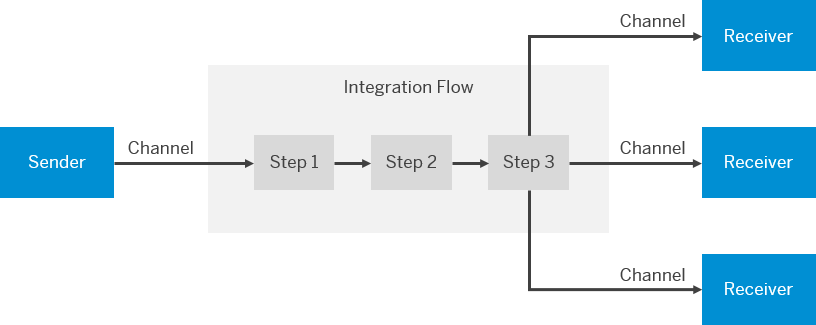

<!-- loiob763478c3ceb4dc299c14e321933c35b -->

# Interface Design and Implementation

In a migration project, you may need to redesign a particular integration flow or develop one from scratch in an implementation project.

The Cloud Integration Web UI provides a modeling environment that allows you to design the details of message processing \(its senders and receivers as well as the individual processing steps\) with a graphical user interface. For a comprehensive description of the main aspects when starting the development of a new interface, see [Getting Started with Integration Flow Development](https://help.sap.com/viewer/368c481cd6954bdfa5d0435479fd4eaf/Cloud/en-US/e5724cd84b854719973afe0356ea128b.html).

In general, an integration flow contains the following aspects:

-   The senders and receivers of the message

-   How the senders and receivers are connected to the tenant \(adapters\)

-   The steps that define the message processing

  

-   **[Guidelines to Design Integration Flows](guidelines-to-design-integration-flows-f9d7627.md "")**  

-   **[Integration Patterns](integration-patterns-980eace.md "")**  

-   **[Additional References for Interface Development](additional-references-for-interface-development-6daed01.md "The following table provides additional resources for developing interfaces.")**  
The following table provides additional resources for developing interfaces.

**Related Information**  

[Guidelines to Design Integration Flows](guidelines-to-design-integration-flows-f9d7627.md "")

[Integration Patterns](integration-patterns-980eace.md "")

[Additional References for Interface Development](additional-references-for-interface-development-6daed01.md "The following table provides additional resources for developing interfaces.")

