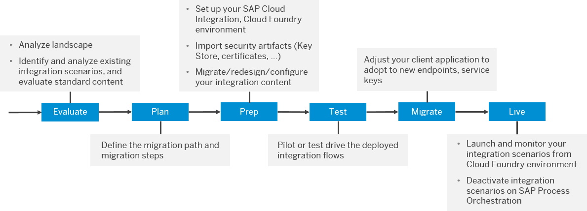

<!-- loio46c8a368b7dd4f20826cfbe498d1601c -->

# Interface Migration Strategy

When migrating from SAP Process Orchestration to SAP Integration Suite on Cloud Foundry, there are different options and strategies for the migration process itself.

The migration process itself can be covered by a migration project, which can contain different phases as illustrated in the following diagram:

The migration phases can be adjusted to your needs and the preferred project methodology. There are different options to execute the phases.

1.  **Evaluate**
    -   Estimate the effort involved in the migration process and how your integration scenarios can be migrated using [Migration Assessment](https://help.sap.com/docs/SAP_INTEGRATION_SUITE/51ab953548be4459bfe8539ecaeee98d/5c5e50ee2d644cc59d864409d5b7871c.html?locale=en-US&version=CLOUD).
    -   Analyze the current and the to-be landscape, for example, using the [SAP Integration Solution Advisory Methodology](https://blogs.sap.com/2019/02/24/integration-solution-advisory-methodology-isa-m-define-integration-guidelines-for-your-organization/).

    -   Create a high-level architecture for the connected systems and a list of these systems with the protocols, adapters, triggers, and authentication used.

    -   Check if there are other options to integrate the systems on the [SAP Business Accelerator Hub](https://api.sap.com/), such as standard integration packages or standard API documentation.

2.  **Plan**: create a migration strategy
    -   Migration of integration scenarios

        -   Automatically migrated \(depending on the features of the [Migration Tooling](https://help.sap.com/docs/SAP_INTEGRATION_SUITE/51ab953548be4459bfe8539ecaeee98d/60610163aec44849ac4783c92fb2e55c.html?locale=en-US&version=CLOUD)\)

        -   Semiautomatically migrated \([Migration Tooling](https://help.sap.com/docs/SAP_INTEGRATION_SUITE/51ab953548be4459bfe8539ecaeee98d/60610163aec44849ac4783c92fb2e55c.html?locale=en-US&version=CLOUD), import of mappings, import of artifacts\)

        -   Redesign scenarios \(standard content, standard APIs, interfaces not covered by the Migration Tooling\)

    -   Side-by-side migration: Scenarios can be converted and run in parallel to SAP Process Orchestration.

    -   Prioritize integration scenarios depending on customer-specific aspects, for example business or functional requirements, and availability of features on Cloud Integration.

3.  **Prepare/Implement**
    -   Set up Cloud Foundry

        -   Provision the tenant and SAP Integration Suite

        -   Configure SAP Integration Suite \(authorization and roles\)

    -   Import or configure artifacts \(certificates, user credentials, known-host file, public and private keyring\)

    -   Setup Cloud Connector \(if required\)

    -   Test the connectivity to the connected applications \(optional\)

    -   Setup implementation guidelines and architecture \(if you plan to redesign integration scenarios\)

    -   Migrate content

        -   Configure standard content

        -   Migrate automatically using the [Migration Tooling](https://help.sap.com/docs/SAP_INTEGRATION_SUITE/51ab953548be4459bfe8539ecaeee98d/60610163aec44849ac4783c92fb2e55c.html?locale=en-US&version=CLOUD)

        -   Reimplement redesigned interfaces and objects not supported by the Migration Tooling

4.  **Test**

    Run test phases to test the migrated content \(e.g. connectivity, developer, unit, process, system, acceptance\)

5.  **Migrate Connected System / Go Live**
    -   Activate integration content on the productive tenant

    -   Configure the connected system to switch over to Cloud Integration

6.  **Live**
    -   Monitoring of integration processes

    -   Decommission plan for SAP Process Orchestration

<a name="loio46c8a368b7dd4f20826cfbe498d1601c__section_b3c_m53_qqb"/>

## Migrating Cloud Integration from the Neo Environment to the Multi-Cloud Foundation

The [guide for migrating integration scenarios in the Cloud Integration tenant from Neo environment to the Multi-Cloud Foundation](https://help.sap.com/viewer/de9f95b388f1489abc3c7890a66bae2f/LATEST/en-US/e97a93d541ff45c6b513317ca3c5e620.html) addresses Cloud Integration customers who have at least one existing integration scenario in the Neo environment that they would like to move to a tenant in the multi-cloud foundation.

You can also use this guide to migrate integration scenarios from one tenant to another tenant within the same environment.

Migrating Cloud Integration from Neo to Cloud Foundry allows you to stay up to date with the newest updates and offerings of SAP BTP. Benefits include the following:

-   Availability on hyperscale environments, such as Amazon Web Services, Microsoft Azure, and Alibaba Cloud

-   Scalability

-   Asynchronous JMS message queues

-   B2B libraries

-   Different services in SAP Integration Suite in a unified commercial offering

-   No downtime for upgrade and maintenance activities

Restrictions you may experience while migrating from Neo to Cloud Foundry include the following:

-   The audit log access via Cloud Integration monitoring UI is not supported.

-   Access to system log files is not supported.

-   RFC adapter with principal propagation on a tenant that is hosted in Cloud Foundry environment is not supported.

-   Customers can move their Cloud integration license from Neo to Cloud Foundry and perform the technical migration of the Content tenant afterwards.

    > ### Note:  
    > Such “as-is” migration is not available for Enterprise Edition, App Edition, and Enterprise Messaging Upsell \(8005999\). SAP Integration licenses shall be considered for such cases. For more details, contact your SAP representative.

For the full list, see SAP Note [2752867](https://me.sap.com/notes/2752867).

