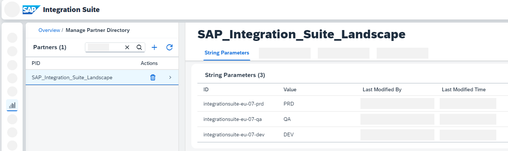
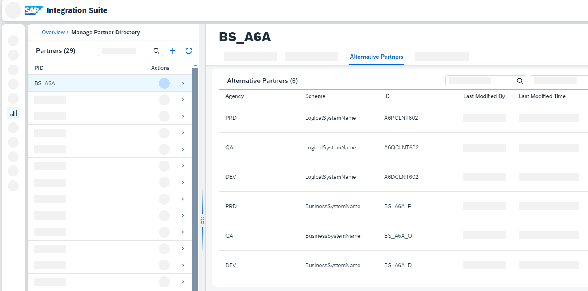

<!-- loio05cace189f9c4eb4a049e293630fed1e -->

# Landscape Stages

Landscape stages allow you to run scenarios on different stages without changing the Partner Directory configuration. Use it to automatically identify the landscape stage of your tenant during runtime, map actual names to aliases, and maintain routing conditions for integration scenarios.

As of integration package version 1.0.9, the pipeline concept supports different landscape stages such as DEV, QA, or PRD. This allows you to run your scenarios on the different landscape stages without changing the configuration in the Partner Directory, such as the XSLT for determining the receivers. During runtime, the actual sender business system name is mapped to a sender alias, which is used within the pipeline processing. Once the receiver alias has been determined, it's then mapped to the actual receiver business name.

To set up the support for landscape stages, you need to create the business system aliases as partner IDs in the Partner Directory, and for each stage maintain the mapping between alias name and actual names. Furthermore, to automatically identify the landscape stage of your tenant during runtime, the tenant names are used and are mapped to the corresponding stage IDs. This mapping is stored in the Partner Directory using partner ID `SAP_Integration_Suite_Landscape`.

For this mapping, you can either use the **Partner Directory API** \(see [Partner Directory](https://help.sap.com/docs/integration-suite/sap-integration-suite/partner-directory)\) or the new **Partner Directory user interface** \(see [Managing Partner Directory Entries](https://help.sap.com/docs/integration-suite/sap-integration-suite/managing-partner-directory-entries)\).

> ### Note:  
> When connecting to ABAP proxies using the XI protocol or when exchanging IDoc messages, the business system names and logical system names depend on the landscape stages. In this case, you need a a landscape stage setup.
> 
> However, not all scenarios require different business system names based on the landscape stage: If your **business system names for a particular scenario remain the same on all stages**, you don't need to maintain the mapping between actual names and alias. During the pipeline processing, the alias names are then used instead.

> ### Note:  
> Even if aliases are used within the pipeline processing, the headers `SAP_Sender` and `SAP_Receiver` hold the actual business names. Therefore, the message monitor displays the actual business names.

<a name="loio05cace189f9c4eb4a049e293630fed1e__section_chp_2n5_g2c"/>

## Prerequisite: Map Tenant Name to Landscape Stage

As a prerequisite to automatically identify the landscape stage of your tenant during runtime, the tenant names must be mapped to the corresponding stage IDs. For this, create a new partner with name `SAP_Integration_Suite_Landscape` in the Partner Directory. For each stage, create a string parameter as follows:

-   Define the *ID* to equal the tenant name.
-   Define the *Value* as stage ID.

The following example shows the partner `SAP_Integration_Suite_Landscape`, with the three stage IDs DEV, QA, and PRD mapped to the corresponding tenant names.

> ### Note:  
> The tenant name uses the environment variable `TENANT_NAME`. See [Environment Variables](https://help.sap.com/docs/cloud-integration/sap-cloud-integration/environment-variables).

> ### Note:  
> If no `SAP_Integration_Suite_Landscape` partner exists or the tenant name is missing as string parameter in the partner `SAP_Integration_Suite_Landscape`, the value `PRD` is used as default during the pipeline processing.

> ### Note:  
> You can use your own naming convention for the stage IDs and you're flexible in terms of the number of stages. However, ensure that the stage IDs used for maintaining the business systems correspond to the stage IDs defined in the partner `SAP_Integration_Suite_Landscape`.

<a name="loio05cace189f9c4eb4a049e293630fed1e__section_gxw_2n5_g2c"/>

## Map Actual Name to Alias

For each sender or receiver system for which the landscape stages setup is required, create a partner in the Partner Directory, with the partner ID equaling the business system alias.

For each stage, create the following alternative partner to map the business system name to the alias:

-   Define the *Agency* to equal the `stage ID`.
-   Define the *Scheme* as fixed string that equals `BusinessSystemName`.
-   Define the *ID* to equal the actual business system name of the corresponding stage.

If you need the logical system name, create the following alternative partner for each stage:

-   Define the *Agency* to equal the `stage ID`.
-   Define the *Scheme* as a fixed string that equals `LogicalSystemName`.
-   Define the *ID* as the actual logical system name of the corresponding stage.

The following example shows a business system alias for which the actual business system names and logical system names are mapped as alternative partners.

> ### Note:  
> If no corresponding alias name exists or the alternative partner entry is missing, the sender system name or receiver system name isn’t mapped during the pipeline processing.

> ### Note:  
> When you're maintaining the routing conditions for the partner IDs to define an integration scenario in the Partner Directory, whether as XSLT mapping or as string parameter in case of any bypass option, you must use the aliases. This way, you can reuse the same scenario configuration across all stages.

