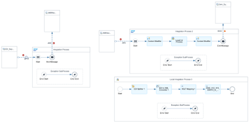

<!-- loio8e2cbe00955f4f6184c04c71063d2313 -->

# Migration to Cloud Integration

Learn how to migrate your B2B scenarios to Cloud Integration use cases that are based on sample scenarios.

The following sections describe the migration procedure for **[Inbound Interfaces](migration-to-cloud-integration-8e2cbe0.md#loio8e2cbe00955f4f6184c04c71063d2313__section_akw_4mg_42c)** and **[Outbound Interfaces](migration-to-cloud-integration-8e2cbe0.md#loio8e2cbe00955f4f6184c04c71063d2313__section_lxg_2jb_42c)**.

<a name="loio8e2cbe00955f4f6184c04c71063d2313__section_akw_4mg_42c"/>

## Inbound Interfaces

In this case, the trading partner sends an EDI \(`ANSI X12 – 810`\) flat file, which must be transformed to an invoice IDoc \(`INVOIC.INVOIC02`\) and sent to your own system.

In SAP Process Integration and SAP Process Orchestration, this integration consists of the following steps:

1.  Sender integration flow \(trading partner to EDI separator\)
2.  Mapping integration flow \(EDI separator to own system or partner\)
3.  Receiver integration flow \(acknowledgment from EDI separator to trading partner\)

### Step 1: Sender Integration Flow \(Trading Partner to EDI Separator\)

The first step of the integration involves the following substeps:

1.  The trading partner triggers the ANSI X12 - 810 flat files to SAP Process Orchestration system with connectivity such as `AS2/HTTP/SFTP/FTP`.

2.  Based on the connectivity, the trading partner identifiers are fetched in the sender channel.

3.  The file is sent as it is to the EDI separator receiver channel, which also performs the validation.

    > ### Note:  
    > The file can be a single file or bulk. By default, it's automatically split into single transactions \(including envelopes\).

4.  Finally, the file is sent to the second integration flow, in step 2.

### Step 2: Message Mapping Integration Flow \(EDI to Own System or Partner\)

The second step of the integration involves the following substeps:

1.  In the EDI separator sender channel with the validated EDI format using the adapter module `X12ConverterModule` in the sender channel, the flat file is converted to `ANSI X12 – 810 XML` file.
2.  The receiver determination finds the receivers to which the target systems must route the file.
3.  The configured source and target message and envelopes are transformed from `ANSI X12 – 810 XML` file to an `IDOC INVOIC.INVOIC02 XML` format. Inbuilt mapping functions and UDFs are used to design any mapping operations.
4.  With the help of the receiver channel, the generated `IDOC INVOIC.INVOIC02 XML` is sent to the target system.

\[SCREENSHOT\]

### Step 3: Receiver Integration Flow: Acknowledgment from EDI Separator to Trading Partner

In the final step of the integration, this integration flow sends the acknowledgment `ANSI X12 – 997` back to the trading partner.

> ### Note:  
> This integration flow is an optional configuration in case `997` is required. Setting EDI Separator sender channel, the sender and receiver identifier remain to be specified.

### Semi-Automatic Inbound Interface Migration from SAP Process Integration and SAP Process Orchestration

Based on the example scenario in the previous section, the following section describes the semi-automatic migration steps.

The [Migration Tool](https://help.sap.com/docs/integration-suite/sap-integration-suite/migration-tooling?version=CLOUD) offers a template-based approach to migrating integration artifacts. You must choose how the content lifecycle of the integration artifacts, especially message mappings and UDFs, value mappings, message types, and XSLT scripts, are maintained and governed, given the framework of SAP Integration Suite. For best practices and further readings about resource management, see [Manage Resources](https://help.sap.com/docs/integration-suite/sap-integration-suite/manage-resources-of-integration-flow?q=Reuse+xslt&version=CLOUD#referencing-resources).

The following example uses the pattern **point-to-point asynchronous**.

1.  Select the template `Point-to-Point Asynchronous`. *Decouple with JMS queue* is selected, which creates an interface with one integration process to receive the file from the trading partner and send it to a JMS queue. The second integration process fetches the file from the JMS queue, transforms it using a local integration process, and sends it to its own system. Finally, the migrated message mapping is created in the local integration process.

2.  In the local integration process you can add the sequence of mappings and additional logic.

3.  Add the EDI splitter and add it to the XML converter. Select the Cloud Integration-specific `ANSI X12 810` schema. You can use it from Integration Advisor or from the source payload from your SAP Process Orchestration system.

4.  Use XSLT mapping to convert the Cloud Integration-specific `ANSI X12 810` XML structure to the SAP Process Orchestration-specific `ANSI X12 810` XML structure.

    The following example shows the integration processes: 

If Cloud Integration is connected to ES Repository in SAP Process Orchestration, individually migrate your objects to integration flows in Cloud Integration. See [Import Mapping Content from ES Repository](https://help.sap.com/docs/cloud-integration/sap-cloud-integration/importing-mapping-content-from-es-repository) .

<a name="loio8e2cbe00955f4f6184c04c71063d2313__section_lxg_2jb_42c"/>

## Outbound Interfaces

In the following example for an outbound interface, `INVOIC02` IDocs are sent from your own system to the trading partner. This is a one-step interface.

1.  `INVOIC02` IDocs triggered from your own system are received at SAP Process Orchestration using the IDoc sender channel.
2.  In the receiver determination, based on the conditions, the trading partners are selected.
3.  In the mapping step, `INVOIC.INVOIC02` IDocs are transformed to `ANSI X12 – 810` XML files.
4.  In the receiver channel, the generated `ANSI X12 – 810` XML files are converted to `ANSI X12 – 810` flat files using the X12ConverterModule.

\[SCREENSHOT\]

### Semi-Automatic Outbound Interface migration from SAP Process Orchestration

The following steps refer to the example using the pattern **Point-to-Point Asynchronous**.

1.  Select the template `Point-to-Point Asynchronous`. *Decouple with JMS queue* is selected, which creates an interface with one integration process to receive the file from the trading partner and send it to a JMS queue. The second integration process then fetches the file from the JMS queue, transforms it using a local integration process, and sends it to your own system. The migrated message mapping is created in the local integration process.
2.  In the local integration process, you can add sequence of mappings and additional logic.

    For highest reusability and optimized lifecycle management, collect the imported MMAPs in dedicated integration packages. The mapping ID should be used with exchange properties for a dynamic approach.

3.  Use XSLT mapping to convert the SAP Process Orchestration-specific `ANSI X12 810` XML structure to the Cloud Integration-specific `ANSI X12 810` XML structure. You can use it from Integration Advisor or the source payload from your SAP Process Orchestration system.
4.  Add XML to the EDI converter and select the Cloud Integration-specific `ANSI X12 810` schema.

The following image shows the integration processes:

If Cloud Integration is connected to the ES Repository in SAP Process Orchestration, the objects should be individually migrated to integration flows in Cloud Integration. See [Import Mapping Content from ES Repository](https://help.sap.com/docs/cloud-integration/sap-cloud-integration/importing-mapping-content-from-es-repository).

For the lifecycle management and the optimized reuse of the mappings in multiple integration flow, it's recommended to import the message mapping in a package as follows.

1.  Navigate to your package.
2.  Go to *Add* \> *Message Mapping*, then choose *ES Repository* \> *Connect*.
3.  Select your message mapping and choose *Submit*.

    For more information about using message mapping as artifact for cross-reference usage, see [Creating Message Mapping as an Artifact](https://help.sap.com/docs/cloud-integration/sap-cloud-integration/developing-message-mapping-as-artifact).

Next, export the XSD from SAP Process Orchestration. The current import of message mapping, including the source and target interface, is converted from XSD to WSDL. Use either the ESR import option for message types/data types, or, optionally, export the XSD locally and upload them as a resource into the integration flows.

The usage of the maps including XSDs can be consumed in the previously explained integration flows.

<a name="loio8e2cbe00955f4f6184c04c71063d2313__section_uxc_hwh_q2c"/>

## Limitations

The following limitations apply to the lifecycle management of migrated extended standard EDI messages \(for example, `EDIFACT`, `X12`\):

Currently, there's no editor for maintaining extended standard EDI messages in SAP Integration Suite. Instead, you need an external editor or, if the SAP Process Orchestration instance is available, you need an extension in the legacy in the B2B integration cockpit, and then reimport it into SAP Integration Suite.

For information about feature parity, watch the [SAP Road Map Explorer](https://help.sap.com/docs/link-disclaimer?site=https%3A%2F%2Froadmaps.sap.com%2Fboard%3FCB%3D901B0ED1A0641ED8B4D1230C6387E0DB%26range%3DCURRENT-LAST).

