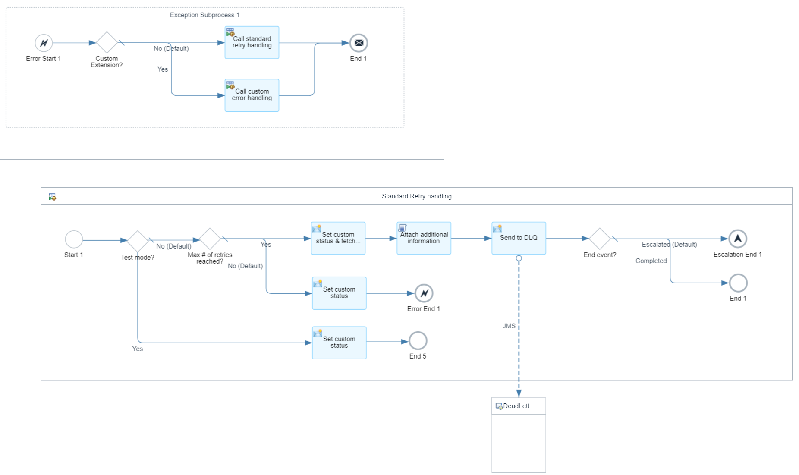

<!-- loioed9b82cb928049e6990a4d784aa6aac7 -->

# Monitoring and Error Handling in the Pipeline Concept

Perform monitoring and error handling in the pipeline concept, for example by using retry handling, message monitoring, and using the dead letter queue.


The following measures improve monitoring and error handling in the pipeline concept:

-   Use **SAP headers** to search for messages based on sender system, interface/message type, and receiver system.

-   Set a **custom status** for more information on the error root cause.
-   Use **retry handling** to limit the number of overall retries. See [Standard Retry Handling](monitoring-and-error-handling-in-the-pipeline-concept-ed9b82c.md#loioed9b82cb928049e6990a4d784aa6aac7__section_l3k_qrn_j1c).

-   User **custom exception handling** as an alternative to the standard retry handling and implement your own logic. See [Custom Exception Handling](monitoring-and-error-handling-in-the-pipeline-concept-ed9b82c.md#loioed9b82cb928049e6990a4d784aa6aac7__section_pm1_ggs_5bc).
-   With a **dead letter queue**, you can park messages for which the maximum number of retries has been exceeded. See [Dead Letter Queue Handling](monitoring-and-error-handling-in-the-pipeline-concept-ed9b82c.md#loioed9b82cb928049e6990a4d784aa6aac7__section_lq1_2sn_j1c).

-   Attach **additional information to the message processing log** if errors occur.

-   Add **custom header properties** to the message processing log so you can search logs based on payload data. See [Custom Header Properties](monitoring-and-error-handling-in-the-pipeline-concept-ed9b82c.md#loioed9b82cb928049e6990a4d784aa6aac7__section_c4h_dkz_zcc).


<a name="loioed9b82cb928049e6990a4d784aa6aac7__section_l3k_qrn_j1c"/>

## Standard Retry Handling

If you want to define a scenario-specific retry behavior, you need to create a string parameter with ID `MaxJMSRetries`. Otherwise, the maximum number of retries is set to 5, which is the global default value. In the generic inbound processing integration flow, this parameter is read from the Partner Directory and written in the message header `maxJMSRetries`. The header is passed to all other integration flows in the sequence of flows.

In all generic integration flows that read from a JMS queue, the following standard retry handling is implemented. For custom retry handling, see [Custom Exception Handling](monitoring-and-error-handling-in-the-pipeline-concept-ed9b82c.md#loioed9b82cb928049e6990a4d784aa6aac7__section_pm1_ggs_5bc).

Depending on whether a splitter is used within the generic integration flow, the implementation of the standard retry handling differs slightly. For the generic receiver determination and interface determination integration flows where the message is split, transaction handling ensures that split messages are rolled back in case of an error. However, if the message is forwarded to the dead letter queue, the message processing ends with either a message end event or an escalation end event so that already split messages are committed. If the message is moved from the dead letter queue to the actual queue for reprocessing, this may lead to duplicates. To avoid duplicates, an additional restart is required after the maximum number of retries have been actually exceeded. Its check needs to be done at the beginning of the integration flows, before splitting the message.

In general, if a message processing error occurs, the error is fetched in an exception subprocess. Within the exception subprocess, a local integration process is called.

For the generic inbound processing and the generic outbound processing flows, the local integration process checks if the maximum number of retries has already been exceeded using the following condition expression:

```
${header.SAPJMSRetries} = ${header.maxJMSRetries} or ${header.maxJMSRetries} = '0'
```

As mentioned before, for the generic receiver determination and the generic interface determination integration flows, the check must be done in the beginning, and one additional retry is needed. Hence, the condition expression looks as follows:

```
${header.SAPJMSRetries} > ${header.maxJMSRetries} and ${property.CustomXError_Enabled} != 'true'
```

If the condition is met, the custom status is set to `MaxRetriesExceeded` and an error is raised. In this case, the condition expression in the exception subprocess reads as follows:

```
${property.SAP_MessageProcessingLogCustomStatus} = 'MaxRetriesExceeded'
```

In both cases, the default route, that is, if the maximum number of retries hasn't been exceeded, sets the custom status to *AutomaticRetry* and then ends with an **error end event**. This means that the message remains in the status *Failed* and is retried from the inbound JMS queue.

Otherwise, if the maximum number of retries has been exceeded, the custom status is set to `MaxRetriesExceeded`. In a Groovy script, additional information about the inbound queue name and the dead letter queue name is attached to the message processing log. The name of the dead letter queue follows the following pattern:

`<name of the inbound queue>_DLQ`

The message is then written to the dead letter queue. By default, the message ends with an escalation end event, which then sets the message status to *Escalated*. You can change this behavior by configuring the externalized parameter `DLQ_EndEvent` of the generic integration flows. By default, the value of the parameter is `Escalated`, but you can change the value to `Completed` to end the message with the message status `Completed`.

For failed test messages, that is, failed messages for which the header `testMode` is set to `true`, the retry handling is skipped and the message is instantly completed with the custom status *ErrorInTestMode*.

The following is an example of retry handling:




<a name="loioed9b82cb928049e6990a4d784aa6aac7__section_pm1_ggs_5bc"/>

## Custom Exception Handling

As an alternative to the standard retry handling, you can implement your own custom exception handling. The generic integration flows support a kind of custom exit that you can use to run your own custom exception logic without changing the delivered generic integration flows. To do so, you must implement a separate integration flow that's called instead of the standard retry handling if an exception occurs.

To enable the custom exception handling, configure the generic integration flows as follows:

1.  In the integration flow configuration, switch to the tab *More* and set the parameter *CustomXError\_Enabled* to `true` \(the default value is `false`\).

2.  Next, in the tab *Receiver*, select the receiver *CustomErrorFlow* of adapter type *ProcessDirect*. Maintain the end point of the integration flow that should be called in an exception occurs. By default, the value is set to `/pip/custom/errorHandling`. You can keep that value or change it to your preference.

    Instead of the standard retry handling, the local integration process `Call custom error handling` is now called.

3.  You can exchange message headers and the message body between the generic integration flows and the custom exception handling integration flow.

    In a content modifier step, the following headers are passed to the custom exception handling integration flow:


    <table>
    <tr>
    <th valign="top">

    Name
    
    </th>
    <th valign="top">

    Source Type
    
    </th>
    <th valign="top">

    Source Value
    
    </th>
    </tr>
    <tr>
    <td valign="top">
    
    `exceptionTimestamp`
    
    </td>
    <td valign="top">
    
    Expression
    
    </td>
    <td valign="top">
    
    `${date:now:dd-MM-yyyy HH:mm z}`
    
    </td>
    </tr>
    <tr>
    <td valign="top">
    
    `exceptionStacktrace`
    
    </td>
    <td valign="top">
    
    Expression
    
    </td>
    <td valign="top">
    
    `${exception.stacktrace`
    
    </td>
    </tr>
    <tr>
    <td valign="top">
    
    `exceptionMessage`
    
    </td>
    <td valign="top">
    
    Expression
    
    </td>
    <td valign="top">
    
    `${exception.message}`
    
    </td>
    </tr>
    <tr>
    <td valign="top">
    
    `pipelineStepID`
    
    </td>
    <td valign="top">
    
    Expression
    
    </td>
    <td valign="top">
    
    `${camelId}`
    
    </td>
    </tr>
    <tr>
    <td valign="top">
    
    `partnerID`
    
    </td>
    <td valign="top">
    
    Expression
    
    </td>
    <td valign="top">
    
    `${property.partnerID}`
    
    </td>
    </tr>
    <tr>
    <td valign="top">
    
    `incomingQueue`
    
    </td>
    <td valign="top">
    
    Expression
    
    </td>
    <td valign="top">
    
    `{{JMS_Incoming}}`
    
    </td>
    </tr>
    </table>
    
    Additionally, the following further headers of the Camel runtime or headers that have already been defined in the generic integration flow before are also passed to the custom exception handling integration flow:

    -   `SAP_Sender`

    -   `SAP_SenderInterface`

    -   `SAP_MessageType`

    -   `SAP_Receiver`

    -   `maxJMSRetries`

    -   `SAPJMSRetries`

    -   `testMode`


    You can use these headers within the custom exception handling integration flow to implement your custom exception logic. If you do so, remember to enter the headers in the *Allowed Header\(s\)* runtime configuration in the custom exception handling integration flow.

4.  In a request reply step, the custom exception handling integration flow is then called via a ProcessDirect adapter.

5.  As response, the headers *customXError\_Status* and *customXError\_EndEvent* are excepted. The headers must be set in the custom exception handling integration flow.

6.  In a content modifier, the custom status is set to the value of the header *customXError\_Status*.

7.  Depending on the value of the *customXError\_EndEvent*, the local integration process ends as follows:

    -   If the value equals *Complete*, it ends with an end event.

    -   If the value equals *Escalated*, it ends with an escalation end event.

    -   In all other cases, it ends with an error end event.


The following screenshot shows the local integration flow as it calls the custom exception handling integration flow:


You can either create your custom exception handling flow from scratch or use the provided integration flow `Pipeline Template – Custom Error Handling` as template. The `Pipeline Template - Custom Error Handling` has implemented a similar logic like the standard retry handling. If you define your own integration flow from scratch, ensure that the allowed headers are set as described in the previous steps. You also need to pass back the headers *customXError\_Status* and *customXError\_EndEvent*.


<a name="loioed9b82cb928049e6990a4d784aa6aac7__section_xfy_1sn_j1c"/>

## Message Monitoring

To showcase the monitoring handling, the following section discusses the monitoring of a message that fails in the inbound conversion.

In the SAP Integration Suite, go to *Monitor* \> *Integration and APIs* \> *Monitor Message Processing*. Here, you can filter for the **correlation ID**, which shows the logs of the different pipeline steps that have been carried out so far for a particular message. You can also see that Sender and Application Message Type are set as well, so you can also filter for the sender system and the sender interface name.

If the inbound conversion failed, the logs of the scenario-specific conversion integration flow are in status *Failed*. In this example, you see two failed logs because one restart has already been carried out. The custom status is set to *RetryViaParentFlow*, which indicates that the retry is handled by the calling integration flow.

The following is an example of a failed inbound conversion integration flow:


In the Monitoring section, you can also filter for a **Custom Status**, for example, for *MaxRetriesExceeded*.

The following is an example in which the maximum number of retries has been exceeded:


<a name="loioed9b82cb928049e6990a4d784aa6aac7__section_lq1_2sn_j1c"/>

## Dead Letter Queue Handling

If the maximum number of retries has been exceeded, the message is sent to a **dead letter queue**. The name of the queue is provided in the additional information attached to the message processing log.

The following is an example of additional information:


Once you've fixed the root cause of the error, you can reprocess the messages in the dead letter queue: simply move the message from the dead letter queue to the corresponding inbound queue.

> ### Note:  
> Currently, you can't move a **single message** from one queue to another. The move feature in the queue monitor only enables you to move **all messages within a queue**.

The following is an example of how to reprocess messages in dead letter queues:

 


<a name="loioed9b82cb928049e6990a4d784aa6aac7__section_c4h_dkz_zcc"/>

## Custom Header Properties

If you want to search the message processing logs based on any payload data, you can create custom header properties in the generic integration flows. To do so, you must configure and pass the header `customHeaderProperties` to the generic integration flows.

Depending on your integration scenario, you can configure the header in either the scenario-specific inbound processing flow or the scenario-specific inbound conversion flow.

The following approaches are supported:

-   **Recommended option**: Define exchange properties with prefix `customHeader_` and call the Groovy script `addCustomHeaderProperties` to set the header `customHeaderProperties` as JSON pairs in base64 encoded. In this case, any special characters inside the custom header values are supported.
-   **Alternative option**: Define the header `customHeaderProperties` as a list of name and value pairs.

    > ### Note:  
    > This option uses the characters colon \("`:`"\) and pipe \("`|`"\) to separate name and value and their pairs. Therefore, you can't use this option if the value of the custom header properties contains any of those special characters.

-   **Combination**: For compatibility reasons, you can combine both options.


### Recommended Option: Using Exchange Properties

For each custom header property, you can create an exchange property with prefix `customHeader_` in a content modifier step. The name of the exchange property without the prefix becomes the name of the custom header property.

After the content modifier step, call the Groovy script `addCustomHeaderProperties` from the script collection `Pipeline Generic - Script Collection` of the provided integration package. The script creates the header `customHeaderProperties`, adding the name and value pairs of the previously defined exchange properties with prefix `customHeader_` as JSON format and base64 encodes it. Furthermore, it adds the custom header properties to your scenario-specific integration flow. The header `customHeaderProperties` is then passed to the generic integration flows.

In the generic integration flows, the same Groovy script `addCustomHeaderProperties` encodes the value of the header `customHeaderProperties`, splits up the list of name and value pairs, and adds the custom header properties accordingly.

In the message monitor, you can find the custom headers in the *Properties* tab of the message processing logs of the generic integration flows. In the filter section, you can search for specific custom header values.


### Alternative Option: Directly Maintaining Header CustomHeaderProperties

In a content modifier step, you can create a new header `customHeaderProperties`. Its source value must follow the following pattern:

-   Name and value are separated by colon \(“`:`”\)

-   Name and value pairs are separated by pipe \(“`|`”\)


Optionally, you can call the script `addCustomHeaderProperties` to add the custom header properties to your scenario-specific flow.

In the generic integration flows, the Groovy script `addCustomHeaderProperties` splits up the list of name and value pairs and adds the custom header properties accordingly.

In the message monitor, the custom headers are displayed in the Properties tab of the message processing logs of the generic integration flows. In the filter section, you can search for specific custom header values.


### Provided Templates

The templates `Pipeline Template Step01 - Inbound Processing At Least Once`, `Pipeline Template Step01 - Inbound Processing Exactly Once`, and `Pipeline Template Step01 - Inbound Processing Synchronous` contain content modifier flow steps and a Groovy script flow step that support the custom header properties.

If you go for the recommended option, you only need one content modifier in which you define the exchange properties with prefix `customHeader_` and source type `XPath` parsing the incoming XML message. For example, `customHeader_prop_1` and `customHeader_prop_2`.

If you decide to apply the alternative option, in the first content modifier step, you can define exchange properties, for example, prop\_1, prop\_2, by parsing the incoming XML message. In the second content modifier step, you then maintain the name and value pairs in the source value of source type *Expression* of the header `customHeaderProperties` following the following pattern:

`name_1:${property.prop_1}|name_2:${property.prop_2}`

If your incoming payload isn't in XML format, create a script to parse the body of your message. Alternatively, you can define the custom header properties in the scenario-specific inbound conversion flow, if applicable. In this case, refer to the template `Pipeline Template Step03 - Inbound Conversion`.

Depending on the option you choose, delete the unnecessary message header or exchange property from the template copy. If you don’t need custom header properties, delete the unnecessary flow steps from the template copy.

