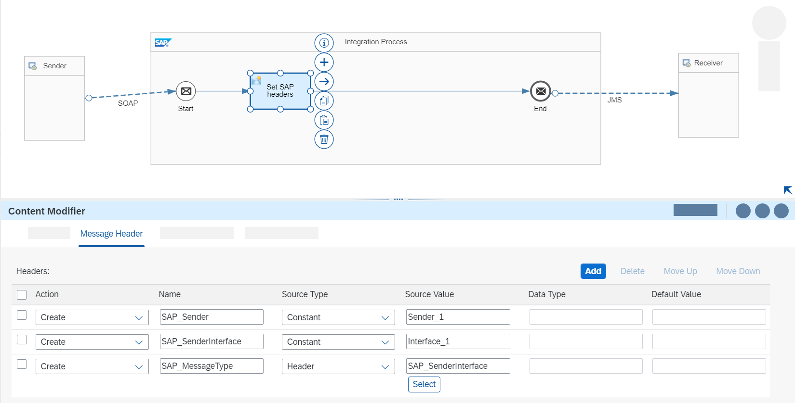
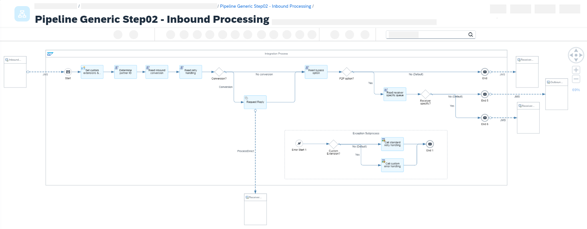
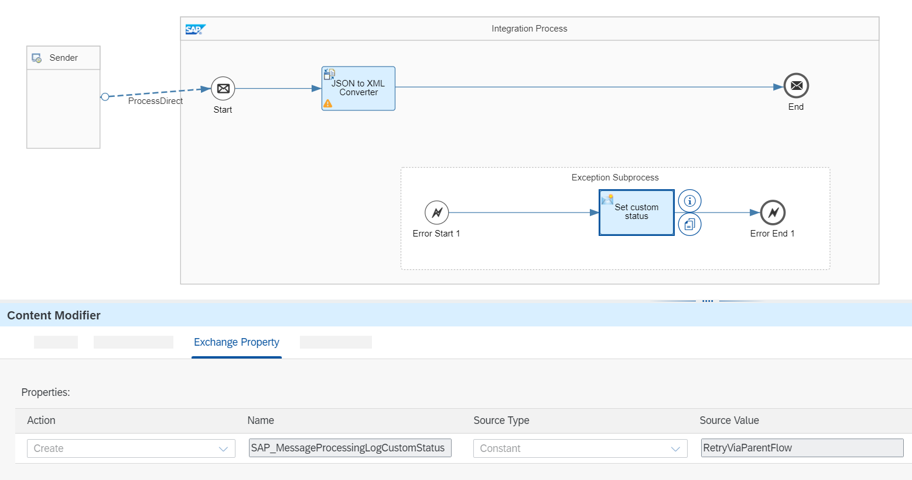
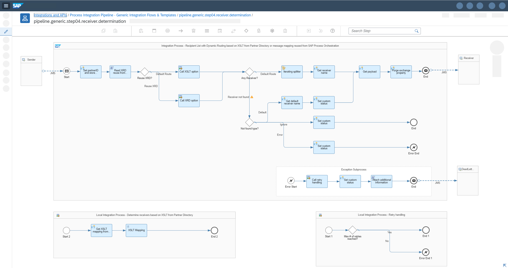
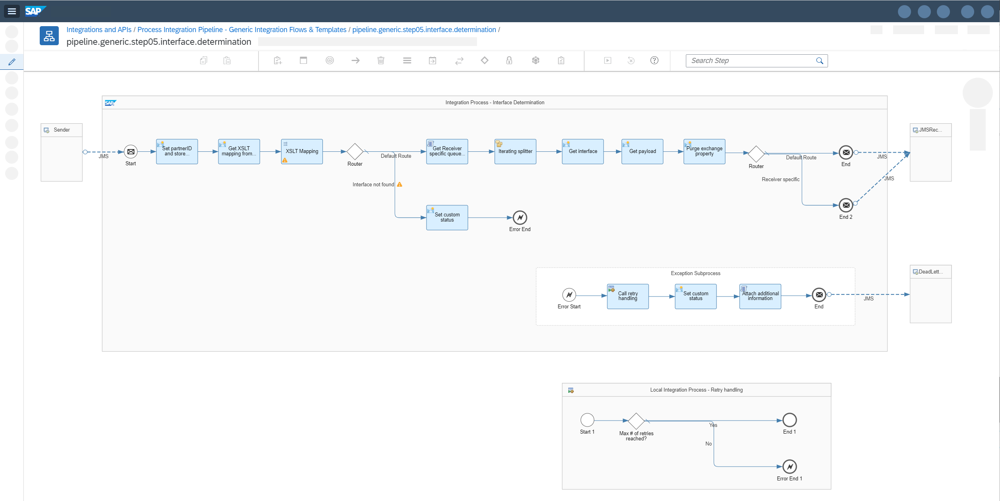
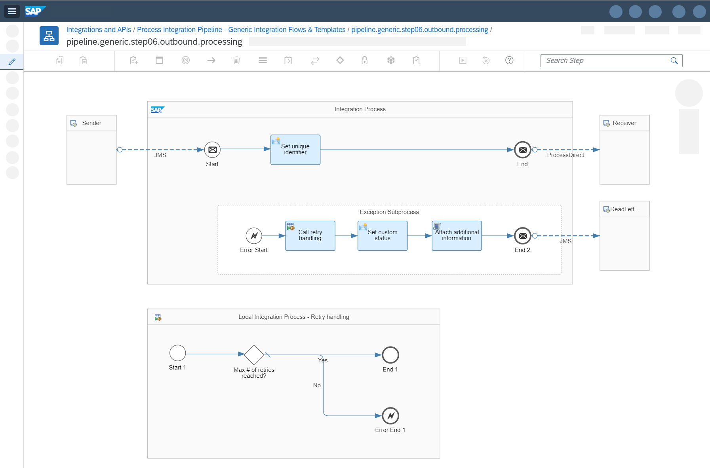
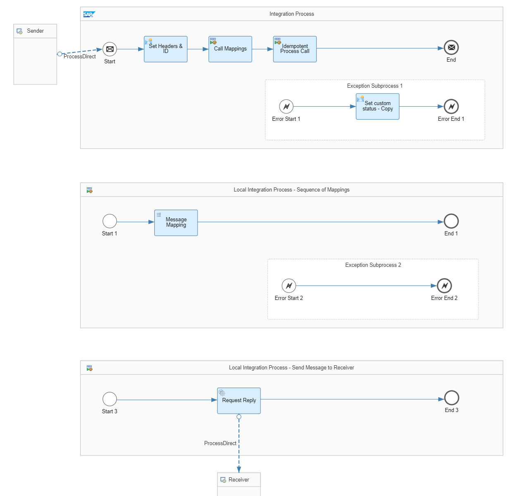

<!-- loiof8e69f43059a44cdb891892f4ff083d8 -->

# Pipeline Steps

The pipeline concept works with a fixed sequence of integration flows, the pipeline steps.

You can find the generic integration flows, the corresponding script collection, and a set of templates for the scenario-specific integration flows in the integration package <code><a href="https://hub.sap.com/package/PIPipelineGenericIntegrationFlows/overview">Process Integration Pipeline - Generic Integration Flows &amp; Templates</a></code> on the [SAP Business Accelerator Hub](https://hub.sap.com/). The generic integration flows can be deployed on your tenant as they are, but you can also adapt them to your own needs. The scenario-specific integration flows can be created as copies of the templates. Note that the templates are not complete but function as examples. For example, you must add the end points as they aren't included, especially for templates with ProcessDirect. Copy or replicate the templates to use them in your system with your custom details.

The following fixed sequence of integration flows makes up the pipeline steps:

1.  [Inbound Processing \(Scenario-Specific\)](pipeline-steps-f8e69f4.md#loiof8e69f43059a44cdb891892f4ff083d8__section_cfy_myk_31c): Handles the sender adapters.

2.  [Inbound Processing \(Generic\)](pipeline-steps-f8e69f4.md#loiof8e69f43059a44cdb891892f4ff083d8__section_ryf_vyk_31c): Dispatches the messages to the inbound conversion and handles the retry of messages with inbound conversion errors.

3.  [Conversion at Inbound \(Scenario-Specific\)](pipeline-steps-f8e69f4.md#loiof8e69f43059a44cdb891892f4ff083d8__section_q1q_vyk_31c): Runs conversion at the Cloud Integration inbound such as JSON to XML conversion.

4.  [Receiver Determination \(Generic\)](pipeline-steps-f8e69f4.md#loiof8e69f43059a44cdb891892f4ff083d8__section_qbb_wyk_31c): Determines the receivers in a content-based router or recipient list pattern scenario.

5.  [Interface Determination \(Generic\)](pipeline-steps-f8e69f4.md#loiof8e69f43059a44cdb891892f4ff083d8__section_drs_wyk_31c): Determines the receiver interfaces in an interface split scenario.

6.  [Outbound Processing \(Generic\)](pipeline-steps-f8e69f4.md#loiof8e69f43059a44cdb891892f4ff083d8__section_yqj_xyk_31c): Dispatches the messages to the message outbound and handles the retry of failed messages.

7.  [Outbound Processing \(Scenario-Specific\)](pipeline-steps-f8e69f4.md#loiof8e69f43059a44cdb891892f4ff083d8__section_e2p_xyk_31c): Handles the mappings and message outbound delivery.


> ### Note:  
> Generic integration flows read from JMS queues, for which some capacity restraints apply. To meet the demands of your landscape and workload, you can customize the **number of concurrent processes**. The default value is `2` as delivered with the integration package. See [Configure the JMS Sender Adapter](https://help.sap.com/docs/integration-suite/sap-integration-suite/configure-jms-sender-adapter).


<a name="loiof8e69f43059a44cdb891892f4ff083d8__section_cfy_myk_31c"/>

## Inbound Processing \(Scenario-Specific\)

The first integration flow in the sequence of flows represents the sender adapter processing. It's usually scenario-specific, for example, a file sender adapter polling files for a specific scenario. Depending on your specific use cases, you can also configure inbound processing integration flows, which are used across multiple scenarios. See, for example, [XI Sender Adapter](special-cases-1606af9.md#loio1606af9b55bf4391bea01d2f7ee112af__section_vcg_m1f_j1c) and [IDoc Sender Adapter](special-cases-1606af9.md#loio1606af9b55bf4391bea01d2f7ee112af__section_tjw_z3f_j1c). For these special cases, you can use the generic integration flows `Pipeline Generic Step01 - Inbound Processing for Idoc` and `Pipeline Generic Step01 - Inbound Processing for XI`.

In the scenario-specific inbound integration flow, you first configure the sender adapter, followed by a content modifier step in which the scenario-specific message headers are set. The message headers are needed for the subsequent processing, such as fetching the right receiver determination, and are passed to the rest of the integration flows. While the headers that are allowed are already preconfigured in generic integration flows, for scenario-specific integration flows, you must maintain the list of allowed headers in the runtime configuration. If you use the provided scenario-specific templates, the headers that are allowed are already preconfigured.

The following message headers are defined:

-   *SAP\_Sender*: Name of the sender system

-   *SAP\_SenderInterface*: Name of the sender interface

-   *SAP\_MessageType*: Same as *SAP\_SenderInterface*


*SAP\_Sender* and *SAP\_MessageType* are standard message headers that you can use to search for specific message logs in the message monitor. *SAP\_Sender* and *SAP\_SenderInterface* uniquely define an integration scenario.

> ### Note:  
> In SAP Process Orchestration, a scenario is uniquely defined using a combination of Sender Party, Sender System/Component, Sender Interface, Sender Interface Namespace, and, in some cases, Virtual Receivers. However, Sender Party, Sender Interface Namespace, and Virtual Receivers aren't used in Cloud Integration. Therefore, let's assume that the Sender System and Sender Interface sufficiently define an integration scenario.

Usually, you can set the message headers as constants since the integration flow is scenario-specific anyway. Depending on your use case, you can also fetch the information from the message payload or adapter-specific headers or properties.

After setting the message headers, the message is written to the first JMS queue using a JMS receiver adapter. It’s recommended to use externalized parameters for the queue name to be able to configure the JMS queue name without changing the integration flow.

The inbound processing integration flow is intentionally kept to a minimum to ensure message delivery. As the message is directly written to a JMS queue, the processing is decoupled from the sending system. If an error occurs in the subsequent message processing, the message is retried from this JMS queue.

The following screenshot is an example of a scenario-specific integration flow for inbound processing:



For this integration flow, the following templates are available in the integration package:

-   `Pipeline Template Step01 - Inbound Processing At Least Once`

-   `Pipeline Template Step01 - Inbound Processing Exactly Once`


<a name="loiof8e69f43059a44cdb891892f4ff083d8__section_ryf_vyk_31c"/>

## Inbound Processing \(Generic\)

The second integration flow in the sequence of flows, `Pipeline Generic Step02 - Inbound Processing`, is a generic integration flow, which means it’s used across all integration scenarios and only must be deployed once. In this case, use the Partner Directory to dynamically configure the message processing.

The generic inbound processing integration flow reads the messages from the first JMS queue. It then passes the messages to a scenario-specific integration flow to run scenario-specific inbound conversion steps like a JSON to XML conversion or conversion steps of the adapter module chain.

The information about whether a conversion is needed is stored in the Partner Directory. If a conversion is needed, the end point of the ProcessDirect adapter of the scenario-specific conversion integration flow is read from the Partner Directory. The partner ID with which the information is fetched is a combination of the sender system name and the sender interface name, separated with `~`. It's defined as follows, using the respective message headers:

`${header.SAP_Sender}~${header.SAP_SenderInterface}`

After the successful conversion, the message is stored in the second JMS queue using a JMS receiver adapter. Like in the first integration flow, use an externalized parameter for the queue name to be able to configure the JMS queue name without changing the integration flow.

If no conversion is needed, the message is passed through and directly stored in the second JMS queue.

If a conversion error occurs, the error is fetched in an exception subprocess, which first checks if the maximum number of retries have been exceeded. If they haven't been exceeded, the message remains in the first JMS queue from which it's retried. Otherwise, the message is parked in a so-called dead letter queue.

> ### Note:  
> You can define the maximum number of retries for a specific scenario. This is also stored in the Partner Directory. See [Retry Handling](monitoring-and-error-handling-in-the-pipeline-concept-ed9b82c.md#loioed9b82cb928049e6990a4d784aa6aac7__section_l3k_qrn_j1c).

The following screenshot is an example of a generic integration flow for inbound processing :

 


<a name="loiof8e69f43059a44cdb891892f4ff083d8__section_q1q_vyk_31c"/>

## Conversion at Inbound \(Scenario-Specific\)

The third integration flow is a scenario-specific integration flow that carries out message conversion at the Cloud Integration inbound. For example, if you want to migrate a scenario with a REST sender adapter and JSON to XML conversion, the JSON to XML conversion is done in this integration flow. Another example is a file sender adapter with flat file conversion option, for which the CSV to XML conversion is done here. Also, if you pick up a zipped file, you can perform the unzipping in the scenario-specific inbound conversion flow.

The scenario-specific integration flow is called by the second integration flow via the ProcessDirect adapter. If the conversion fails, the flow remains in status `Failed` because ProcessDirect connects synchronously. However, retrying the failed message is handled by the second integration flow. To mitigate the monitoring and error handling, you can define an exception subprocess as shown in the following example. In the exception subprocess, you must maintain the exchange property `SAP_MessageProcessingLogCustomStatus` to set a custom status. In this example, set the custom status value to `RetryViaParentFlow`, indicating that this failed message instance can be ignored. Ensure that the exception subprocess ends with an error end event. This way, the error is forwarded to the calling integration flow and the message isn't removed from the inbound JMS queue, but rather scheduled for a retry.

The following screenshot is an example of a scenario-specific integration flow for inbound conversion:

 

For this integration flow, the template `Pipeline Template Step03 - Inbound Conversion` is available in the integration package.


<a name="loiof8e69f43059a44cdb891892f4ff083d8__section_qbb_wyk_31c"/>

## Receiver Determination \(Generic\)

The fourth integration flow, `Pipeline Generic Step04 - Receiver Determination`, is a generic integration flow that handles the receiver determination. Similarly as the other generic integration flows, use the Partner Directory to dynamically configure the message processing. The partner ID with which the information is fetched is a combination of the sender system name and the sender interface name, separated with `~` and defined as follows using the respective message headers:

`${header.SAP_Sender}~${header.SAP_SenderInterface}`

The generic receiver determination integration flow reads the messages from the second JMS queue using a JMS sender adapter. By default, the XSLT mapping containing the content-based routing xpath conditions is read from the Partner Directory and then executed. The special case in which you can reuse an existing extended receiver determination mapping is described in [Reuse Extended Receiver Determination](special-cases-1606af9.md#loio1606af9b55bf4391bea01d2f7ee112af__section_kjy_1jf_j1c). As mentioned previously, by using an XSLT mapping for the receiver determination instead of explicit multicasts and routers, the integration flow model can be kept concise and easy to read.

Before the XSLT mapping is run, the incoming message body is stored in an exchange property because the execution of the mapping overwrites the body.

The following example shows what an XSLT mapping to execute the content-based routing condition to determine the receivers can look like:

```
<?xml version="1.0" encoding="UTF-8"?>
<xsl:stylesheet version="3.0" xmlns:xsl="http://www.w3.org/1999/XSL/Transform">
  <xsl:template match="/">
    <ns0:Receivers xmlns:ns0="http://sap.com/xi/XI/System">
     <ReceiverNotDetermined>
       <Type>Error</Type>
       <DefaultReceiver/>
    </ReceiverNotDetermined>
    <xsl:if test="/*:Item/Category = 'Keyboards'">
      <Receiver>
        <Service>Receiver_1</Service>
      </Receiver>
    </xsl:if>
    <xsl:if test="(/*:Item/Category = 'Keyboards') or (/*:Item/Category = 'Software')">
      <Receiver>
        <Service>Receiver_2</Service>
      </Receiver>
    </xsl:if>
    <xsl:if test="(/*:Item/Category = 'Keyboards') and (/*:Item/ProductName != 'XXXX')">
      <Receiver>
        <Service>Receiver_3</Service>
      </Receiver>
    </xsl:if>
    </ns0:Receivers>
  </xsl:template>
</xsl:stylesheet>
```

The following example shows the outcome when running the XSLT mapping:

```
<?xml version="1.0" encoding="UTF-8"?>
<ns0:Receivers xmlns:ns0="http://sap.com/xi/XI/System">
  <ReceiverNotDetermined>
    <Type>Error</Type>
    <DefaultReceiver/>
  </ReceiverNotDetermined>
  <Receiver>
    <Service>Receiver_1</Service>
    </Receiver>
  <Receiver>
    <Service>Receiver_2</Service>
  </Receiver>
</ns0:Receivers>
```

The XML format resembles the format of the extended receiver determination message type of SAP Process Orchestration. For each receiver for whom the xpath condition applies, a receiver node with service node and the receiver system name is added. For simplification purposes, the Party part of the standard message format is removed here. However, the format has been extended with configuration information about how the processing should behave in case that no xpath condition is met, that is, if no receiver could be determined. In the example, an error should be raised. Other options are `Ignore` and `Default`. In the `Default` case, a default receiver must be maintained in the same format as the receiver node.

If the Receivers XML doesn't contain any Receiver nodes, the message processing continues in the `Receiver not found` route. Depending on the settings for `Receiver not found`, either an error is raised, the message is ignored, or the message is sent to a default receiver. If an *Error* occurs, the message is kept in the inbound JMS queue and eventually retried until the maximum number of retries is reached. If *Ignore* is set, the message is ended without an error and the message status is set to `Completed`. If *Default* is set, the default receiver name is fetched from the payload and the message processing continues.

For all `receiver not determined` options, a custom status is maintained so that you have full transparency about why the processing has been terminated. For the *Default* option, the custom status is set to `ReceiverNotFoundDefault`, for *Ignore* it's set to `ReceiverNotFoundIgnored`, and for *Error*, it's set to `ReceiverNotFoundError`.

Otherwise, in the default route, that is, if at least one receiver has been determined, the receivers XML message is split using an iterating splitter. For each split message, the standard message header `SAP_Receiver` is set with the name of the receiver system, the original payload is retrieved from the exchange property, and the message is then stored in the third JMS queue to be passed on to the next pipeline step.

This way, you can ensure that the messages for different receivers are processed individually. If the processing for one receiver fails, it doesn't affect the processing of the messages of the other receivers.

The following screenshot is an example of a generic integration flow for receiver determination:

 


<a name="loiof8e69f43059a44cdb891892f4ff083d8__section_drs_wyk_31c"/>

## Interface Determination \(Generic\)

The fifth integration flow, `Pipeline Generic Step05 - Interface Determination`, is a generic integration flow that handles the interface determination and the interface split. Here, you can also use the Partner Directory to dynamically configure the message processing. In this case, the partner ID with which the information is fetched is a combination of the sender system name, the sender interface name, and the receiver system name, separated with `~` and defined as follows using the respective message headers:

`${header.SAP_Sender}~${header.SAP_SenderInterface}~${header.SAP_Receiver}`

The generic interface determination integration flow reads the messages from the third JMS queue using a JMS sender adapter. For the interface determination, the same approach as the receiver determination is applied, that is, for each receiver you use an XSLT mapping to determine the receiver interface and mapping. The XSLT mapping containing the routing xpath conditions is read from the Partner Directory and then executed.

Before the XSLT mapping is run, the incoming message body is stored in an exchange property because the execution of the mapping overwrites the body.

The following is an example of an XSLT mapping to execute the routing condition to determine the interfaces:

```
<?xml version="1.0" encoding="UTF-8"?>
<xsl:stylesheet version="3.0" xmlns:xsl="http://www.w3.org/1999/XSL/Transform">
  <xsl:template match="/">
    <ns0:Interfaces xmlns:ns0="http://sap.com/xi/XI/System">
    <xsl:if test="/*:Item/Quantity = '10'">
      <Interface>
        <Index>1</Index>
        <Service>/pip/07/scenario1/rcvidx1/ifidx1</Service>
      </Interface>
    </xsl:if>
    <xsl:if test="/*:Item/CurrencyCode = 'EUR'">
      <Interface>
        <Index>2</Index>
        <Service>/pip/07/scenario1/rcvidx1/ifidx2</Service>
      </Interface>
    </xsl:if>
    <xsl:if test="/*:Item/Quantity != '10'">
      <Interface>
        <Index>3</Index>
        <Service>/pip/07/scenario1/rcvidx1/ifidx3</Service>
      </Interface>
    </xsl:if>
    </ns0:Interfaces>
  </xsl:template>
</xsl:stylesheet>
```

The following is an example of the outcome of running the XSLT mapping:

```
<?xml version="1.0" encoding="UTF-8"?>
<ns0:Interfaces xmlns:ns0="http://sap.com/xi/XI/System">
  <Interface>
    <Index>1</Index>
    <Service>/pip/07/scenario1/rcvidx1/ifidx1</Service>
  </Interface>
  <Interface>
    <Index>2</Index>
    <Service>/pip/07/scenario1/rcvidx1/ifidx2</Service>
  </Interface>
</ns0:Interfaces>
```

For the interface determination, SAP Process Orchestration doesn’t support a similar capability as for the extended receiver determination. So, we came up with a new XML format in sync with the receiver determination XML format. For each condition in the interface determination of the integrated configuration object in SAP Process Orchestration, assign an index number. Because there can be two different conditions for the same receiver interface, don't work with receiver interface names here but rather use the interface index. Whenever the xpath condition applies, an interface node with index node and service node is added. The value of the service node holds the ProcessDirect endpoint of the scenario-specific outbound processing integration flow.

If the Interfaces XML doesn't contain any interface nodes, the message processing continues in the `Interface not found` route and an error is raised. Besides the receiver determination, the interface determination in SAP Process Orchestration doesn’t distinguish between the different exception cases *Error*, *Ignore*, and *Default*. If no condition is met, an error is raised and the custom status is set to `InterfaceNotFoundError`.

Otherwise, in the default route, that is, if at least one interface has been determined, the interface XML message is split using an iterating splitter. For each split message, the message headers `SAP_ReceiverInterfaceIndex` and `SAP_OutboundProcessingEndpoint` are set based on the split messages. The original payload is retrieved from the exchange property, and the message is stored in the fourth and last JMS queue to be passed to the next pipeline step. For a special case in which you can use a receiver-specific JMS queue, see [Receiver-Specific Outbound Queues](special-cases-1606af9.md#loio1606af9b55bf4391bea01d2f7ee112af__section_n2d_cjf_j1c).

This way, you can ensure that the messages for different interfaces are processed individually. If the processing for one interface fails, it doesn't affect the processing of the messages of the other interfaces.

The following screenshot is an example of a generic integration flow for interface determination:

 


<a name="loiof8e69f43059a44cdb891892f4ff083d8__section_yqj_xyk_31c"/>

## Outbound Processing \(Generic\)

The sixth integration flow in the sequence of flows, `Pipeline Generic Step06 - Outbound Processing`, is a generic integration flow. The task of this integration flow is to dispatch the messages to the right scenario-specific outbound processing and to handle the retry if outbound conversion errors occur. So, it reads the messages from the fourth JMS queue, sets a unique ID based on the MPL ID and then calls the scenario-specific outbound processing flow via ProcessDirect adapter whereas the ProcessDirect endpoint of the scenario-specific outbound processing flow was passed from the previous generic flow. The unique ID is eventually used in the subsequent integration flow to guarantee exactly once delivery in case that the final receiver system isn't idempotent.

The following screenshot is an example of a generic integration flow for outbound processing:

 


<a name="loiof8e69f43059a44cdb891892f4ff083d8__section_e2p_xyk_31c"/>

## Outbound Processing \(Scenario-Specific\)

The seventh and last integration flow is a scenario-specific integration flow in which mappings, message conversions at the Cloud Integration outbound, and the message delivery are carried out. For example, if you want to migrate a scenario with a message mapping, a REST receiver adapter and XML to JSON conversion, all the conversion is done here, and the message is sent out using the HTTP adapter.

The scenario-specific integration flow is called by the sixth integration flow via the ProcessDirect adapter. If the conversion or outbound delivery fails, the flow remains in status `Failed` and the message processing is eventually retried from the sixth integration flow. Similar to the third integration flow in the sequence, you can define a custom status `RetryViaParentFlow` indicating that this failed message instance can be ignored.

For the scenario-specific outbound processing, we've identified four different templates based on the different options for defining the receiver interfaces in the integrated configuration object in SAP Process Orchestration:

-   Point-to-Point with either no message mapping or a sequence of 1:1 message mappings

-   Interface split with a One-to-Many message mapping with one target message type, for example, one message for each item

-   Interface split with a One-to-Many message mapping with multiple target message types, for example, header and items

-   Interface split with the Maintain Order at Runtime flag selected, for example, actual message and trigger message


In the following example, the Point-to-Point migration template is used for creating the scenario-specific outbound processing integration flow. It runs a message mapping to map the sender message type to the receiver message type and then delivers the message to the receiver within an idempotent process call to guarantee exactly once delivery.

The following screenshot is an example of a scenario-specific outbound integration flow:



For this integration flow, the following templates are available in the integration package:

-   `Pipeline Template Step07 - Outbound Processing Point-to-Point`

-   `Pipeline Template Step07 - Outbound Processing One-to-Many with One Message Type`

-   `Pipeline Template Step07 - Outbound Processing One-to-Many with Multiple Message Types`

-   `Pipeline Template Step07 - Outbound Processing Maintain Order At Runtime`


