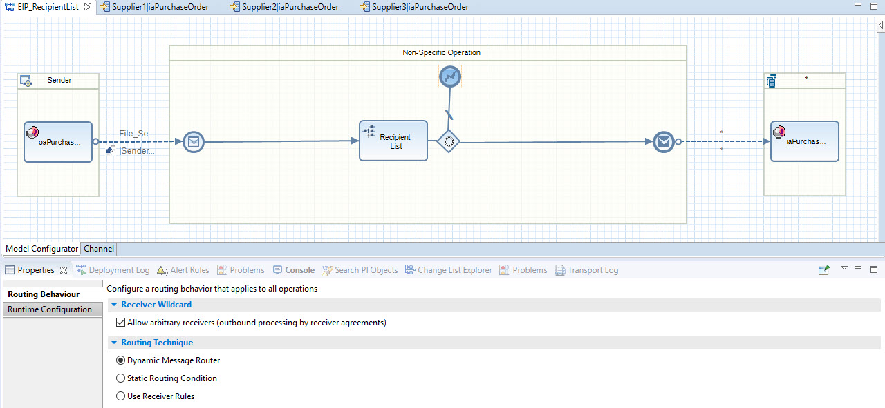
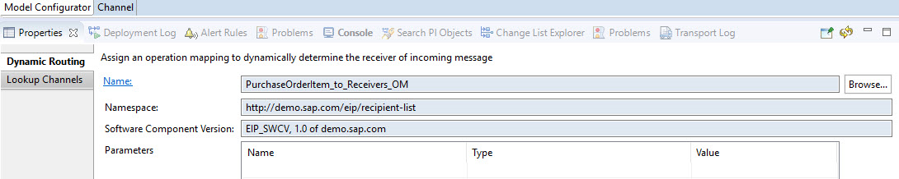
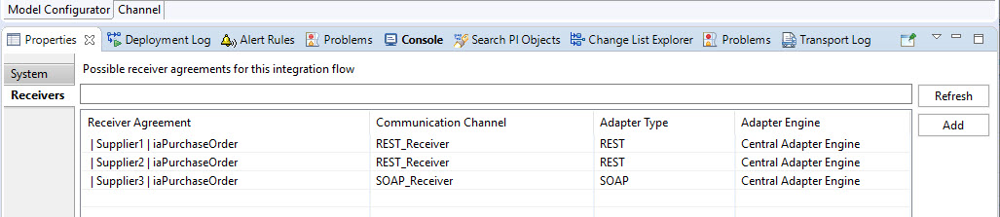

<!-- loio9df9086a830c42f3961f2b274e61bf85 -->

# Recipient List

The [Recipient List](https://www.enterpriseintegrationpatterns.com/patterns/messaging/RecipientList.html) pattern is used to route a message to a list of recipients. It's similar to the Content-Based Routing pattern, but the receiver determination doesn’t rely on the content of the message.

<a name="loio9df9086a830c42f3961f2b274e61bf85__section_hzk_pzj_qqb"/>

## SAP Process Orchestration

Similar to the Content-Based Routing, you model the Recipient List pattern using a Recipient List within the integration flow. When maintaining the list of potential receivers, you have the possibility to select one of the following routing techniques:

-   Dynamic \(via message mapping\)

-   Static \(an Xpath condition either based on the payload data or the message header\),

-   Receiver rules \(reusable routing conditions\).

Other than for the Content-Based Router, here the routing conditions don’t have to be disjoint, and hence the same message may be routed to multiple receivers.

In the following example, we stick to the dynamic routing condition in combination with the receiver wildcard. As you can see in the figure, we've chosen the *Dynamic Message Router* as routing technique and have selected the *Allow arbitrary receivers* flag.

On the *Dynamic Routing* tab, a message mapping is selected which is carried out to determine the receivers the message should be routed to.

For each potential receiver, we need to create a receiver agreement. This way you can add new receivers without the need of changing and redeploying the integration flow. When selecting the receiver in the integration flow model, in the tab *Receivers* you get a list of receiver agreements displayed which fit the particular integration flow.

<a name="loio9df9086a830c42f3961f2b274e61bf85__section_kf4_pzj_qqb"/>

## Cloud Integration

The Recipient List pattern is modeled using the same message mapping that we've used for SAP Process Orchestration before. The message mapping can be imported from SAP Process Orchestration. The message mapping returns a list of receivers, which is then split using an Iterating splitter flow step. For each split item, the message is then routed to another integration flow via Process Direct adapter. The Process Direct address is dynamically determined based on the mapping outcome.

For each potential receiver, we create an own integration flow that would correspond to a receiver agreement in SAP Process Orchestration. By decoupling the main integration flow from the receiver-specific message delivery, we don’t need to maintain a fixed number of receivers in the main integration flow. Furthermore, other than for the receiver wildcard in SAP Process Orchestration, each receiver can have a different receiver-specific mapping or other receiver-specific flow steps.

For a detailed description of the Recipient List pattern on Cloud Integration, see [Recipient List](https://help.sap.com/viewer/368c481cd6954bdfa5d0435479fd4eaf/Cloud/en-US/06594b982e86462ab371993fb66c3a37.html), which also describes another variant of the Recipient List pattern with static routing.

