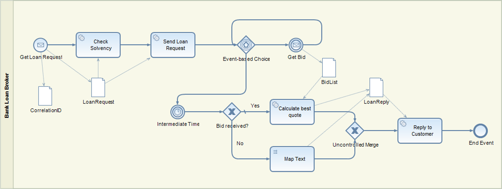

<!-- loio0a8582f659d0410780eec2e5569828fe -->

# Scatter-Gather

The [Scatter-Gather](https://www.enterpriseintegrationpatterns.com/patterns/messaging/BroadcastAggregate.html) pattern is used when it’s required to send a message to multiple recipients and collect the individual responses in an aggregated message.

<a name="loio0a8582f659d0410780eec2e5569828fe__section_x1y_xxj_qqb"/>

## SAP Process Orchestration

In the following, the process model of a typical bidding process that is implemented in SAP Process Orchestration are explained briefly. The process itself is modeled using BPM, and the message exchange with the various systems is done using SAP Process Integration as part of the SAP Process Orchestration solution bundle. In this document, the BPM process only is illustrated. For a detailed description of the overall implementation, see the blog [Enterprise Patterns in Process Orchestration - Scatter-Gather](https://blogs.sap.com/2013/01/23/enterprise-patterns-in-process-orchestration-scatter-gather/).

The process model starts with a message start event. For a new loan request, a new process instance is created. After having carried out a solvency check, the request is broadcast to multiple banks. Here, this is a service call, the distribution of the request to the banks is done within SAP Process Integration \(not shown here\). The bidding process should be open for a limited time, for example 2 days. Within this time frame, all bids from the banks are collected. Once the time has been exceeded, the bidding is closed, so no further bids are accepted. This is implemented via an event-based choice gateway with two branches. One branch contains an intermediate message event with a correlation condition so that the bids are assigned to the right process instance. The other branch contains an intermediate timer event, which is triggered once the time is up. In this case, the best quote is calculated, and a response is sent to the original requester. If a bid arrives after the time has been exceeded, the message is discarded because there's no active intermediate message event that meets the correlation condition.

<a name="loio0a8582f659d0410780eec2e5569828fe__section_b2b_yxj_qqb"/>

## Cloud Integration

For a detailed description of the Scatter-Gather pattern on Cloud Integration, see [Scatter-Gather](https://help.sap.com/viewer/368c481cd6954bdfa5d0435479fd4eaf/Cloud/en-US/987eef23b2544f79b500b4e6e3bb4616.html). In the following, only the rough model is outlined.

Since an intermediate message event is available on Cloud Integration, the Scatter and the Gather parts are modeled as separate integration processes. This is not a disadvantage, as the distribution and the collection don't have to be modeled in the same process. If the information from one part is used in the other, an exchange via a data store is modeled. Furthermore, to be able to correlate both parts in the message monitor, a common Application ID based on the request ID for instance can be defined.

The *Scatter* part takes the request and broadcasts it to multiple banks. Before, the timer is triggered via a separate message sent to the Gather part.

The *Gather* part collects the bids using an aggregator flow step, calculates the best quote, and sends the response to the original requester. The best quote calculation is done via a message mapping that can be imported from the Enterprise Service Repository \(ESR\) of SAP Process Orchestration.

By default, if a bid arrives after the time has been expired, a new process instance is created. To avoid this, a third integration process that checks if the bidding process is still active and eventually forwards the bids to the Gather part must be added. The check is based on a respective entry in the data store. Once the request has been received, the request is stored in the data store with the request ID as the key. This is done in the Scatter part, as described before. Once the time has been exceeded, the data store entry is deleted. This is done in the Gather part, as described before. In the model below, it's checked if the data store entry still exists. If not, the exception subprocess is triggered, and the message processing is stopped, hence discarding the message. Otherwise, the message is sent to the Gather part.

