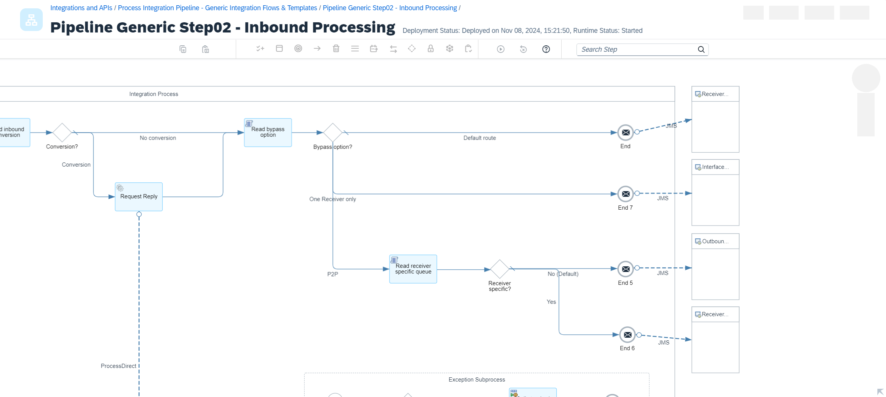
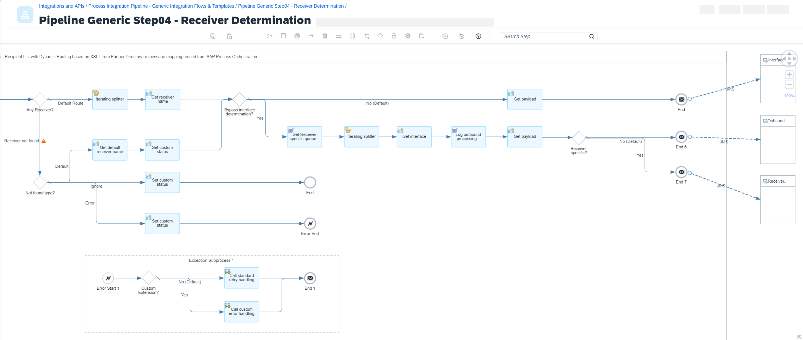

<!-- loio1606af9b55bf4391bea01d2f7ee112af -->

# Special Cases

Before you get started with the pipeline concept, consider a few special cases, like the XI sender adapter, the IDoc sender adapter, reusing extended receiver determination, receiver-specific outbound queues, and the bypass option for Point-to-Point scenarios.


<a name="loio1606af9b55bf4391bea01d2f7ee112af__section_vcg_m1f_j1c"/>

## XI Sender Adapter

For scenarios in which sender systems connect to Cloud Integration via the XI message protocol, you can use a generic inbound integration flow to act as one single entry point for your XI proxy inbound scenarios.

> ### Note:  
> From version 1.0.9 onwards, the generic XI inbound processing flow supports both asynchronous and synchronous scenarios.

As in the integration flow [Inbound Processing \(Scenario-Specific\)](fully-decoupled-pipeline-f8e69f4.md#loiof8e69f43059a44cdb891892f4ff083d8__section_cfy_myk_31c), you must set the message headers for holding the sender system name and sender interface name. You can derive them from the headers provided by the XI sender adapter.

In a content modifier step, the headers are defined as follows:


<table>
<tr>
<th valign="top">

Name

</th>
<th valign="top">

Source Type

</th>
<th valign="top">

Source Value

</th>
</tr>
<tr>
<td valign="top">

`SAP_Sender`

</td>
<td valign="top">

Header

</td>
<td valign="top">

`sapsenderservice`

</td>
</tr>
<tr>
<td valign="top">

`SAP_SenderInterface`

</td>
<td valign="top">

Header

</td>
<td valign="top">

`sapinterfacename`

</td>
</tr>
<tr>
<td valign="top">

`SAP_MessageType`

</td>
<td valign="top">

Header

</td>
<td valign="top">

`sapinterfacename`

</td>
</tr>
<tr>
<td valign="top">

`SAP_ApplicationID`

</td>
<td valign="top">

Expression

</td>
<td valign="top">

`${header.SapMessageIdEx.toUpperCase()}`

</td>
</tr>
</table>

The header `SAP_ApplicationID` holds the XI message ID that was passed from the Integration Engine of the sender system. It allows you to search for a particular message ID in the message monitoring. The ID is converted to upper case to make it easier to track a message from the sender system to Cloud Integration.

In the *Delivery Assurance* tab of the XI sender adapter, select `Handled by Integration Flow` as *Quality of Service* to be able to support both asynchronous and synchronous message processing.

For asynchronous messages, put the JMS receiver send step to write the message to the JMS queue within your sequence of flows into an idempotent process call.

In the *Processing* tab of the idempotent process call step, set the idempotent conditions details to the following:

-   *Message ID*: `${header.SapMessageIdEx}`

-   *Skip Process Call for Duplicates*: select the checkbox


The idempotent process uses the exchange property `CamelDuplicateMessage` to identify duplicates. If the property isn't set, the message is sent to the JMS queue. If this succeeds, for all following calls of the idempotent process with the same unique ID, the exchange property `CamelDuplicateMessage` has the value `true`. In this case, the message isn't forwarded to the JMS queue again. Instead, the custom status is set to `DuplicateDiscarded`, which is displayed in the message processing log in the message monitor.

As the outbound JMS queue, configure the queue name of the first JMS queue in the sequence of flows, namely the inbound processing queue. For the fully decoupled pipeline, the default queue name is `PIPQ01`, and for the integrated messaging runtime, the default queue name is `PIPX01`. If you want to overwrite your configuration for a specific scenario, you need to maintain the string parameter `InboundQueue` in the Partner Directory. See [Message Processing Behavior](using-the-partner-directory-in-the-pipeline-concept-9ec7d2d.md#loio9ec7d2dce72d423abff80543f11b2091__section_bxk_wty_31c).

> ### Note:  
> From version 1.0.11 of the script collection included in the integration package [Process Integration Pipeline - Generic Integration Flows and Templates](https://hub.sap.com/package/PIPipelineGenericIntegrationFlows/scriptcollection) onwards, the default inbound processing queue is defined as `PIPX01`, following the recommendation of using the integrated messaging runtime. Before, the default value was `PIPQ01`.

For synchronous content-based router scenarios, send the messages to the synchronous integrated messaging runtime using the ProcessDirect adapter. When you're using synchronous point-to-point scenarios, the pipeline can be bypassed, and the message directly routed to the corresponding scenario-specific outbound flow.

The following is the generic XI inbound processing integration flow `Pipeline Generic Step01 - Inbound Processing for XI`:


<a name="loio1606af9b55bf4391bea01d2f7ee112af__section_tjw_z3f_j1c"/>

## IDoc Sender Adapter

For scenarios in which sender systems connect to Cloud Integration via the IDoc sender adapter, use a generic inbound flow acting as one single entry point for your IDoc inbound scenarios.

As in the scenario-specific inbound integration flow, the message headers for holding the sender system name and sender interface name must be set. You can derive them from the IDoc control header.

In a content modifier step, the message headers are defined as follows:


<table>
<tr>
<th valign="top">

Name

</th>
<th valign="top">

Source Type

</th>
<th valign="top">

Source Value

</th>
<th valign="top">

Data Type

</th>
</tr>
<tr>
<td valign="top">

`SAP_Sender` 

</td>
<td valign="top">

XPath

</td>
<td valign="top">

`//EDI_DC40/SNDPRN` 

</td>
<td valign="top">

java.lang.String

</td>
</tr>
<tr>
<td valign="top">

`testMode` 

</td>
<td valign="top">

XPath

</td>
<td valign="top">

`//*:TEST != ''`

</td>
<td valign="top">

java.lang.Boolean

</td>
</tr>
<tr>
<td valign="top">

`SAP_IDoc_EDIDC_MESTYP` 

</td>
<td valign="top">

XPath

</td>
<td valign="top">

`//*:MESTYP`

</td>
<td valign="top">

java.lang.String

</td>
</tr>
<tr>
<td valign="top">

`SAP_IDoc_EDIDC_IDOCTYP` 

</td>
<td valign="top">

XPath

</td>
<td valign="top">

`//*:IDOCTYP`

</td>
<td valign="top">

java.lang.String

</td>
</tr>
<tr>
<td valign="top">

`SAP_IDoc_EDIDC_CIMTYP` 

</td>
<td valign="top">

XPath

</td>
<td valign="top">

`//*:CIMTYP`

</td>
<td valign="top">

java.lang.String

</td>
</tr>
</table>

If you want to run your scenario in test mode, for example, for scenario regression tests, you can set the IDoc control header field `TEST` in the sender system, which sets the `testMode` header to `true`. This header is passed through the sequence of integration flows. You can then use it to define the processing behavior for scenario tests, for example, when sending the message to a mocked receiver instead of to the actual receiver.

In a Groovy script, the `SAP_SenderInterface` is concatenated as a combination of the previously created headers `SAP_IDoc_EDIDC_MESTYP`, `SAP_IDoc_EDIDC_IDOCTYP`, and `SAP_IDoc_EDIDC_CIMTYP`. The latter is only added if the IDoc control header field `CIMTYP` isn't empty.

The partner ID with which your read the Partner Directory is a combination of `SAP_Sender` and `SAP_SenderInterface` and it's used to read the scenario-specific retry handling.

For improved monitoring of IDoc bulk messages, all IDoc numbers are stored in a custom header property. The leading zeros are removed from the IDoc numbers to make it easier to search for a message in the message monitor.

IDoc bulk messages are split using an IDoc Splitter step.

Put the JMS receiver send step to write the message to the JMS queue within your sequence of integration flows into an idempotent process call. This way, if the sender resends the same IDoc message, you guarantee exactly once delivery.

In the *Processing* tab of the idempotent process call step, set the idempotent conditions details as follows. The exchange property unique ID is a combination of the sender partner number and the IDoc document number.

-   *Message ID*: `${property.uniqueID}`

-   *Skip Process Call for Duplicates*: don't select the checkbox


The idempotent process uses the exchange property `CamelDuplicateMessage` to identify duplicates. If the property hasn’t been set yet, the message is sent to the JMS queue. If this succeeds, for all subsequent calls of the idempotent process with the same unique ID, the exchange property `CamelDuplicateMessage` has the value `true`. In this case, the message isn't forwarded to the JMS queue again. Instead, the custom status is set to `DuplicateDiscarded`, which is displayed in the message processing log in the message monitor.

As the outbound JMS queue, configure the queue name of the first JMS queue in the sequence of flows, namely the inbound processing queue. For the fully decoupled pipeline, the default queue name is `PIPQ01`, and for the integrated messaging runtime, the default queue name is `PIPX01`. If you want to overwrite your configuration for a specific scenario, you need to maintain the string parameter `InboundQueue` in the Partner Directory. See [Message Processing Behavior](using-the-partner-directory-in-the-pipeline-concept-9ec7d2d.md#loio9ec7d2dce72d423abff80543f11b2091__section_bxk_wty_31c).

> ### Note:  
> From version 1.0.11 of the integration package onwards, the default inbound processing queue is defined as `PIPX01`, following the recommendation of using the integrated messaging runtime. Before, the default value was `PIPQ01`.

The following is the generic IDoc inbound processing integration flow `Pipeline Generic Step01 - Inbound Processing for Idoc`:


<a name="loio1606af9b55bf4391bea01d2f7ee112af__section_kjy_1jf_j1c"/>

## Reuse Extended Receiver Determination

If your integration scenario on SAP Process Orchestration already uses the extended receiver determination, you can reuse the receiver determination mapping instead of the XSLT mapping.

If you reuse, you need to create corresponding parameters in the Partner Directory. In a Groovy script, the parameters are read from the Partner Directory, and the following properties are set:

-   *reuseXRDBoolean*: either `true` or `false`

-   *reuseXRDEndpoint*: ProcessDirect endpoint of the integration flow you want to call


In a router step of the generic receiver determination integration flow, check the value of the `reuseXRDBoolean` property. The default route is running the XSLT mapping from the Partner Directory. If `reuseXRDBoolean` is `true`, the lower route is carried out calling the corresponding local subprocess.

The following is the integration flow for generic receiver determination with an extended receiver determination route, `Pipeline Generic Step04 - Receiver Determination`:


In the subprocess, the integration flow performing the extended receiver determination mapping is called via a request reply step. The endpoint is defined via the exchange property that you defined before:

```
${property.reuseXRDEndpoint}
```

Next, in a Groovy script, the parameters for the receiver-not-determined behavior are read from the Partner Directory, and the following properties are set:

-   *receiverNotDeterminedType*: *Error*, *Ignore*, or *Default*

-   *receiverNotDeterminedDefault*: If you selected *Default*, enter the name of the default receiver system.


In a message mapping, the ReceiverNotDetermined XML node is then mapped based on these parameters.

The following subprocess is used to call extended receiver determination:


The following is an example of an integration flow that carries out a message mapping to determine the list of receivers \(template `Pipeline Template Step04 - Reuse Extended Receiver Determination`\):


<a name="loio1606af9b55bf4391bea01d2f7ee112af__section_n2d_cjf_j1c"/>

## Receiver-Specific Outbound Queues

By default, each scenario uses the same set of generic JMS queues. For receivers for which you want to control the outbound delivery, you can define receiver-specific JMS queues.

If you're using receiver-specific JMS outbound queues, create a string parameter with partner ID `ReceiverSpecificQueue` in the Partner Directory. In a Groovy script, the parameter is read from the Partner Directory, and the following properties are set:

-   *receiverSpecificQueueBoolean*: either `true` or `false`

-   *receiverSpecificQueueName*: queue name


In a router step, the value of the *receiverSpecificQueueBoolean* property is checked. The default route is to store the message to the fourth JMS queue in the sequence of flows. If *receiverSpecificQueueBoolean* equals true, the message is written to the queue with the queue name `${property.receiverSpecificQueueName}`.

The following is an example of generic interface determination with a receiver-specific JMS outbound queue:


If you're using a receiver-specific outbound queue, create a receiver-specific outbound processing integration flow as a copy of the generic outbound processing integration flow. In the copy, maintain the sender JMS queue accordingly to read from the receiver-specific queue. This works across all scenarios in which the system is a receiver.

The following is an example of a receiver-specific outbound processing integration flow:


<a name="loio1606af9b55bf4391bea01d2f7ee112af__section_bdm_kc3_hcc"/>

## Pipeline Bypass Options

In some cases, you can bypass one or more pipeline steps and have an improved runtime behavior. You have the following bypass options:

-   Point-to-Point scenarios
-   Combined receiver and interface determination in a single XSLT
-   Bypass interface determination
-   Bypass receiver determination


### Point-to-Point Scenarios

For Point-to-Point scenarios, that is, scenarios with only one receiver and one receiver interface, you can bypass the two pipeline steps receiver determination and interface determination.

In this case, you don't have to upload XSLT mappings to determine the list of receivers and receiver interfaces, but instead you need to create corresponding string parameters in the Partner Directory.

In the Groovy script `readBypassOptionFromPD` within the generic inbound processing integration flow, the string parameters are read from the Partner Directory. If the scenario is identified as a point-to-point scenario, the exchange property `bypassOption` is set to `p2p` .

Furthermore, the following headers are set:

-   **SAP\_Receiver**: Receiver component name

-   **SAP\_OutboundProcessingEndpoint**: ProcessDirect endpoint of the outbound processing integration flow


You can check the value of the `bypassOption` property in a router step of the generic inbound processing integration flow. The default route stores the message to the receiver determination JMS queue where it's picked up by the generic receiver determination integration flow. If `bypassOption` equals `p2p`, the P2P route is carried out, storing the message to the outbound processing JMS queue and directly passing the message to the generic outbound processing integration flow. If you're using a receiver-specific outbound queue, the message is stored accordingly. See [Receiver-Specific Outbound Queues](special-cases-1606af9.md#loio1606af9b55bf4391bea01d2f7ee112af__section_n2d_cjf_j1c).




### Combined Receiver and Interface Determination in a Single XSLT

In general, you can combine the receiver determination and the interface determination in a single XSLT instead of defining separate XSLTs for the receiver determination and an interface determination for each receiver. In this case, you only need to upload a single XSLT that carries out the xpath routing conditions to determine the list of receivers and the xpath conditions to determine the list of receiver interfaces. This way, you can bypass the interface determination step.

In this case, you don't have to upload XSLT mappings for the receiver interfaces. Instead, you only have to upload one combined XSLT mapping with the object ID `receiverDetermination` to the Partner Directory.

The following example shows what a combined XSLT mapping to execute the routing condition and determine the receivers as well as the receiver interfaces can look like:

```
<?xml version="1.0" encoding="UTF-8"?> 
<xsl:stylesheet version="3.0" xmlns:xsl="http://www.w3.org/1999/XSL/Transform"> 
    <xsl:param name="dc_country"/>   
    <xsl:template match="/"> 
    <ns0:Receivers xmlns:ns0="http://sap.com/xi/XI/System"> 
     <ReceiverNotDetermined> 
       <Type>Error</Type> 
       <DefaultReceiver/> 
    </ReceiverNotDetermined> 
    <xsl:if test="/*:Item/Category = 'Keyboards'"> 
      <Receiver> 
        <Service>Receiver_1</Service> 
        <Interfaces> 
          <xsl:if test="$dc_country = 'DE'"> 
            <Interface> 
              <Index>1</Index> 
              <Service>/pip/07/scn1/rcv1/ifidx1</Service> 
            </Interface> 
          </xsl:if> 
          <xsl:if test="$dc_country != 'DE'"> 
            <Interface> 
              <Index>2</Index> 
              <Service>/pip/07/scn1/rcv1/ifidx2</Service> 
            </Interface> 
          </xsl:if> 
        </Interfaces> 
      </Receiver> 
    </xsl:if> 
    <xsl:if test="(/*:Item/Category = 'Keyboards') or (/*:Item/Category = 'Software')”> 
      <Receiver> 
        <Service>Receiver_2</Service> 
        <Interfaces> 
          <xsl:if test="/*:Item/CurrencyCode = 'EUR'"> 
            <Interface> 
              <Index>1</Index> 
              <Service>/pip/07/scn1/rcv2/ifidx1</Service> 
            </Interface> 
          </xsl:if> 
          <xsl:if test="(/*:Item/CurrencyCode != 'EUR') or (/*:Item/Quantity = '10')">"> 
            <Interface> 
              <Index>2</Index> 
              <Service>/pip/07/scn1/rcv2/ifidx2</Service> 
            </Interface> 
          </xsl:if> 
        </Interfaces> 
      </Receiver> 
    </xsl:if> 
    </ns0:Receivers> 
  </xsl:template> 
</xsl:stylesheet> 
```

The following example shows the outcome of running the combined XSLT mapping:

```
<?xml version="1.0" encoding="UTF-8"?> 
<ns0:Receivers xmlns:ns0="http://sap.com/xi/XI/System"> 
  <ReceiverNotDetermined> 
    <Type>Error</Type> 
    <DefaultReceiver/> 
  </ReceiverNotDetermined> 
  <Receiver> 
    <Service>Receiver_1</Service> 
    <Interfaces> 
      <Interface> 
        <Index>1</Index> 
        <Service>/pip/07/scn1/rcv1/ifidx1</Service> 
      </Interface> 
    </Interfaces> 
  </Receiver> 
  <Receiver> 
    <Service>Receiver_2</Service> 
    <Interfaces> 
      <Interface> 
        <Index>1</Index> 
        <Service>/pip/07/scn1/rcv2/ifidx1</Service> 
      </Interface> 
      <Interface> 
        <Index>2</Index> 
        <Service>/pip/07/scn1/rcv2/ifidx2</Service> 
      </Interface> 
    </Interfaces> 
  </Receiver> 
</ns0:Receivers> 
```

The generic integration flow `Pipeline Generic Step04 - Receiver Determination` can now handle such combined XSLT mappings. In addition to the receiver split, it also splits the interfaces.

Each split message is then stored in the outbound processing JMS queue. The message is directly passed to the generic outbound processing integration flow, bypassing the generic interface determination integration flow. If you're using a receiver-specific outbound queue, the message is stored accordingly. See [Receiver-Specific Outbound Queues](special-cases-1606af9.md#loio1606af9b55bf4391bea01d2f7ee112af__section_n2d_cjf_j1c).




### Bypass Interface Determination

This bypass option is a subset of the combined receiver and interface determination option. It applies to recipient list scenarios without interface split, that is, scenarios in which each receiver has only a single receiver interface. This way, you can bypass the interface determination step.

The configuration is similar to the combined receiver and interface determination option. To determine the list of receivers, you only need to upload one single XSLT that carries out the xpath routing conditions. For each receiver however, you define a fixed receiver interface in the XSLT.

The following example shows what an XSLT mapping to execute the routing condition to determine the receivers with their receiver interface can look like:

```
<?xml version="1.0" encoding="UTF-8"?> 
<xsl:stylesheet version="3.0" xmlns:xsl="http://www.w3.org/1999/XSL/Transform"> 
    <xsl:param name="dc_country"/>   
    <xsl:template match="/"> 
    <ns0:Receivers xmlns:ns0="http://sap.com/xi/XI/System"> 
     <ReceiverNotDetermined> 
       <Type>Error</Type> 
       <DefaultReceiver/> 
    </ReceiverNotDetermined> 
    <xsl:if test="/*:Item/Category = 'Keyboards'"> 
      <Receiver> 
        <Service>Receiver_1</Service> 
        <Interfaces> 
            <Interface> 
              <Index>1</Index> 
              <Service>/pip/07/scn1/rcv1/ifidx1</Service> 
            </Interface> 
        </Interfaces> 
      </Receiver> 
    </xsl:if> 
    <xsl:if test="(/*:Item/Category = 'Keyboards') or (/*:Item/Category = 'Software')”> 
      <Receiver> 
        <Service>Receiver_2</Service> 
        <Interfaces> 
            <Interface> 
              <Index>1</Index> 
              <Service>/pip/07/scn1/rcv2/ifidx1</Service> 
            </Interface> 
        </Interfaces> 
      </Receiver> 
    </xsl:if> 
    </ns0:Receivers> 
  </xsl:template> 
</xsl:stylesheet>
```

The following example shows the outcome of running the combined XSLT mapping:

```
<?xml version="1.0" encoding="UTF-8"?> 
<ns0:Receivers xmlns:ns0="http://sap.com/xi/XI/System"> 
  <ReceiverNotDetermined> 
    <Type>Error</Type> 
    <DefaultReceiver/> 
  </ReceiverNotDetermined> 
  <Receiver> 
    <Service>Receiver_1</Service> 
    <Interfaces> 
      <Interface> 
        <Index>1</Index> 
        <Service>/pip/07/scn1/rcv1/ifidx1</Service> 
      </Interface> 
    </Interfaces> 
  </Receiver> 
  <Receiver> 
    <Service>Receiver_2</Service> 
    <Interfaces> 
      <Interface> 
        <Index>1</Index> 
        <Service>/pip/07/scn1/rcv2/ifidx1</Service> 
      </Interface> 
    </Interfaces> 
  </Receiver> 
</ns0:Receivers> 
```


### Bypass Receiver Determination

For interface split scenarios with only a single receiver, you can bypass the receiver determination step. In this case, you don't need to upload an XSLT mapping to determine the list of receivers. Instead, create a corresponding string parameter `receiverDetermination` in the Partner Directory. However, for the interface determination, you need to create an XSLT in the Partner Directory that carries out the xpath routing conditions to determine the interfaces.

In the Groovy script `readBypassOptionFromPD` within the generic inbound processing integration flow, the string parameter is read from the Partner Directory, and the exchange property `bypassOption` is set to `skipRcvDet` if the scenario is identified as an interface split scenario.

Furthermore, the header `SAP_Receiver` is set based on the component name maintained in the string parameter.

You can check the value of the `bypassOption` property in a router step of the generic inbound processing integration flow. The default route stores the message to the receiver determination JMS queue where it's picked up by the generic receiver determination integration flow. If `bypassOption` equals `skipRcvDet`, the One Receiver only route is carried out, storing the message to the interface determination JMS queue and directly passing the message to the generic interface determination integration flow bypassing the generic receiver determination integration flow.


<a name="loio1606af9b55bf4391bea01d2f7ee112af__section_onv_nk5_g2c"/>

## Sender Wildcard Scenarios

You can set up so-called sender wildcard scenarios, which are scenarios in which the same configuration applies to different sender systems or different sender interfaces. There are two options:

-   Sender wildcard with different sender systems and same sender interface
-   Sender wildcard with same sender system and different sender interfaces


### Sender Wildcard with Different Sender Systems

For this specific case, multiple sender systems exchange messages using the same sender interface. The routing rules and mappings are the same across all sender systems. For example, you exchange messages with your partners using the same interface.

You can easily configure this option when you're using alternative partners for your partner ID. For each sender system, maintain a corresponding alternative partner. During the pipeline processing, the sender system and sender interface is then mapped to the same integration scenario. See *Option 2: Using alternative partner* in [Partner ID](using-the-partner-directory-in-the-pipeline-concept-9ec7d2d.md#loio9ec7d2dce72d423abff80543f11b2091__section_oy4_t1p_hcc).

> ### Example:  
> The following example shows a wildcard scenario with sender systems `Sender_1`, `Sender_2`, and interface `Interface_1`:
> 
> -   For the partner ID `Scenario_1`, maintain the following alternative partner:
> 
>     -   Agency: `Sender_1`
>     -   Scheme: `SenderInterface`
>     -   ID: `Interface_1`
>     -   
> -   Then, for the same partner ID `Scenario_1`, maintain the following alternative partner:
>     -   Agency: `Sender_2`
>     -   Scheme: `SenderInterface`
>     -   ID: `Interface_1`


### Sender Wildcard with Different Sender Interfaces

In this case, you want to reuse a configuration for multiple sender interfaces of a sender system. For example, you want to replicate different master data to multiple systems in a pass-through scenario.

For this option, using alternative partners as in the other wildcard scenario doesn’t work: agency and scheme would be the same for each entry, while the ID holding the interface name would differ. However, in the Partner Directory, the pair of agency and scheme must be unique. So, you can't maintain multiple entries due to key violations.

Instead, use the same scenario-specific inbound processing flow across the sender interfaces, and create the header partnerID holding the integration scenario name. The header partnerID is then passed to the next generic integration flow in the sequence of the pipeline in which the partnerID is usually determined based on the sender information. If, however, the partnerID is already prefilled, the partnerID determination step is skipped.


<a name="loio1606af9b55bf4391bea01d2f7ee112af__section_tsx_5mb_t2c"/>

## Scenarios with Sender Service Interface Operations

For scenarios with multiple operations of the sender service interface, you need to pass the SAP header `SAP_SenderOperation` from either the scenario-specific inbound processing flow or the scenario-specific inbound conversion flow to the generic integration flows to determine receiver systems or receiver interfaces based on the operation. To define routing conditions based on the SAP\_SenderOperation header or other headers or properties, see [Access Header and Properties in XSLT Mapping](https://help.sap.com/docs/integration-suite/sap-integration-suite/access-header-and-properties-in-xslt-mapping).

If you want to determine the operation based on the message type, you can apply the following templates to set up your scenario-specific flows:

-   `Pipeline Template Step01 - Inbound Processing At Least Once`
-   `Pipeline Template Step01 - Inbound Processing Exactly Once`
-   `Pipeline Template Step03 - Inbound Conversion`

Like in SAP Process Orchestration, the solution provided in the templates assumes that there's a one-to-one relationship between the service interface operation and the message type: each operation of the same service interface must have a unique message type. This allows us to uniquely determine the operation based on the message type.

To determine the operation, you need to maintain the mapping between the operation and the root node name of the incoming XML message in the scenario-specific inbound flow. Optionally, if the incoming message is not in XML format, you can maintain the mapping in the scenario-specific inbound conversion flow assuming that your message is in XML format after the conversion. Otherwise, you must implement your own solution.

In a content modifier step, create an exchange property for each operation to map the operation to the message type, all the while adhering to the naming convention as shown in the following table. In the example, we assume that we have two operations `Operation1` and `Operation2` with the corresponding message types `MessageType1` and `MessageType2`, respectively. In addition, we need to store the name of the XML root node in the exchange property `messageTypeFromXMLRoot`.

****


<table>
<tr>
<th valign="top">

Name

</th>
<th valign="top">

Source Type

</th>
<th valign="top">

Source Value

</th>
<th valign="top">

Data Type

</th>
</tr>
<tr>
<td valign="top">

`messageTypeFromXMLRoot`

</td>
<td valign="top">

XPath

</td>
<td valign="top">

`/*/local-name()`

</td>
<td valign="top">

java.lang.String

</td>
</tr>
<tr>
<td valign="top">

`SAP-MT2OP-Operation1`

</td>
<td valign="top">

Constant

</td>
<td valign="top">

`MessageType1`

</td>
<td valign="top">

 

</td>
</tr>
<tr>
<td valign="top">

`SAP-MT2OP-Operation2`

</td>
<td valign="top">

Constant

</td>
<td valign="top">

`MessageType2`

</td>
<td valign="top">

 

</td>
</tr>
</table>

After the content modifier, carry out the Groovy script `mapMessageTypeToOperation`. The script compares the value of all exchange properties with prefix `SAP-MT2OP-` with the value of the exchange property `messageTypeFromXMLRoot` to determine the operation and at the end to set the header `SAP_SenderOperation`.

