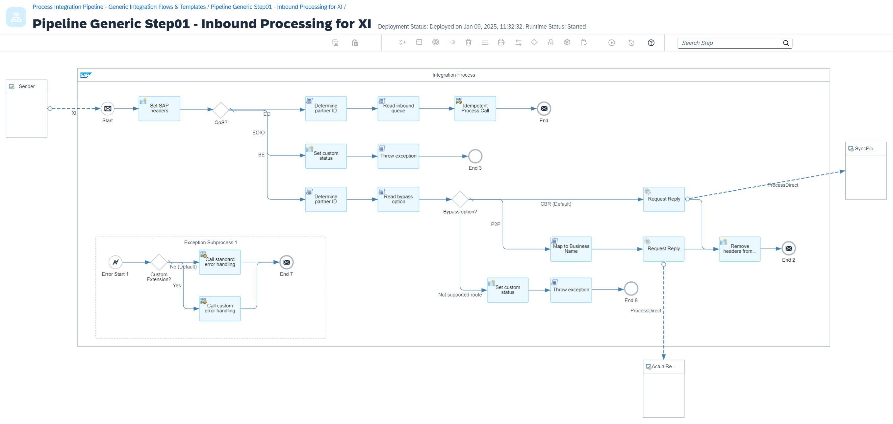
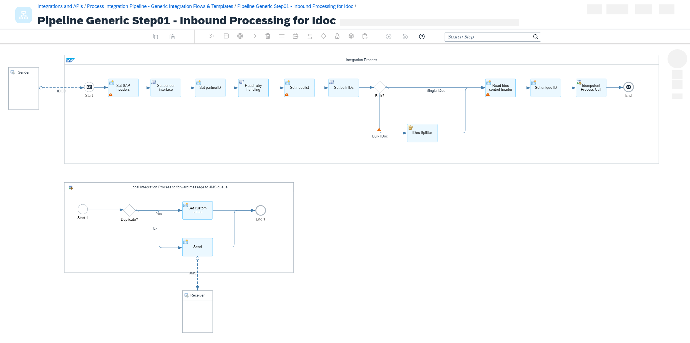

<!-- loio1606af9b55bf4391bea01d2f7ee112af -->

# Special Cases

Before you get started with the pipeline concept, consider a few special cases, like the XI sender adapter, the IDoc sender adapter, reusing extended receiver determination, and receiver-specific outbound queues.


<a name="loio1606af9b55bf4391bea01d2f7ee112af__section_vcg_m1f_j1c"/>

## XI Sender Adapter

For scenarios in which sender systems connect to Cloud Integration via the XI message protocol, you can use a generic inbound integration flow to act as one single entry point for your XI proxy inbound scenarios.

As in the integration flow [Inbound Processing \(Scenario-Specific\)](pipeline-steps-f8e69f4.md#loiof8e69f43059a44cdb891892f4ff083d8__section_cfy_myk_31c), you must set the message headers for holding the sender system name and sender interface name. You can derive them from the headers provided by the XI sender adapter.

In a content modifier step, the headers are defined as follows:


<table>
<tr>
<th valign="top">

Name

</th>
<th valign="top">

Source Type

</th>
<th valign="top">

Source Value

</th>
</tr>
<tr>
<td valign="top">

`SAP_Sender`

</td>
<td valign="top">

Header

</td>
<td valign="top">

`sapsenderservice`

</td>
</tr>
<tr>
<td valign="top">

`SAP_SenderInterface`

</td>
<td valign="top">

Header

</td>
<td valign="top">

`sapinterfacename`

</td>
</tr>
<tr>
<td valign="top">

`SAP_MessageType`

</td>
<td valign="top">

Header

</td>
<td valign="top">

`sapinterfacename`

</td>
</tr>
</table>

In the *Delivery Assurance* tab of the XI sender adapter, select `JMS Queue` as *Temporary Storage* to avoid mixing JDBC and JMS transactions. Since this option only supports `At least Once` delivery, put the JMS receiver send step to write the message to the JMS queue within your sequence of flows into an idempotent process call.

In the *Processing* tab of the idempotent process call step, set the idempotent conditions details to the following:

-   *Message ID*: `${header.SapMessageIdEx}`

-   *Skip Process Call for Duplicates*: select the checkbox


The idempotent process uses the exchange property `CamelDuplicateMessage` to identify duplicates. If the property isn't set, the message is sent to the JMS queue. If this succeeds, for all following calls of the idempotent process with the same unique ID, the exchange property `CamelDuplicateMessage` has the value `true`. In this case, the message isn't forwarded to the JMS queue again. Instead, the custom status is set to `DuplicateDiscarded`, which is displayed in the message processing log in the message monitor.

As the outbound JMS queue, select the second JMS queue in your sequence of flows, assuming that for XI inbound scenarios you don't need an inbound conversion.

The following is the generic XI inbound processing integration flow `Pipeline Generic Step01 - Inbound Processing for XI`:




<a name="loio1606af9b55bf4391bea01d2f7ee112af__section_tjw_z3f_j1c"/>

## IDoc Sender Adapter

For scenarios in which sender systems connect to Cloud Integration via the IDoc sender adapter, use a generic inbound flow acting as one single entry point for your IDoc inbound scenarios.

As in the scenario-specific inbound integration flow, the message headers for holding the sender system name and sender interface name must be set. You can derive them from the IDoc control header.

In a content modifier step, the message headers are defined as follows:


<table>
<tr>
<th valign="top">

Name

</th>
<th valign="top">

Source Type

</th>
<th valign="top">

Source Type

</th>
<th valign="top">

Data Type

</th>
</tr>
<tr>
<td valign="top">

`SAP_Sender` 

</td>
<td valign="top">

XPath

</td>
<td valign="top">

`//EDI_DC40/SNDPRN` 

</td>
<td valign="top">

java.lang.String

</td>
</tr>
<tr>
<td valign="top">

`testMode` 

</td>
<td valign="top">

XPath

</td>
<td valign="top">

//\*:TEST != ''

</td>
<td valign="top">

java.lang.Boolean

</td>
</tr>
<tr>
<td valign="top">

`SAP_IDoc_EDIDC_MESTYP` 

</td>
<td valign="top">

XPath

</td>
<td valign="top">

//\*:MESTYP

</td>
<td valign="top">

java.lang.String

</td>
</tr>
<tr>
<td valign="top">

`SAP_IDoc_EDIDC_IDOCTYP` 

</td>
<td valign="top">

XPath

</td>
<td valign="top">

//\*:IDOCTYP

</td>
<td valign="top">

java.lang.String

</td>
</tr>
<tr>
<td valign="top">

`SAP_IDoc_EDIDC_CIMTYP` 

</td>
<td valign="top">

XPath

</td>
<td valign="top">

//\*:CIMTYP

</td>
<td valign="top">

java.lang.String

</td>
</tr>
</table>

If you want to run your scenario in test mode, for example, for scenario regression tests, you can set the IDoc control header field `TEST` in the sender system, which sets the `testMode` header to `true`. This header is passed through the sequence of integration flows. You can then use it to define the processing behavior for scenario tests, for example, when sending the message to a mocked receiver instead of to the actual receiver.

In a Groovy script, the `SAP_SenderInterface` is concatenated as a combination of the previously created headers `SAP_IDoc_EDIDC_MESTYP`, `SAP_IDoc_EDIDC_IDOCTYP`, and `SAP_IDoc_EDIDC_CIMTYP`. The latter is only added if the IDoc control header field `CIMTYP` isn't empty.

The partner ID with which your read the Partner Directory is a combination of `SAP_Sender` and `SAP_SenderInterface` and it's used to read the scenario-specific retry handling.

For improved monitoring of IDoc bulk messages, all IDoc numbers are stored in a custom header property.

IDoc bulk messages are split using an IDoc Splitter step.

Put the JMS receiver send step to write the message to the JMS queue within your sequence of integration flows into an idempotent process call. This way, if the sender resends the same IDoc message, you guarantee exactly once delivery.

In the *Processing* tab of the idempotent process call step, set the idempotent conditions details as follows. The exchange property unique ID is a combination of the sender partner number and the IDoc document number.

-   *Message ID*: `${property.uniqueID}`

-   *Skip Process Call for Duplicates*: don't select the checkbox


The idempotent process uses the exchange property `CamelDuplicateMessage` to identify duplicates. If the property hasn’t been set yet, the message is sent to the JMS queue. If this succeeds, for all subsequent calls of the idempotent process with the same unique ID, the exchange property `CamelDuplicateMessage` has the value `true`. In this case, the message isn't forwarded to the JMS queue again. Instead, the custom status is set to `DuplicateDiscarded`, which is displayed in the message processing log in the message monitor.

As the outbound JMS queue, select the second JMS queue in your sequence of flows, assuming that for IDoc inbound scenarios you don't need an inbound conversion.

The following is the generic IDoc inbound processing integration flow `Pipeline Generic Step01 - Inbound Processing for Idoc`:




<a name="loio1606af9b55bf4391bea01d2f7ee112af__section_kjy_1jf_j1c"/>

## Reuse Extended Receiver Determination

If your integration scenario on SAP Process Orchestration already uses the extended receiver determination, you can reuse the receiver determination mapping instead of the XSLT mapping.

If you reuse, you need to create corresponding parameters in the Partner Directory. In a Groovy script, the parameters are read from the Partner Directory, and the following properties are set:

-   *reuseXRDBoolean*: either `true` or `false`

-   *reuseXRDEndpoint*: ProcessDirect endpoint of the integration flow you want to call


In a router step of the generic receiver determination integration flow, check the value of the `reuseXRDBoolean` property. The default route is running the XSLT mapping from the Partner Directory. If `reuseXRDBoolean` is `true`, the lower route is carried out calling the corresponding local subprocess.

The following is the integration flow for generic receiver determination with an extended receiver determination route, `Pipeline Generic Step04 - Receiver Determination`:


In the subprocess, the integration flow performing the extended receiver determination mapping is called via a request reply step. The endpoint is defined via the exchange property that you defined before:

```
${property.reuseXRDEndpoint}
```

Next, in a Groovy script, the parameters for the receiver-not-determined behavior are read from the Partner Directory, and the following properties are set:

-   *receiverNotDeterminedType*: *Error*, *Ignore*, or *Default*

-   *receiverNotDeterminedDefault*: If you selected *Default*, enter the name of the default receiver system.


In a message mapping, the ReceiverNotDetermined XML node is then mapped based on these parameters.

The following subprocess is used to call extended receiver determination:


The following is an example of an integration flow that carries out a message mapping to determine the list of receivers \(template `Pipeline Template Step04 - Reuse Extended Receiver Determination`\):


<a name="loio1606af9b55bf4391bea01d2f7ee112af__section_n2d_cjf_j1c"/>

## Receiver-Specific Outbound Queues

By default, each scenario uses the same set of generic JMS queues. For receivers for which you want to control the outbound delivery, you can define receiver-specific JMS queues.

If you're using receiver-specific JMS outbound queues, create a string parameter with partner ID `ReceiverSpecificQueue` in the Partner Directory. In a Groovy script, the parameter is read from the Partner Directory, and the following properties are set:

-   *receiverSpecificQueueBoolean*: either `true` or `false`

-   *receiverSpecificQueueName*: queue name


In a router step, the value of the *receiverSpecificQueueBoolean* property is checked. The default route is to store the message to the fourth JMS queue in the sequence of flows. If *receiverSpecificQueueBoolean* equals true, the message is written to the queue with the queue name `${property.receiverSpecificQueueName}`.

The following is an example of generic interface determination with a receiver-specific JMS outbound queue:


If you're using a receiver-specific outbound queue, create a receiver-specific outbound processing integration flow as a copy of the generic outbound processing integration flow. In the copy, maintain the sender JMS queue accordingly to read from the receiver-specific queue. This works across all scenarios in which the system is a receiver.

The following is an example of a receiver-specific outbound processing integration flow:


