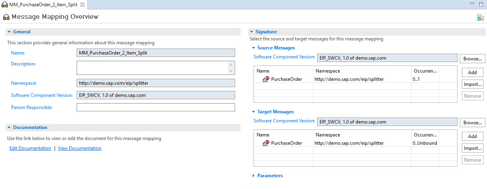
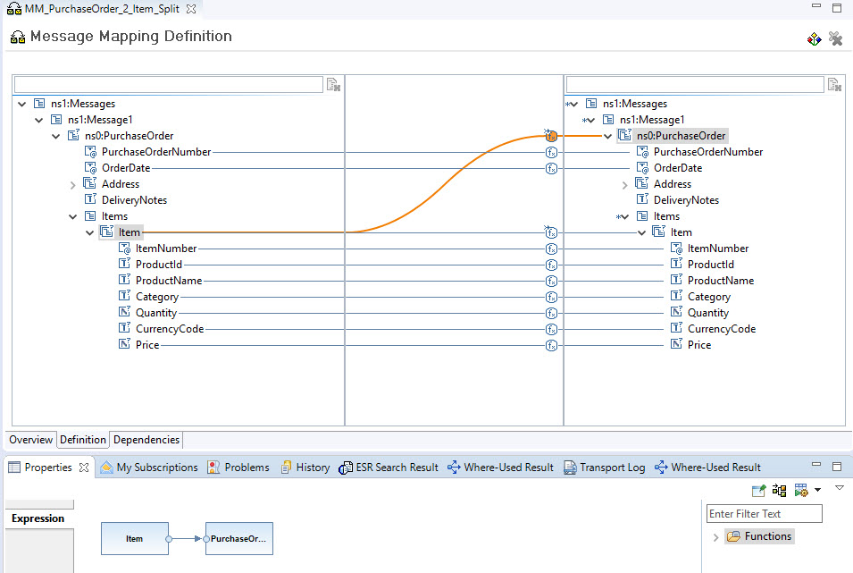
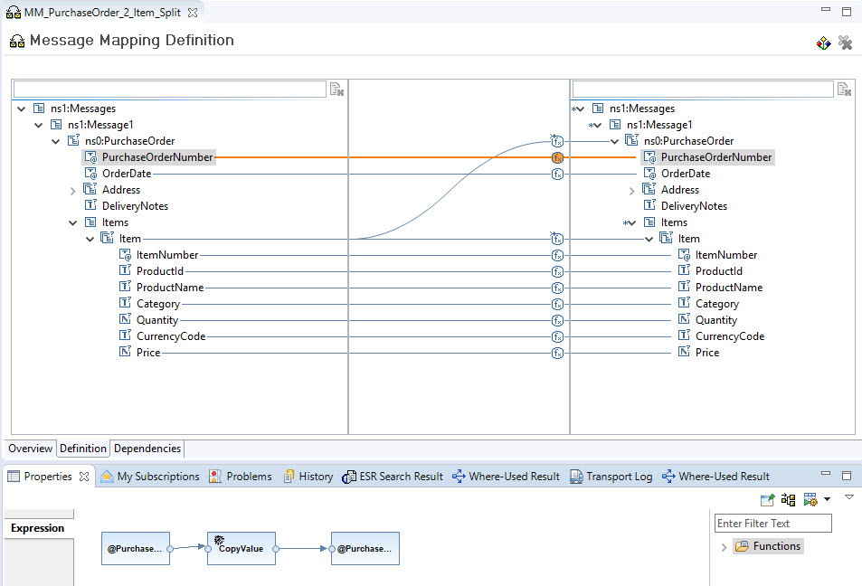
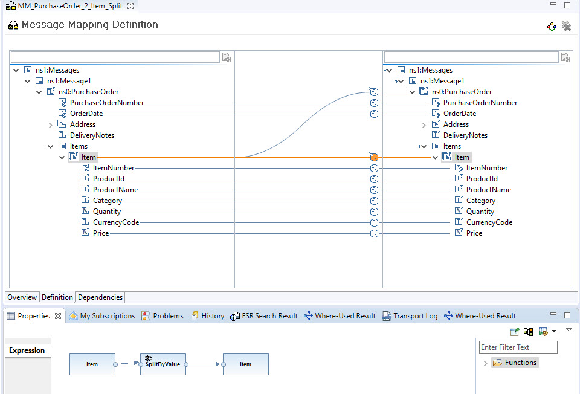

<!-- loio64ae5595b6dc4b98b0ff27a17d9c01aa -->

# Splitter

The [Splitter](https://www.enterpriseintegrationpatterns.com/patterns/messaging/Sequencer.html) pattern is used when it's required to split up a bulk or composite message into individual messages. For the following example, there’s an order document with multiple lines. The message needs to be split into individual messages each containing the data related to one item. Furthermore, it must be ensured that the order header information is available in every message. You can find the XML files from before and after transformation in the [Splitter](https://help.sap.com/viewer/368c481cd6954bdfa5d0435479fd4eaf/Cloud/en-US/4b475eaac3de4ef1a9f434fd13cbb709.html) help documentation.

The following sections describe the usage of this stateless pattern in SAP Process Orchestration and Cloud Integration.

<a name="loio64ae5595b6dc4b98b0ff27a17d9c01aa__section_k54_ywj_qqb"/>

## SAP Process Orchestration

On SAP Process Orchestration, there’s the possibility to use either Business Process Management \(BPM\) or implement the split with a message mapping.

An example of the first option via BPM is described in the blog [Enterprise Patterns in Process Orchestration – Splitter](https://blogs.sap.com/2012/09/14/enterprise-patterns-in-process-orchestration-splitter/). The BPM process is picked if further message orchestration steps are required.

This document illustrates the message mapping option since this option is more often used compared to the BPM process. In the message mapping, the occurrence of the source message type is set to 1, and for the target message type, it’s unbound.

For each item within the source structure, a new message should be created. Every item node is mapped to the PurchaseOrder node.

The order header information such as the order number should be added to each individual target message. So, this information needs to be replicated. This can be achieved by using the CopyValue standard message function.

The item node and all child nodes can be mapped one by one. For the item, it’s required to insert a context change to ensure that each message contains one item only. Here, the SplitByValue standard message function is used.

<a name="loio64ae5595b6dc4b98b0ff27a17d9c01aa__section_akt_ywj_qqb"/>

## Cloud Integration

On Cloud Integration, depending on the use case, several options are available. In the Splitter documentation, two use cases are illustrated:

-   Splitting a bulk order message into multiple orders

-   Splitting a single order with multiple items

For the first use case, an Iterating Splitter flow step can be used. For a detailed description, see the [Variant with Iterating Splitter](https://help.sap.com/viewer/368c481cd6954bdfa5d0435479fd4eaf/Cloud/en-US/24f9f29ad45849af978c17de4789842a.html) documentation.

For the second use case, we describe two options: either reusing the [Message Mapping](https://help.sap.com/viewer/368c481cd6954bdfa5d0435479fd4eaf/Cloud/en-US/f6bb2b7d6860418bbe4c0c40e5cacecd.html) or using a [General Splitter](https://help.sap.com/viewer/368c481cd6954bdfa5d0435479fd4eaf/Cloud/en-US/cba1ecb0f88a4a3c862c3cadd0403f6e.html) flow step.

When the General Splitter flow step is added to the integration process, it takes care of splitting up the message into individual messages based on the items. On the processing tab of the General Splitter configuration, the XPath is selected as expression type and an XPath expression is maintained. The XPath expression is pointing to the location of the item node. The benefit of this option is that the General Splitter automatically duplicates the header information of the order for each individual message.

For more information, see the blog [SAP Cloud Platform Integration – Splitter](https://blogs.sap.com/2019/11/08/sap-cloud-platform-integration-splitter/).

